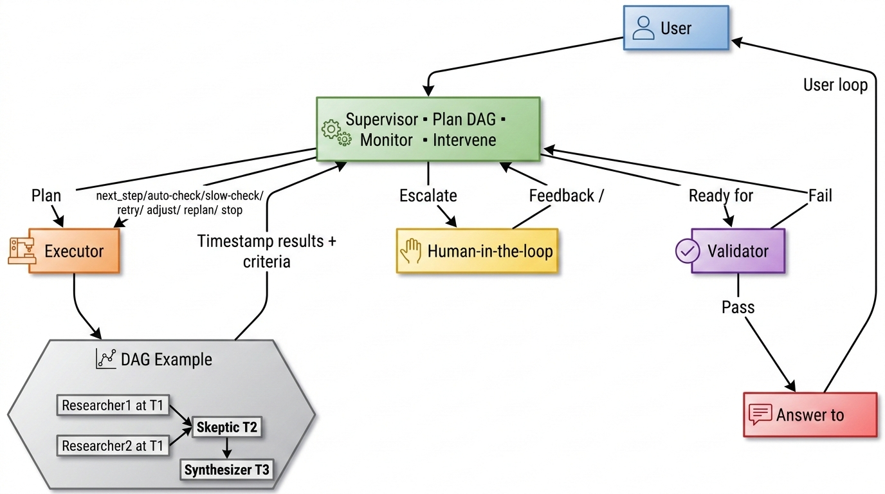
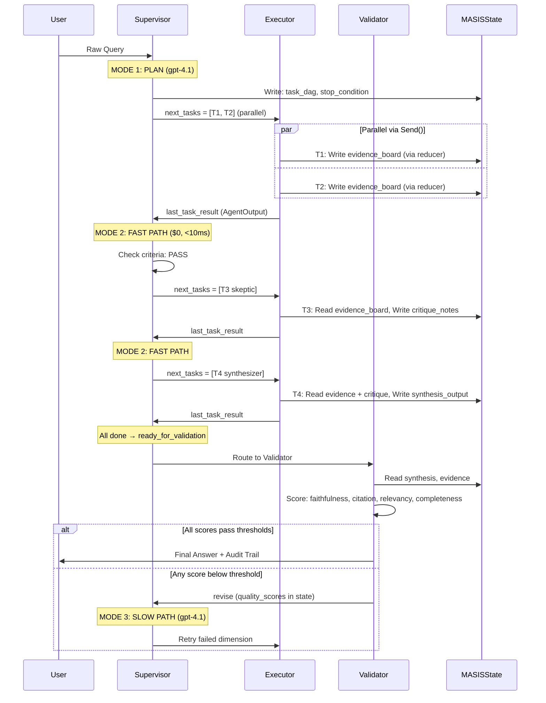

# MASIS — Multi-Agent Strategic Intelligence System

A multi-agent system that answers complex business research questions by decomposing them into parallel research tasks, verifying the evidence, and producing a cited answer. Built on LangGraph with a Supervisor → Executor → Validator control flow.



---

## What It Does

You ask a deep business question. MASIS breaks it down, researches it, checks the facts, and writes a cited answer.

The Supervisor makes routing decisions from summaries, not 100,000 chars of raw evidence. This keeps its context window small and its decisions fast.Skeptic agent actively tries to find contradictions and unsupported claims in the evidence before the answer is written. If the evidence doesn't hold up, the system retries with a better query rather than guessing.

**Example flow:**

```
User: "How is Infosys's revenue trending and what's driving it?"

Supervisor plans and monitors:
  T1 (researcher) — search for Infosys quarterly revenue data
  T2 (researcher) — search for business drivers and headwinds
  T3 (skeptic)    — verify claims from T1 and T2
  T4 (synthesizer) — write the final answer with citations

T1 + T2 run in parallel → find 9 evidence chunks
T3 checks all claims → 0 contradictions, confidence 0.73 → PASS
T4 writes answer → 10 citations, all grounded in evidence
Validator scores it → PASS → answer returned
```

<video src="MASIS_demo.mp4" controls title="MASIS Demo"></video>

---

## Previous Repo (single agent flow)

https://github.com/SalilBhatnagarDE/AI-Leadership-Insights-Agent-Flow-Research

## Architecture

```
User Query
    │
    ▼
Supervisor (gpt-4.1)
  Plans a task DAG, monitors results, decides what to do next.
  Two modes:
    Fast Path — pure rule checks, no LLM call, runs every turn
    Slow Path — LLM call only when a task fails or DAG is blocked
    │
    ▼
Executor
  Runs DAG tasks in parallel where possible.
  Dispatches to the right agent per task type.
    │
    ├── Researcher(s) — search internal docs (ChromaDB + BM25)
    ├── Web Search    — external search via Tavily
    ├── Skeptic       — verify claims, flag contradictions
    └── Synthesizer   — write final cited answer
    │
    ▼
Validator
  Scores the answer on faithfulness, citation accuracy, relevancy.
  Pass → return answer. Fail → back to Supervisor for correction.
```

The Supervisor keeps a **decision log** of every routing action — what it decided, why, and the cost. This is visible in the UI and saved to JSON after each run.

---

## Execution Flow (Sequence Diagram)



---

## Agents

### Researcher
Searches the knowledge base using both vector search (ChromaDB) and keyword search (BM25), then reranks results. If it finds too few relevant chunks, it rewrites its own query and tries again (CRAG loop). Self-RAG checks that the answer it generates is actually grounded in what it found.

### Skeptic
This is the key differentiator. The Skeptic reads all the evidence collected so far, extracts factual claims, and checks each one against its source using an NLI model (BART-MNLI). Then it runs an adversarial LLM judge (o3-mini) to find logical gaps and reconcile any conflicts. It outputs a confidence score — if that score is below 0.65, the Supervisor retries.

### Synthesizer
Takes the verified evidence plus the Skeptic's critique notes and writes the final answer. Every claim must have a citation pointing to a specific document chunk. If some parts of the question couldn't be answered, it says so rather than making something up.

### Validator
Final quality gate. Scores the answer on four metrics: faithfulness, citation accuracy, answer relevancy, DAG completeness. If anything falls below threshold, routes back to the Supervisor. Capped at 2 rounds to avoid infinite loops.

### What Each Returns
All task agents return a normalized `AgentOutput` to Supervisor via Executor:

| Agent | Main typed payload (`raw_output`) | Fast Path `criteria_result` used by Supervisor |
|---|---|---|
| Researcher | `ResearcherOutput` (`evidence`, summary, retrieval stats) | `chunks_after_grading`, `grading_pass_rate`, `self_rag_verdict`, `source_diversity`, `crag_retries_used` |
| Skeptic | `SkepticOutput` (claim checks, gaps, reconciliations, confidence) | `claims_unsupported`, `claims_contradicted`, `logical_gaps_count`, `overall_confidence` |
| Synthesizer | `SynthesizerOutput` (final answer + citations) | `citations_count`, `claims_count`, `all_citations_in_evidence_board` |
| Validator | Validator state update (not `AgentOutput`) | `quality_scores` + `validation_pass` |

### How Supervisor Decides: Continue vs Slow Mode
1. Fast safety checks run first (no LLM): budget, iteration cap, wall-clock cap, repetition.
2. If safe, Supervisor checks `criteria_result` for completed task(s):
Researcher PASS: `chunks_after_grading >= 2`, `grading_pass_rate >= 0.30`, `self_rag_verdict in {"grounded","partial"}`.
Skeptic PASS: `claims_unsupported <= 2`, `claims_contradicted == 0`, `logical_gaps_count <= 3`, `overall_confidence >= 0.65`.
Synthesizer PASS: `citations_count >= 1` and `all_citations_in_evidence_board == true`.
3. If PASS, Supervisor marks task `done` and returns `supervisor_decision="continue"` with next ready tasks.
4. If FAIL (or task status is `failed` / `timeout` / `rate_limited`), Supervisor enters Slow Path (`supervisor_slow_path`).
5. Slow Path actions are one of: `retry`, `modify_dag`, `escalate`, `force_synthesize`, `stop`.
6. When all tasks are terminal and synthesis exists, Supervisor returns `ready_for_validation`.

---

## Filtered State Views Per Agent

Each agent sees only what it needs. The Supervisor never sees full evidence chunks.

| Agent | Sees | Does NOT See |
|---|---|---|
| **Supervisor** | `original_query`, `task_dag` (statuses), `last_task_result.summary`, `token_budget`, `iteration_count` | Full `evidence_board`, `critique_notes`, `synthesis_output` |
| **Researcher** | `task.query` (its own sub-question only) | Other researchers' evidence, `task_dag`, budget |
| **Skeptic** | All `evidence_board` chunks (needs cross-doc analysis), `task_dag` | Budget, `iteration_count`, other agent summaries |
| **Synthesizer** | `evidence_board` (U-shape ordered), `critique_notes`, `task_dag` | Budget, raw retrieval scores |
| **Validator** | `synthesis_output`, `evidence_board`, `original_query`, `task_dag` | Budget, `decision_log` |

The Supervisor makes routing decisions from summaries, not 100,000 chars of raw evidence. This keeps its context window small and its decisions fast.

---

## Detailed Documentation

For deeper technical detail, each area has its own doc:

| Doc | What's in it |
|---|---|
| [High-Level Design](docs_md/01_HLD.md) | 3-node graph architecture, Supervisor modes (Fast/Slow Path), dynamic task DAG, why 3 nodes instead of N |
| [Low-Level Design](docs_md/02_LLD.md) | `MASISState` schema, evidence reducer, per-agent filtered state views, Pydantic class hierarchy, routing logic |
| [Research & Tech Choices](docs_md/03_Research_Justification.md) | Why LangGraph, model selection reasoning with benchmarks, HyDE/CRAG/Self-RAG explained, circuit breaker, cost savings |
| [Evaluation Strategy](docs_md/04_Evaluation_Strategy.md) | Validator quality gates, HITL interrupt points, budget enforcement, loop prevention, golden dataset |
| [Demo & Architecture Reference](docs_md/05_Demo_and_Architecture.md) | Step-by-step Q1 demo run with actual JSON artifacts, all 4 agent flow diagrams, API endpoints, cost breakdown |

---

## Why Specific Models

Each agent has a different job, so different tradeoffs apply.

**gpt-4.1 — Supervisor and Synthesizer**

The Supervisor needs to turn a vague question like *"how is Infosys doing?"* into a structured JSON task plan with the right dependencies and acceptance criteria. This requires solid instruction-following and structured output reliability. gpt-4.1 scores near the top on instruction-following benchmarks — 90.7% on IFEval vs 83.6% for gpt-4o — and is significantly more reliable at producing valid Pydantic-constrained JSON than older models. 

I also use it for the Synthesizer because writing a coherent, well-cited answer from 15 evidence chunks requires strong long-context reasoning. 

Using a cheaper model here tends to produce messy citations and dropped claims.

**gpt-4.1-mini — Researcher**

The Researcher runs in a tight loop — it grades chunks, checks relevance, rewrites queries. This happens multiple times per query and the tasks are classification-level work, not complex reasoning. gpt-4.1-mini is 60x cheaper than gpt-4.1 and handles these grading tasks well. On MMLU it scores 71.1%, which is more than enough for "is this chunk relevant to this query?" type decisions. 

Using a heavy model here would triple the cost with no meaningful quality improvement.

**o3-mini — Skeptic**

The Skeptic's job is adversarial reasoning — it needs to find the holes in an argument, not just summarize it. o3-mini is specifically a reasoning model trained on chains of thought. 

It scores significantly higher than gpt-4.1 on reasoning-heavy benchmarks like AIME 2024 (63% vs 26%) and GPQA Diamond (79% vs 66%). In practice, I found o3-mini is much better at flagging subtle logical gaps and forward-looking claims that aren't actually supported by evidence. For a critic role, reasoning > fluency.

**text-embedding-3-small — Vector Index**

Handles the ChromaDB semantic search. It's small, fast, and cheap ($0.00002/1K tokens). For a domain-specific corpus like Infosys press releases, the semantic quality is more than adequate — MTEB retrieval benchmark score of 59.8. The BM25 keyword search runs alongside it as a fallback for exact term matching (revenue figures, quarter names, etc.), so I get the best of both worlds without needing a heavier embedding model.

**BART-MNLI — NLI Pre-filter in Skeptic**

Before spending money on the o3-mini LLM judge, I run each claim through facebook/bart-large-mnli locally for contradiction/entailment scoring. It's free, runs in <100ms per claim, and filters out the obvious cases so the LLM judge only sees the borderline ones. This keeps Skeptic costs down while maintaining quality.

---

## Example Knowledge Base

The system has Infosys documents from Q1 FY24 to Q3 FY25 ingested:

| Document | Coverage |
|----------|----------|
| Q1 FY24 press release | Revenue $4,714M, +2.5% YoY CC |
| Q1 FY25 press release | Revenue $4,941M, +3.8% YoY CC |
| Q2 FY25 press release | Revenue growth 2.9% YoY, 2.2% QoQ CC |
| Q3 FY25 press release | Revenue $5,099M, +1.7% YoY CC, $4.8B large deals |
| Risk disclosures | H-1B, McCamish cybersecurity, geopolitical risks |
| AI strategy docs | Infosys Topaz, Aster, GenAI positioning |

Documents are chunked at 500 tokens (child) with 2000-token parent context, embedded with text-embedding-3-small, and stored in ChromaDB. A BM25 index is built in parallel for keyword search.

---

## Quick Start

**Install:**
```bash
pip install -r requirements.txt
```

**Environment variables:**
```bash
cp .env.example .env
# then edit .env:
#   OPENAI_API_KEY is required
#   TAVILY_API_KEY is optional (enables web search tasks)
```

**Build the index (once):**
```bash
python -m masis.eval.ingest_docs
```

**Launch the UI:**
```bash
python -m streamlit run masis/demo_streamlit_app.py
```

**Or run from the CLI:**
```bash
# Run all 6 standard queries
python -m masis.eval.run_infosys_queries_separate

# Run one query
python -m masis.eval.run_infosys_queries_separate --query-index 1

# Run the strategic queries (including DEMO)
python -m masis.eval.run_strategic_queries --query-index 11
```

Results are saved to `masis/eval/results/` as JSON + log files per query.

---

## Query Presets (Examples)

| ID | Query | Notes |
|----|-------|-------|
| Q1 | What is our current revenue trend? | Simplest, fastest (~50s), good for first run |
| Q2 | Which departments are underperforming? | Multi-dimensional, exercises parallel researchers |
| Q3 | What are the risks highlighted this year? | Tests Skeptic validation on risk claims |
| Q4 | What was AI's impact on operating margins? | Causal analysis |
| Q5 | How is the technology division performing? | Segment-level research |
| Q6 | Compare Infosys cloud revenue to Adobe and GCP | Triggers web search for external data |
| SQ1 | Revenue deceleration Q1–Q3 2025 + large deal analysis | Detailed trend analysis |
| SQ2 | AI and GenAI strategic positioning | Analyst recognition + platform deep-dive |
| SQ3 | Top operational and regulatory risks | Covers H-1B, McCamish, geopolitical |
| SQ4 | Capital allocation + FCF + shareholder returns | Financial health assessment |

---

## Model Profiles

Two profiles are available in the UI:

**Balanced (default)** — good for everyday use
- Supervisor: gpt-4.1
- Researcher: gpt-4.1-mini
- Skeptic: o3-mini
- Synthesizer: gpt-4.1

**High Quality (demo)** — upgrades Researcher to gpt-4.1 for more thorough evidence gathering. Costs more and is slower, but useful when the Balanced profile is missing evidence.

Typical cost: $0.04–$0.18 per query. Typical latency: 50–180 seconds.

---

## Safety Limits

To prevent runaway costs and infinite loops:

- Token budget: 200K tokens per query
- Wall clock: 300 seconds max
- Supervisor iteration cap: 15 turns
- Skeptic: zero tolerance for contradicted claims
- Validator: max 2 correction rounds, then forced pass
- Repetition detector: kills identical retry loops

---

## Project Structure

```
masis/
├── agents/
│   ├── researcher.py       # ChromaDB + BM25 + CRAG + Self-RAG
│   ├── skeptic.py          # BART-MNLI + o3-mini adversarial judge
│   ├── synthesizer.py      # Citation-enforced answer generation
│   └── web_search.py       # Tavily web search
├── nodes/
│   ├── supervisor.py       # DAG planning + fast/slow path routing
│   ├── executor.py         # Parallel task dispatch
│   └── validator.py        # Quality scoring + pass/fail gate
├── graph/
│   └── runner.py           # LangGraph entry point
├── eval/
│   ├── ingest_docs.py      # Document loading + indexing
│   ├── standard_queries.py # All query presets
│   ├── run_infosys_queries_separate.py
│   ├── run_strategic_queries.py
│   └── results/            # JSON + log artifacts
└── schemas/
    ├── models.py            # MASISState, TaskNode, BudgetTracker
    └── thresholds.py        # Quality and safety thresholds
```
