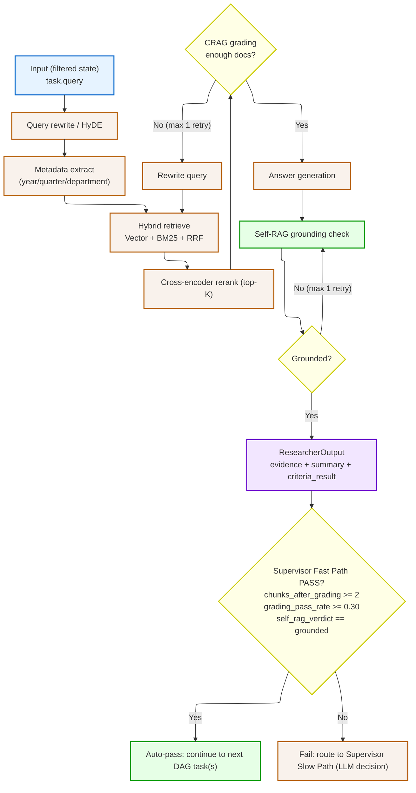
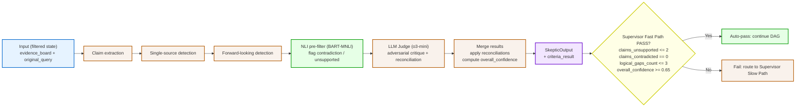
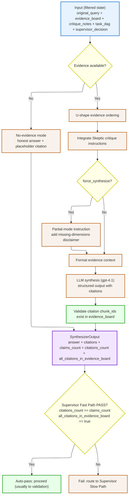
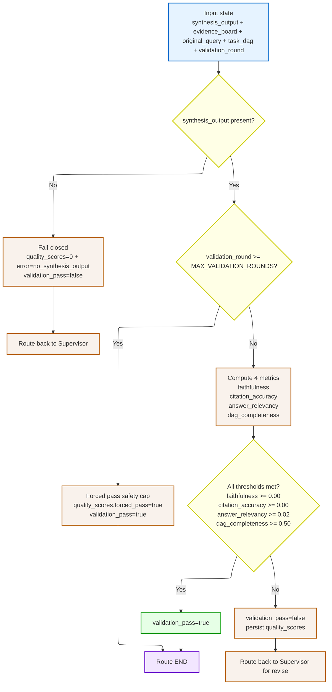

# High Level Design


## Control-Flow Strategy

MASIS follows a hybrid strategy:

* **Graph level Chain:** `Supervisor -> Executor -> Supervisor -> ... -> Validator`.
* **Hierarchical Manager / Supervisor agent:** Supervisor is the control plane that plans DAG, monitors task outputs, and decides next routing via `supervisor_decision`. 

* Example decisions: `continue -> executor`, `ready_for_validation -> validator`, `force_synthesize -> executor (forced synth path)`, `hitl_pause -> END (wait for human resume)`, `failed/done -> END`. 

* Slow Outputs are explicit: `retry -> {supervisor_decision:\"continue\", next_tasks:[...]}`, `modify_dag -> {supervisor_decision:\"continue\", task_dag:[...], next_tasks:[...]}`, `escalate -> {supervisor_decision:\"hitl_pause\"}`, `stop -> {supervisor_decision:\"failed\"}`.

* **Directed Acyclic Graph (DAG):** Work is represented as typed task dependencies and parallel groups, then executed by Executor. Example: `T1(researcher)` and `T2(researcher)` in parallel, then `T3(skeptic)` depends on both, then `T4(synthesizer)` depends on `T3`. Status transitions (`pending -> running -> done/failed`) guide which `next_tasks` are runnable.

* Supervisor plans a task DAG from user query.
* Executor runs DAG tasks (R1, R2, S, S).
* Each Task results feed back to Supervisor.
* Supervisor emits routing outputs each turn: `continue`, `ready_for_validation`, `force_synthesize`, `hitl_pause`, or `failed/done`.
* Validator performs final quality check.
* Pass returns answer; fail loops for correction.

**Simple example:**

* User asks: "How is our revenue trending vs last year?"
* Supervisor creates 4 tasks: 2 Researcher -> Skeptic -> Synthesizer.
* If outputs from each meet predefined crieteria -> `continue`; if risky -> `escalate`; if complete -> `ready_for_validation`.
* Validator checks quality. Pass -> final answer. Fail -> back to Supervisor.

## Demo Run 1 (Simple, Step-by-Step)

### Actual Q1 Artifact: Infosys Revenue Trend

Source: `masis/eval/results/infosys_q1.log` and `masis/eval/results/infosys_q1_result.json`

1. **Supervisor (plan)**  
Input: `original_query="Research what is our current revenue trend and how does it compare to last year?"`  
Output: `task_dag=[T1,T2,T3,T4]`, `next_tasks=[T1,T2]`, `supervisor_decision=continue`
Example supervisor output for same-wave tasks (parallel group):
```json
{
  "next_tasks": [
    {"task_id":"T1","type":"researcher","parallel_group":1,"status":"running"},
    {"task_id":"T2","type":"researcher","parallel_group":1,"status":"running"}
  ],
  "supervisor_decision":"continue"
}
```
Note: both tasks are in the same DAG wave (`parallel_group=1`). Current executor behavior is true parallel fan-out via LangGraph `Send()` when available, with sequential fallback if `Send` is unavailable.

Example full Task DAG (from this run shape):
```json
[
  {
    "task_id": "T1",
    "type": "researcher",
    "query": "Current revenue trend for Infosys",
    "dependencies": [],
    "parallel_group": 1,
    "status": "done"
  },
  {
    "task_id": "T2",
    "type": "researcher",
    "query": "Revenue trend for Infosys last year",
    "dependencies": [],
    "parallel_group": 1,
    "status": "done"
  },
  {
    "task_id": "T3",
    "type": "skeptic",
    "query": "Verify current vs last-year revenue evidence",
    "dependencies": ["T1", "T2"],
    "parallel_group": 2,
    "status": "done"
  },
  {
    "task_id": "T4",
    "type": "synthesizer",
    "query": "Write cited comparison answer",
    "dependencies": ["T3"],
    "parallel_group": 3,
    "status": "done"
  }
]
```

2. **Executor -> Researcher T1 + T2**  
Input: `next_tasks=[T1,T2]`, filtered state per task (`task.query`)  
Output:  
`T1: chunks=5, pass_rate=1.00, self_rag=grounded`  
`T2: first CRAG failed -> rewritten query -> chunks=3, pass_rate=0.60, self_rag=grounded`  
`evidence_board` updated with unique chunks.

Example `evidence_board` entries after researchers:
```json
[
  {
    "doc_id": "ifrs-inr-press-release (3).pdf",
    "chunk_id": "53863d91-1e5c-49bd-bc88-70c127c5e599"
  },
  {
    "doc_id": "infosys-revenue-chart.png",
    "chunk_id": "08065a42-9dc0-4869-a4e4-ed2dffecc945"
  }
]
```

What this means in code:

* `evidence_board` stores full `EvidenceChunk` objects (text + metadata + scores), not only IDs.
* In slide/readme examples we show only `doc_id` + `chunk_id` for readability.
* Per researcher run, max kept chunks after rerank is usually `top_k_after_rerank=5` (from `RESEARCHER_THRESHOLDS`), but it can be lower if grading filters chunks out.
* For demo speed, retries are now limited to:
  * `crag_max_retries=1`
  * `self_rag_max_retries=1`
  These are set in `masis/schemas/thresholds.py`.

Example researcher outputs that trigger fast-path continue:
```json
{
  "T1.criteria_result": {
    "chunks_after_grading": 5,
    "grading_pass_rate": 1.0,
    "self_rag_verdict": "grounded"
  },
  "T2.criteria_result": {
    "chunks_after_grading": 3,
    "grading_pass_rate": 0.6,
    "self_rag_verdict": "grounded"
  }
}
```
Supervisor check: both satisfy thresholds -> `supervisor_decision="continue"`.

Supervisor does not receive full raw evidence in slow-path prompts.

Actual implementation (`_build_supervisor_context` in `supervisor.py`) sends:

* `original_query`
* `iteration_count`
* budget remaining/cost remaining
* `last_task_summary` (truncated summary + criteria)
* compact `dag_overview`

This keeps supervisor context stable even when `evidence_board` grows.

Practical fallback strategy for large runs:

* Keep full `evidence_board` in state for Skeptic/Synthesizer.
* Keep Supervisor prompt compact (already implemented).
* If needed in production, add explicit evidence compaction (for example top-2 per task + task summaries) before slow-path prompting.

3. **Supervisor (fast path)**  
Input: `last_task_result.criteria_result` from researcher  
Output: `next_tasks=[T3]`, `supervisor_decision=continue`

4. **Executor -> Skeptic T3**  
Input: full `evidence_board` + `original_query` + `task_dag` + `task` (filtered state for skeptic)  
Output: `claims_checked=13`, `claims_unsupported=0`, `claims_contradicted=0`, `overall_confidence=0.85`

5. **Supervisor (fast path)**  
Input: skeptic `criteria_result`  
Output: `next_tasks=[T4]`, `supervisor_decision=continue`

6. **Executor -> Synthesizer T4**  
Input: `evidence_board + critique_notes + original_query`  
Output: `citations_count=6`, `claims_count=8`, `all_citations_in_evidence_board=True`

7. **Supervisor -> Validator**  
Input: DAG all done  
Output: `supervisor_decision=ready_for_validation`

8. **Validator**  
Input: `synthesis_output + evidence_board + original_query + task_dag`  
Output example (fail case): threshold failures (`faithfulness=0.700`, `citation_accuracy=0.738`, `answer_relevancy=0.2`) -> `validation_pass=false` -> route back.  
Output example (pass case): all metrics above thresholds -> `validation_pass=true` -> END.

Validation loop cap is now set to 2 scored rounds for speed (`MAX_VALIDATION_ROUNDS=2` in `SAFETY_LIMITS`).

9. **Validator (safety-cap round)**  
Input: `validation_round=2` (after 2 scored rounds, because cap check is `>= 2`)  
Output: `forced_pass=True`, `validation_pass=True` -> graph ends.

### Demo Routing Signals (What field decides where to go)

1. **Agent output field that matters first:** `last_task_result.criteria_result`
2. **Supervisor decision field that controls graph edge:** `supervisor_decision`
3. **Validator decision field that controls graph edge:** `validation_pass`

Common `supervisor_decision` values and routes:

* `continue` -> Executor
* `ready_for_validation` -> Validator
* `force_synthesize` -> Executor (runs forced synth path)
* `hitl_pause` -> END (pause for human input, then resume)
* `failed` / `done` -> END

**Escalation example (Slow Path -> HITL):**
```json
{
  "supervisor_decision": "hitl_pause",
  "reason": "low confidence and high risk",
  "hitl_options": ["retry", "accept_partial", "cancel"]
}
```
Routing result: `route_supervisor -> END` (paused), then resume API continues the run.

* `continue` -> **Executor** (runs agent tasks)
* `force_synthesize` -> **Executor** (forced synth path)
* `ready_for_validation` -> **Validator** (direct route)
* `hitl_pause` -> **END (paused)** (resume later)
* `failed` / `done` -> **END**

## Tooling Exposed for DAG Execution

Tools/capabilities the Supervisor can route through the runtime:

* Web Search (Yes: Supervisor adds `type="web_search"` task; routed through Executor)
* Deep Web Search (extension slot; not yet enabled as runtime TaskNode type)
* Researcher agent (Yes: through Executor)
* Skeptic agent (Yes: through Executor)
* Synthesizer agent (Yes: through Executor)
* Validator agent (No: routed directly from Supervisor when `supervisor_decision="ready_for_validation"`)
* Python interpreter

**Simple example:**
* "Need internal evidence?" -> add `researcher` task.
* "Need latest external number, if internal evidence not there?" -> add `web_search` task.
* "Need risk check?" -> add `skeptic` task.
* "Need final response?" -> add `synthesizer` then `validator`.
Internal-first policy (implemented):

* Supervisor planning prompt explicitly says: do not add `web_search` unless query needs external/competitor/latest data.
* A deterministic normalizer (`_normalize_plan_for_internal_first`) removes unnecessary `web_search` tasks for internal-answerable queries and rewires dependencies.
* So yes: default is internal docs first, then web search only when required.

## State Management

* **Short-term memory:** per-query `MASISState` carries DAG status, last result, budget, quality scores.
  * `MASISState` is the LangGraph shared state schema (TypedDict) for one query run.
  * It **does** carry `evidence_board`.
  * It also carries summaries in `last_task_result.summary` and per-task `task_dag[i].result_summary`.
  * `query_id` is only identity/tracing; evidence and summaries are separate explicit fields.

* **Shared whiteboard:** `evidence_board` is the collaboration surface between agents.
* **Controlled growth:** evidence is deduplicated/merged and agents receive filtered state views.

Evidence dedup + growth control:

* Dedup is done by `evidence_reducer` using key `(doc_id, chunk_id)`.
* If the same chunk appears twice, the higher `retrieval_score` version is kept.
* Upstream control already limits growth: retrieval top-K -> rerank top-K (default 5) -> grading.
* Production fallback (recommended): if board crosses a chosen cap, keep top 1-2 chunks per task and preserve each task summary in `result_summary`.

* **Context discipline:** Supervisor reads compact summaries, not raw long evidence payloads.

How supervisor sees summaries only:

* Slow path uses `_build_supervisor_context`, which passes `last_task_summary` + `dag_overview`, not full chunk text.
* If board grows very large, an additional optional fallback is to compress older task summaries and keep latest wave verbatim.

* **How duplicate merge works (reducer):** dedup key is `(doc_id, chunk_id)`. If duplicate arrives, keep the one with higher `retrieval_score`.
* **Example:** existing `("docA","c7",0.61)` + new `("docA","c7",0.79)` -> keep one chunk with `0.79`.
* **Example:** existing `("docA","c7")` + new `("docB","c2")` -> both stay (different keys).

NLI model usage:

* NLI model: `facebook/bart-large-mnli`.
* Used in Skeptic stage-1 contradiction/unsupported pre-filter.
* Used in Synthesizer post-hoc citation verification.
* Used in Validator faithfulness/citation scoring.

## Fallbacks and Retries (Quick Map)

* **Researcher retries:** CRAG and Self-RAG retries are capped (now 1 each for demo speed).
* **Supervisor fast checks every turn:** budget, max turns, wall-clock, repetition, criteria.
* **If criteria fails:** route to Supervisor slow path (`retry` / `modify_dag` / `escalate` / `force_synthesize` / `stop`).
* **No runnable task but DAG not terminal:** escalate to slow path (do not silently end).
* **Validator fail-closed:** missing `synthesis_output` returns `validation_pass=false`.
* **Validator safety cap:** after max rounds, forced pass is used to prevent endless loops.

## What Supervisor Actually Sees (and what it does not)

Supervisor does **not** read full raw evidence chunks on every turn.  
It reads compact decision context to avoid prompt bloat and drift.

Typical context passed to Supervisor Slow Path:
```json
{
  "original_query": "How is Infosys revenue trending vs last year?",
  "iteration_count": 4,
  "budget_remaining": 93009,
  "cost_remaining": 0.44,
  "last_task_summary": "task_id=T2, status=success, summary=..., criteria={...}",
  "dag_overview": "T1(researcher)=done, T2(researcher)=done, T3(skeptic)=pending, T4(synthesizer)=pending"
}
```

Actual Output (from `masis/eval/results/infosys_q1_result.json`):

```json
{
  "iteration_count": 2,
  "decision_log_action": "criteria_fail_slow_path",
  "failed_task_id": "T1",
  "task_summary_seen_by_supervisor": "No relevant evidence found for this query.",
  "retry_count_after_slow_path": 1
}
```

How supervisor decides from this:

* It reads machine criteria (`chunks_after_grading`, `grading_pass_rate`, `self_rag_verdict`) plus compact summaries.
* If criteria fail, fast path routes to slow path.
* Slow path then returns explicit action (example above: `retry`), and task state is updated (`retry_count` increments).

Why this design:

* Keeps Supervisor fast and stable for routing decisions.
* Prevents context window explosion when evidence_board is large.
* Uses agent `criteria_result` + DAG status for deterministic routing.

If deeper inspection is needed, Supervisor routes additional tasks (e.g., skeptic/web_search/retry) rather than ingesting all raw evidence itself.

## Drift Prevention (Agentic Drift Controls)

* `original_query` stays the anchor across the full run.
* Supervisor only dispatches/re-plans tasks that serve the stop condition.
* Failed/ambiguous subtasks loop back for correction instead of silent drift.
* **Example:** if task output drifts to an unrelated theme, relevancy/criteria checks fail and routing returns to Supervisor.
* Validator enforces answer relevancy against the original query.

### Drift Control in "10 Researchers Keep Failing" Scenario

Scenario: Supervisor plans 10 researcher tasks, they fail, re-plans 10 again, and this repeats.

Implemented guard measures:

* **Iteration cap:** when turns hit cap, Supervisor outputs:
```json
{"supervisor_decision":"force_synthesize","reason":"max_iterations_reached"}
```
* **Budget/time caps:** if token/cost/wall-clock exhausted:
```json
{"supervisor_decision":"force_synthesize","reason":"budget_exhausted"}
```
How this is implemented (simple):

* Yes, these checks run on every Supervisor fast-path turn (`monitor_and_route`).
* Order is deterministic:
  1. budget check
  2. iteration cap check
  3. wall-clock check
  4. repetition check
  5. criteria check for latest task/batch
  6. scheduler check for next runnable tasks
* If any hard safety check fails, supervisor emits `force_synthesize` (or `ready_for_validation` if synthesis already exists).
* **Repetition guard:** repetitive task/query patterns trigger force synthesis.
  * Simple example output:
  ```json
  {"supervisor_decision":"force_synthesize","reason":"repetitive_loop_detected"}
  ```
* **Where these are implemented (plain map):**
  * Budget/iteration/time checks: Supervisor Fast Path.
  * Forced synth execution: Executor forced-synthesis branch.
  * Validation loop cap: Validator sets forced pass at cap.
  * Final routing: graph edges (`route_supervisor`, `route_validator`).
* **Summary:**  
  If the system keeps retrying and not improving, it does **not** loop forever.  
  It either:
  1. retries with a better plan,  
  2. escalates to human, or  
  3. force-synthesizes/stops with clear status.

* **Validation loop cap:** validator rounds are capped; safety exit prevents endless revise loops.
* **Slow-path options:** `retry`, `modify_dag`, `escalate`, `stop` are explicit outputs (not silent looping).

Practical effect:

* The system cannot re-plan forever.
* It either converges, escalates to human, or exits with a bounded best-effort answer.


## Cost and Latency Reality (Multi-Agent Loops)

* Multi-agent loops are expensive/slower than single-pass prompting.
* MASIS mitigates this via Supervisor Fast Path (rule-based checks, no LLM call).
* Slow Path is used only when criteria fail or DAG is blocked.
* Budget/iteration/wall-clock caps prevent runaway cost and latency.
* **Example:** Q1 run used fast-path supervisor decisions repeatedly; slow/LLM was mainly planning + agent calls.

Runtime modes shown in UI:

* **Balanced (default)**  
  * `supervisor_plan`: `gpt-4.1`  
  * `supervisor_slow`: `gpt-4.1`  
  * `researcher`: `gpt-4.1-mini`  
  * `skeptic_llm`: `o3-mini`  
  * `synthesizer`: `gpt-4.1`  
  * `ambiguity_detector`: `gpt-4.1-mini`
  * Why: lower cost and good speed - while keeping quality on planning/synthesis.

* **High Quality (demo)**  
  * `researcher` and `ambiguity_detector` are upgraded to `gpt-4.1` (others stay strong).
  * Why: better retrieval reasoning and ambiguity handling at higher latency/cost.

## Few-Shot and Structured Outputs

* Few-shot is primarily used in Supervisor planning to produce robust DAG decomposition.
* Runtime robustness relies on typed structured outputs (Pydantic models) per agent.
* Fast-path checks read machine fields from `criteria_result` instead of free text.
* **Example:** Researcher fast-pass check reads `chunks_after_grading`, `grading_pass_rate`, `self_rag_verdict` directly.

Tracing and observability:

* LangGraph tracing is available through `stream_graph(..., stream_mode="values"|"updates"|"debug")`.
* You can trace each node turn: Supervisor, Executor, Validator.
* Planned DAG is part of state (`task_dag`) and is visible in streamed events and final artifacts.
* Yes, planned DAG execution is part of LangGraph flow:
  * Supervisor writes `task_dag` and `next_tasks`
  * Executor executes those tasks
  * Supervisor evaluates results and routes again
* LangSmith can be enabled via env (`LANGSMITH_API_KEY` or `LANGCHAIN_TRACING_V2=true`).

## Agent Personas

* **Researcher** - Evidence gathering and retrieval from internal/external sources.
* **Skeptic / Critic** - Hallucination detection, contradiction checks, and logical validation.
* **Synthesizer** - Final answer construction with citations and disclaimers when partial.
* **Validator** - Objective final quality gate before the answer is returned.

**Simple example:**

* Researcher says: "Here are the facts."
* Skeptic says: "Are these facts trustworthy and consistent?"
* Synthesizer says: "Here is the final answer with citations."
* Validator says: "Score check passed or failed."

Consistency and repeatability:

* Typed outputs (Pydantic models) reduce schema drift across agents.
* Deterministic fast-path gates use numeric fields (`criteria_result`) instead of free text.
* Safety caps (turns/retries/time/validation rounds) bound run variance.
* Decision audit trail (`decision_log`) records every routing action.

Production cache strategy (recommended):

* Retrieval cache: reuse vector/BM25 indices across sessions (already done by setup workflow).
* Embedding cache: memoize chunk embeddings by document hash/version.
* Query-result cache: cache top retrieval candidates for repeated/sub-similar queries.
* Model-response cache (optional): cache deterministic helper calls (for example ambiguity classification) with short TTL.


## Low Level Design - Each Agent

### Researcher RAG Agent



* Persona: Evidence gatherer and retrieval specialist.
* Receives only filtered input from Executor (no full global state).
* Retrieval path is hybrid: semantic + keyword, then reranked.
* Available tools: vector databases (semantic retrieval), BM25 keyword retrieval, and reranker.
* CRAG loop improves retrieval quality.
* Self-RAG loop checks hallucination risk.
* Output is typed and machine-checkable for Supervisor fast-path criteria checks.
* Context growth is controlled by top-K filtering, grading, and evidence dedup in shared board.
* Output is typed ResearcherOutput: evidence, concise summary, and machine-checkable criteria_result.
* Supervisor Fast Path auto-passes only if all hold: chunks_after_grading >= 2, grading_pass_rate >= 0.30, self_rag_verdict == "grounded".
* Subtask failure fallback/retry: CRAG retry (max 1), Self-RAG retry (max 1), then Supervisor Slow Path can retry/re-plan.
* Infinite loop protection: internal retry caps + Supervisor repetition/iteration/wall-clock guards.
* Drift prevention: researcher subtasks are scoped to DAG task query derived from the original user intent.
* Few-shot + structured output note: planning few-shot is at Supervisor; Researcher returns typed Pydantic output for strict checks.
* **Simple example:** if T2 gets `pass_rate=0.00`, query is rewritten and retried before escalation.
* **Routing-output example:**
```json
{
  "agent_type": "researcher",
  "criteria_result": {
    "chunks_after_grading": 3,
    "grading_pass_rate": 0.60,
    "self_rag_verdict": "grounded"
  }
}
```
Supervisor result: PASS -> `supervisor_decision="continue"` (next DAG tasks).

### Skeptic Agent



* Skeptic reads full evidence_board (cross-document audit role).
* Persona: Auditor/critic focused on contradiction and weak-evidence detection.
* Stage 1 builds factual claims and runs local NLI screening.
* NLI flags contradictions and unsupported claims using score thresholds.
* Stage 2 uses adversarial LLM judge to find gaps and reconcile conflicts.
* Output is typed (SkepticOutput) and converted to criteria_result for Fast Path.
* Fast Path uses strict numeric gates: unsupported, contradicted, gap count, confidence.
* Any gate failure escalates to Supervisor Slow Path for retry/replan/escalation.
* Subtask failure fallback/retry: local NLI still runs; LLM-judge failure degrades to minimal critique output and routing handles retries.
* Cost control when Skeptic is expensive: NLI pre-filter reduces what goes to LLM judge and keeps critique focused.
* Drift prevention: Skeptic explicitly challenges unsupported/contradicted claims before synthesis.
* Few-shot + structured output note: schema-constrained/typed output is enforced for machine validation.
* **Simple example:** 13 claims -> NLI flags only risky ones -> judge focuses there, not all claims equally.
* **Routing-output example:**
```json
{
  "agent_type": "skeptic",
  "criteria_result": {
    "claims_unsupported": 0,
    "claims_contradicted": 0,
    "logical_gaps_count": 2,
    "overall_confidence": 0.85
  }
}
```
Supervisor result: PASS -> `continue`; FAIL -> Slow Path may return `retry` / `modify_dag` / `escalate`.

### Synthesizer Agent



* Synthesizer receives filtered state: evidence, critique notes, DAG context, and force flag.
* Persona: Final writer that merges evidence into a citation-backed answer.
* If evidence is empty, it returns an explicit no-evidence answer (no hallucinated claims).
* Evidence is reordered using U-shape to reduce lost-in-the-middle effects.
* Skeptic findings are injected so weak/contradictory evidence is handled in final wording.
* In force-synthesize mode, it adds partial-result disclaimer and missing dimensions.
* Output is typed SynthesizerOutput with citation metrics in criteria_result.
* Fast Path pass requires both: citations_count >= claims_count and all_citations_in_evidence_board == true.
* Subtask failure fallback/retry: no-evidence mode returns honest output; citation fallback is used if LLM citation generation is weak.
* How lost-in-the-middle is reduced: U-shape context ordering places strongest evidence at prompt start/end.
* How 50 chunks are handled: upstream retrieval/rerank/grading prunes heavily; remaining chunks are U-shaped for attention efficiency.
* Drift prevention: synthesis is conditioned on original query + critique + DAG context; validator relevancy gate catches drift.
* Few-shot + structured output note: typed Pydantic synthesis schema (with citations) is used for robust downstream checks.
* **Simple example:** if 50 chunks are retrieved upstream, top chunks are kept/prioritized and ordered as U-shape before generation.
* **Routing-output example:**
```json
{
  "agent_type": "synthesizer",
  "criteria_result": {
    "citations_count": 6,
    "claims_count": 8,
    "all_citations_in_evidence_board": true
  }
}
```
Supervisor result: usually `ready_for_validation` when DAG is complete.

### Validator Agent



* Validator is the final objective quality gate before user answer.
* Persona: Independent evaluator that decides pass/fail against configured quality thresholds.
* It is fail-closed: if synthesis_output is missing, validation fails and loops back.
* It computes 4 scores: faithfulness, citation accuracy, answer relevancy, DAG completeness.
* It enforces thresholds configured in `VALIDATOR_THRESHOLDS`: 0.00, 0.00, 0.02, 0.50 (demo best-effort profile).
* If any threshold fails, it writes quality_scores and routes to Supervisor for correction.
* Safety cap: after 2 scored rounds, a forced pass is used on the next round to prevent long loops.
* Routing is simple: validation_pass=true -> END, else -> Supervisor.
* Subtask failure fallback/retry: fail-closed on missing synthesis, then revise loop; only max-round cap triggers forced pass.
* Drift prevention: answer_relevancy metric explicitly checks alignment with the original user query.
* Few-shot + structured output note: validator is mostly deterministic metrics over typed state, not open-ended generation.
* **Simple example:** missing `synthesis_output` -> immediate `validation_pass=false` and return to Supervisor.
* **Routing-output example:**
```json
{
  "quality_scores": {
    "faithfulness": 0.88,
    "citation_accuracy": 0.93,
    "answer_relevancy": 0.84,
    "dag_completeness": 1.0
  },
  "validation_pass": true
}
```
Routing result: `route_validator -> END`; if `validation_pass=false` then `route_validator -> supervisor`.

#### Evaluation Strategy (LLM-as-Judge style quality gate)

System quality is measured by validator scoring and threshold gates.

Core metrics:

* **Faithfulness** - No hallucinations; answer claims must be supported by evidence.
* **Relevance** - Final answer matches user intent/original query.
* **Completeness** - All required aspects of the question are addressed.

**Simple example:**

* Faithfulness: claim says "4.2% growth" and cited chunk also says 4.2% -> good.
* Relevance: question is revenue trend, answer talks about revenue trend (not hiring policy).
* Completeness: answer covers both "current trend" and "compare to last year".

## Models

* **Supervisor plan:** `gpt-4.1`
* **Supervisor slow path:** `gpt-4.1`
* **Researcher:** `gpt-4.1-mini` (Balanced) or `gpt-4.1` (High Quality mode)
* **Skeptic LLM judge:** `o3-mini` or `gpt-5.2` with reasoning
* **Synthesizer:** `gpt-4.1`
* **Ambiguity detector:** `gpt-4.1-mini` (Balanced) or `gpt-4.1` (High Quality mode)
* **NLI model across agents:** `facebook/bart-large-mnli`
  * Skeptic: contradiction/unsupported pre-filter
  * Synthesizer: citation post-verification
  * Validator: faithfulness/citation scoring

## Runbook (Setup and Demo)

### 1) Install

```bash
pip install -r requirements.txt
```

### 2) Required environment variables

* `OPENAI_API_KEY` (required)
* `TAVILY_API_KEY` (optional but recommended for web-search tasks)
* Optional tracing:
  * `LANGSMITH_API_KEY`
  * `LANGCHAIN_TRACING_V2=true`

### 3) Build/reuse retrieval index

```bash
python -m masis.eval.ingest_docs
```

### 4) Run standard Infosys queries (Q1-Q6)

Run all:

```bash
python -m masis.eval.run_infosys_queries_separate
```

Run selected (example Q1 and Q4):

```bash
python -m masis.eval.run_infosys_queries_separate --query-index 1,4
```

Watchdog timeout (default is 180s):

```bash
set QUERY_TIMEOUT_SECONDS=180
python -m masis.eval.run_infosys_queries_separate --query-index 1
```

Artifacts are written to `masis/eval/results/` (per-query `.log` and `_result.json`, plus report files).

### 5) Launch demo UI

```bash
streamlit run masis/demo_streamlit_app.py
```

## Final Notes 

* Supervisor is the control plane; it routes by explicit machine signals.
* Executor is the task plane; all agent tools run through it.
* Validator is the quality gate; fail-closed and bounded by safety caps.
* State is shared via `MASISState` with reducer-safe evidence merging.
* The system is traceable end-to-end via stream events and decision logs.
