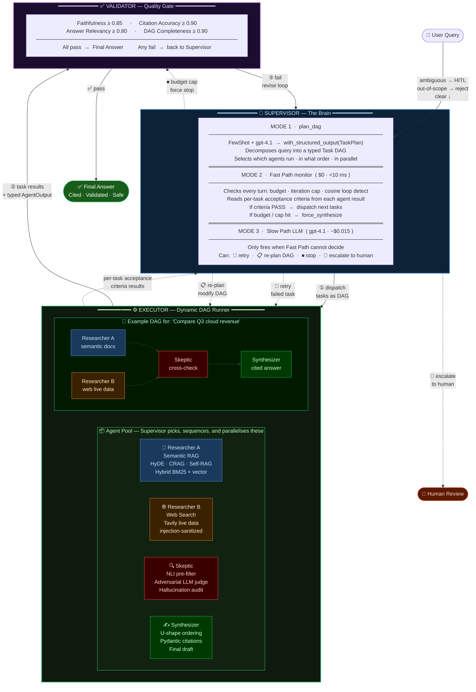
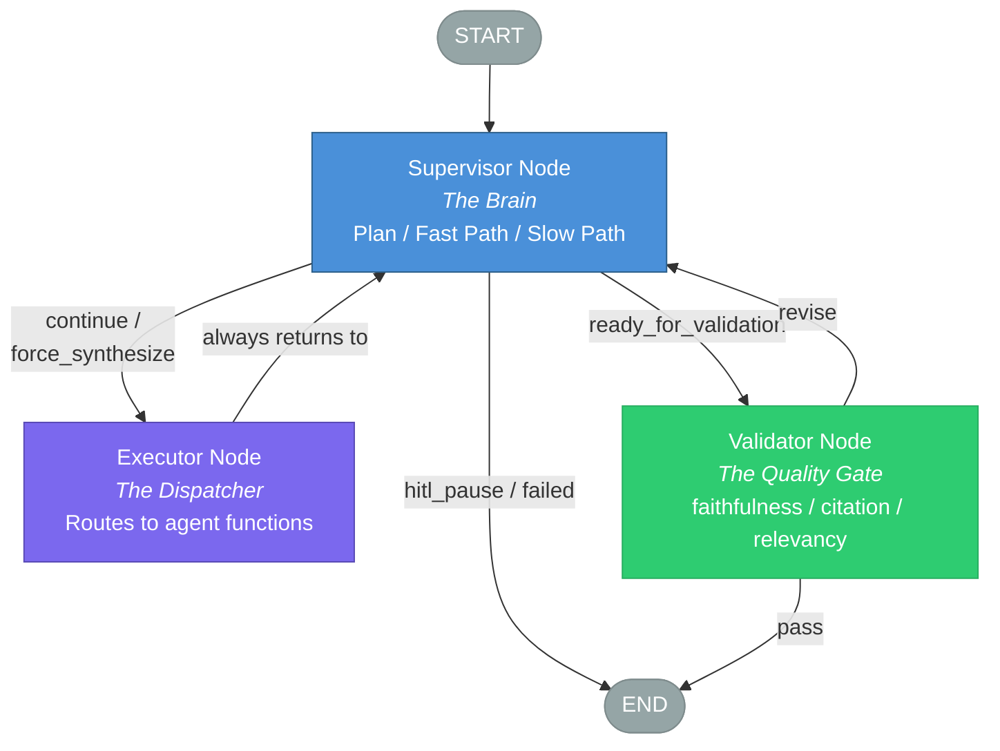
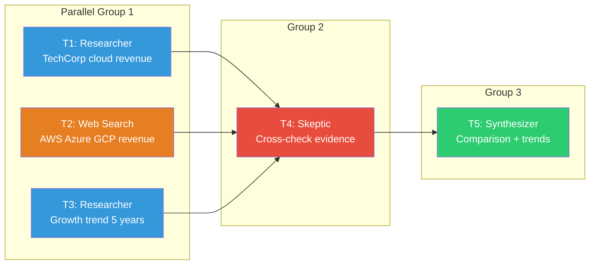
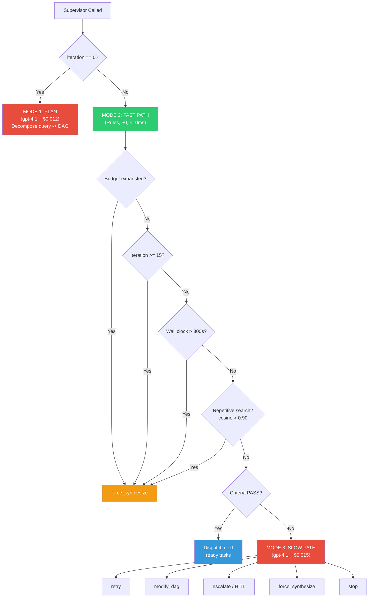

# MASIS — System Overview



> **How to present this:** Start at the top — "the user's query enters and the Supervisor immediately decides if it's even worth processing." Then walk the happy path (plan → dispatch → execute DAG → validate → answer). Then point to the dotted lines — "but the Supervisor never lets go of control: it reads every task result, and can retry, re-plan, force-stop, or escalate to a human at any turn." Finish with the validator loop — "and even after synthesis, the answer must pass four quality gates before the user sees it."

---

# Slide 1: High-Level Design -- "The Brain Trust"

> **Pillar:** High-Level Design (HLD)
> **Time Allocation:** 4-5 minutes
> **Curveball Addressed:** "Why only 3 graph nodes instead of one per agent?" / "Can you explain this to a non-technical CTO?"

---

## System Overview

MASIS (Multi-Agent Supervised Intelligence System) is a **3-node LangGraph StateGraph** that orchestrates a dynamic task DAG for enterprise document research. The graph is the engine; the DAG is the fuel.

### Core Principle: Separation of Concerns

| Concept | What It Is | When Created | Who Creates It |
|---------|-----------|--------------|----------------|
| **LangGraph Execution Graph** | Fixed 3-node structure: Supervisor - Executor - Validator. Built once at startup. Never changes. | `workflow.compile()` at startup | Developer |
| **Task DAG** | Dynamic research plan: `T1(researcher) \|\| T2(web_search) -> T3(skeptic) -> T4(synthesizer)`. Data inside state. | Runtime, Supervisor's first turn | Supervisor LLM (gpt-4.1) |

---

## The 3-Node Architecture



**Three nodes. Two loops. The Supervisor is always in control.**

---

## Why Only 3 Graph Nodes?

The agents (Researcher, Skeptic, Synthesizer, Web Search) are **Python functions called by the Executor** -- NOT separate LangGraph nodes.

```python
# Inside executor -- these are just function calls, NOT graph nodes:
async def dispatch_agent(task: TaskNode, state: MASISState):
    if task.type == "researcher":    return await run_researcher(task, state)
    if task.type == "web_search":    return await run_web_search(task)
    if task.type == "skeptic":       return await run_skeptic(task, state)
    if task.type == "synthesizer":   return await run_synthesizer(task, state)
```

| 3-Node Advantage | Separate-Agent-Node Disadvantage |
|-------------------|-----------------------------------|
| Simple graph -- 3 nodes, easy to reason about | 5+ conditional edges, complex routing |
| Supervisor always sees results between tasks | Supervision gaps between graph steps |
| Easy to add new agent types -- just a new `if` | Need to rewire graph edges |
| DAG drives dispatch -- structural enforcement | LLM might skip the Skeptic |

> **Codebase Reference:** `C:\Users\salil\final_maiss\masis\graph\workflow.py` -- `build_workflow()` function (lines 88-156)

---

## The Dynamic Task DAG

The Supervisor creates a DAG on the first turn using gpt-4.1 with `with_structured_output(TaskPlan)`. Each task has per-task acceptance criteria written in natural language by the LLM.



---

## Supervisor Two-Tier Decision System

The Supervisor uses a **Fast Path / Slow Path** split. In practice, **60-70% of Supervisor runs are Fast Path** -- free and instant.



> **Codebase Reference:** `C:\Users\salil\final_maiss\masis\nodes\supervisor.py` -- `monitor_and_route()` (lines 433-532)

---

## 96 Micro-Features Across 11 Subsystems

| Subsystem | Count | Key Features |
|-----------|-------|-------------|
| MF-SUP: Supervisor | 17 | DAG planning, Fast/Slow Path, HITL escalation, decision logging |
| MF-EXE: Executor | 10 | Send() parallel dispatch, timeout wrapper, rate limiting |
| MF-VAL: Validator | 7 | Faithfulness, citation accuracy, relevancy, completeness gates |
| MF-RES: Researcher | 10 | HyDE, hybrid retrieval, CRAG, Self-RAG, parent expansion |
| MF-SKE: Skeptic | 9 | NLI pre-filter, LLM judge, contradiction reconciliation |
| MF-SYN: Synthesizer | 8 | U-shape ordering, Pydantic citations, partial result mode |
| MF-MEM: State & Memory | 8 | Evidence reducer, immutable query, filtered views, checkpoints |
| MF-HITL: Human-in-the-Loop | 7 | Ambiguity gate, DAG approval, risk gate, cancel support |
| MF-SAFE: Safety | 8 | 3-layer loop prevention, circuit breaker, model fallback |
| MF-API: API & Observability | 8 | 5 REST endpoints, SSE streaming, Prometheus metrics |
| MF-EVAL: Evaluation | 4 | Golden dataset, regression runner, per-scenario testing |
| **TOTAL** | **96** | |

---

## Key Design Decisions

1. **3-node graph, not N-agent graph:** Keeps routing simple, guarantees supervision after every task
2. **DAG as data, not as graph structure:** Enables dynamic modification at runtime (add/remove tasks)
3. **Two-tier Supervisor:** Fast Path eliminates 60-70% of LLM calls, saving ~$0.10/query
4. **Agents as functions, not nodes:** Adding a new agent type = adding one `if` branch
5. **Parallel execution via Send():** LangGraph's `Send()` dispatches independent tasks concurrently

---

## Presenter Talking Points

1. "MASIS uses a 3-node LangGraph StateGraph -- Supervisor, Executor, Validator -- with the task DAG stored as data in state, not as graph topology."

2. "The Supervisor operates in three modes: PLAN on first turn, FAST PATH for 60-70% of subsequent turns at zero cost, and SLOW PATH only when tasks fail criteria."

3. "Agents are Python functions called by the Executor, not separate graph nodes. This means adding a new agent is a one-line change, and the Supervisor always sees results between every single task."

4. "The system implements 96 micro-features across 11 subsystems, with every feature independently testable and traceable to a micro-feature ID."

---

> **Wow Statement:** "We turned a complex multi-agent system into just three graph nodes -- because the smartest architecture is the one that is simple enough to debug at 3 AM."
