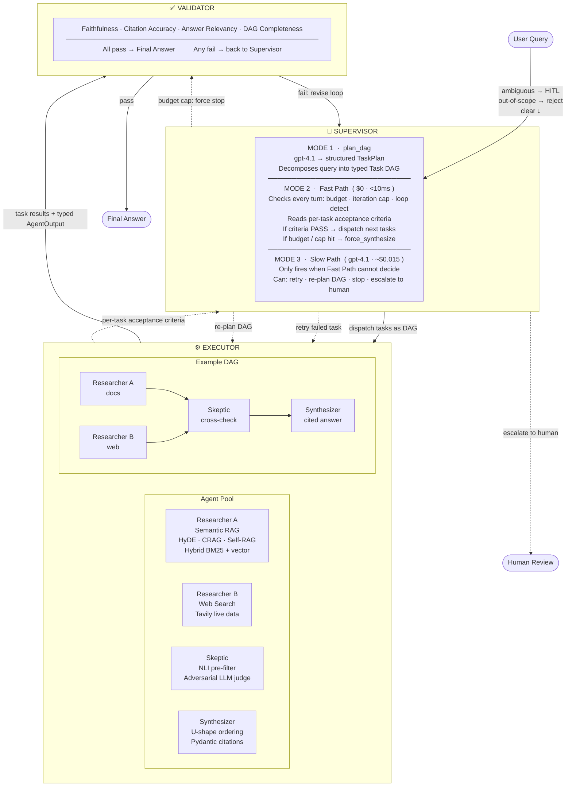
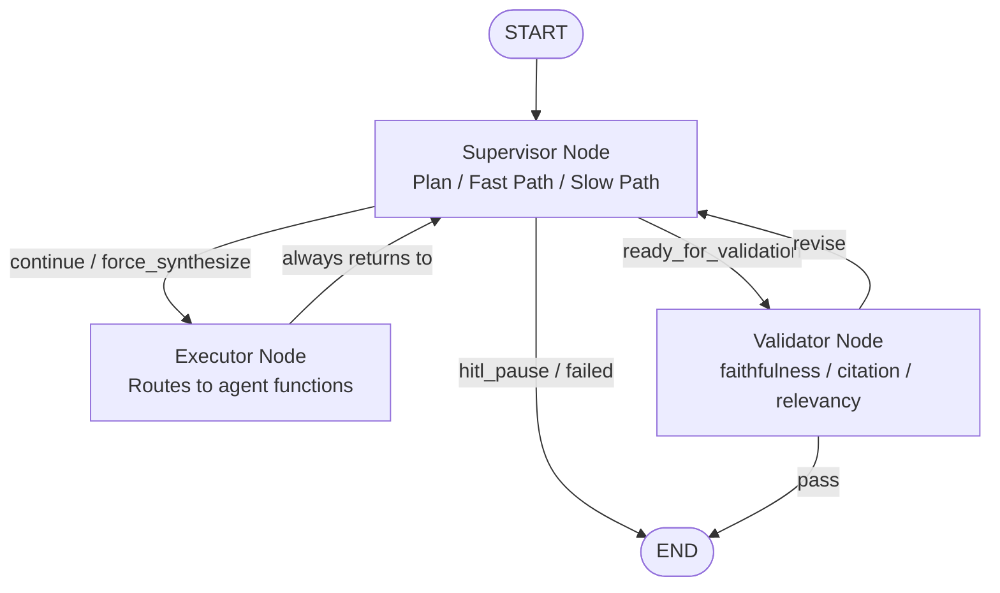
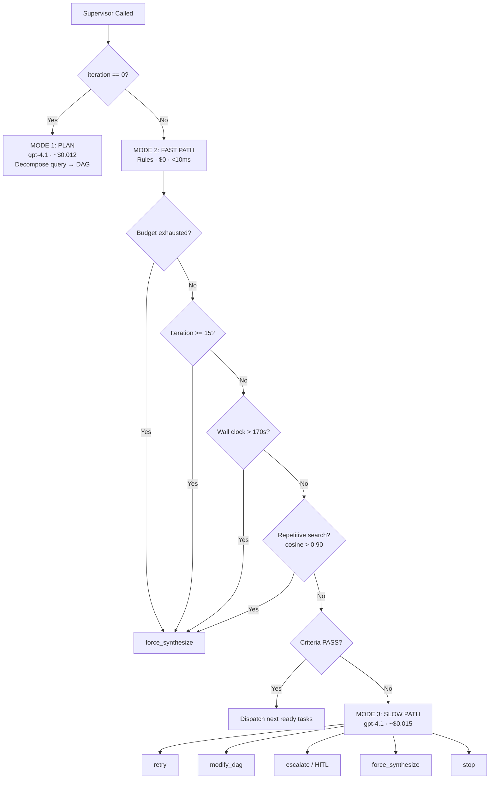
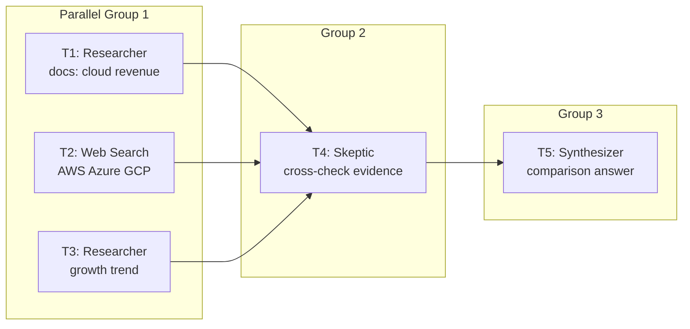

# High-Level Design

MASIS is a **3-node LangGraph StateGraph** that orchestrates a dynamic task DAG for document research. The graph structure is fixed — Supervisor, Executor, Validator. The task plan (who does what and in what order) is data stored inside state, not hardwired into the graph.

---

## System Diagram



---

## Why 3 Graph Nodes?

The graph has exactly 3 nodes: **Supervisor**, **Executor**, **Validator**. The agents (Researcher, Skeptic, Synthesizer, Web Search) are Python functions called by the Executor — not separate LangGraph nodes.

```
LangGraph Execution Graph:   Supervisor ↔ Executor ↔ Validator  (fixed, built once)
Task DAG (inside state):     T1(researcher) || T2(web) → T3(skeptic) → T4(synthesizer)  (dynamic, created at runtime)
```

The split exists because the agents are workhorses — they just execute tasks. The Supervisor is the decision-maker that sees every result and decides what happens next. If each agent were its own graph node, the Supervisor would have no way to intercept between tasks.

```python
# Inside executor — these are function calls, NOT graph nodes:
async def dispatch_agent(task: TaskNode, state: MASISState):
    if task.type == "researcher":    return await run_researcher(task, state)
    if task.type == "web_search":    return await run_web_search(task)
    if task.type == "skeptic":       return await run_skeptic(task, state)
    if task.type == "synthesizer":   return await run_synthesizer(task, state)
```

| 3-Node Design | Per-Agent-Node Design |
|---|---|
| Simple graph — easy to reason about | 5+ conditional edges, complex routing |
| Supervisor sees results between every task | Supervision gaps between graph steps |
| Add new agent = add one `if` branch | Need to rewire graph edges |
| DAG drives dispatch — structural enforcement | LLM might skip the Skeptic |

---

## The 3-Node Flow



Two loops:
1. **Supervisor ↔ Executor** — runs for every task in the DAG
2. **Validator → Supervisor** — runs if quality thresholds aren't met (max 2 rounds)

---

## Supervisor Two-Tier Decision System

The Supervisor runs in three modes. In practice, **60–70% of Supervisor turns use Fast Path** — free and instant.



---

## Dynamic Task DAG

The Supervisor creates the DAG on the first turn using gpt-4.1 with `with_structured_output(TaskPlan)`. Each task has a type, dependencies, parallel group, and natural-language acceptance criteria.



T1, T2, and T3 run in parallel via LangGraph's `Send()`. T4 only starts after all three complete. T5 only starts after T4 passes the Skeptic confidence threshold.

---

## Key Design Decisions

| Decision | Reason |
|---|---|
| 3-node graph, not N-agent graph | Simple routing, supervision after every task |
| DAG as data in state, not graph topology | Enables dynamic modification at runtime |
| Two-tier Supervisor | Fast Path eliminates 60–70% of LLM calls, saves ~$0.10/query |
| Agents as functions, not nodes | Adding a new agent type = one `if` branch |
| Parallel execution via `Send()` | LangGraph dispatches independent tasks concurrently |

---

## Micro-Features by Subsystem

| Subsystem | Count | Key Features |
|---|---|---|
| Supervisor | 17 | DAG planning, Fast/Slow Path, HITL escalation, decision logging |
| Executor | 10 | `Send()` parallel dispatch, timeout wrapper, rate limiting |
| Validator | 7 | Faithfulness, citation accuracy, relevancy, completeness gates |
| Researcher | 10 | HyDE, hybrid retrieval, CRAG, Self-RAG, parent expansion |
| Skeptic | 9 | NLI pre-filter, LLM judge, contradiction reconciliation |
| Synthesizer | 8 | U-shape ordering, Pydantic citations, partial result mode |
| State & Memory | 8 | Evidence reducer, immutable query, filtered views, checkpoints |
| Human-in-the-Loop | 7 | Ambiguity gate, DAG approval, risk gate, cancel support |
| Safety | 8 | 3-layer loop prevention, circuit breaker, model fallback |
| API & Observability | 8 | 5 REST endpoints, SSE streaming, Prometheus metrics |
| Evaluation | 4 | Golden dataset, regression runner, per-scenario testing |

**Total: 96 micro-features across 11 subsystems.**

---

## Relevant Code

| Component | File |
|---|---|
| Graph wiring | `masis/graph/workflow.py` |
| Routing edges | `masis/graph/edges.py` |
| Supervisor node | `masis/nodes/supervisor.py` |
| Executor node | `masis/nodes/executor.py` |
| Schemas | `masis/schemas/models.py` |

---

## Architecture Q&A

Concrete examples of how the design handles real situations.

### How does the Supervisor decompose a query into a task DAG?

On the first turn (`iteration_count == 0`), the Supervisor calls gpt-4.1 with `with_structured_output(TaskPlan)`. The prompt includes few-shot examples so the model knows what a good plan looks like.

```
User: "Compare Infosys's cloud revenue to competitors and analyze growth trends"

gpt-4.1 output (Pydantic-enforced TaskPlan):
  T1(researcher, "Infosys cloud Q3 revenue", group=1,
     criteria: "≥2 chunks, pass_rate≥0.30, grounded")
  T2(web_search, "AWS Azure GCP Q3 revenue", group=1,
     criteria: "≥1 relevant result")
  T3(researcher, "Infosys cloud growth trend 5 years", group=1,
     criteria: "≥2 chunks, pass_rate≥0.30, grounded")
  T4(skeptic, "cross-check all evidence", group=2,
     criteria: "0 contradicted, confidence≥0.65")
  T5(synthesizer, "comparison + trend analysis", group=3,
     criteria: "all claims cited")
```

The LLM writes `acceptance_criteria` as a natural language string for each task. The Fast Path then parses and checks these against the agent's structured output — no LLM needed at check time.

### How does the Supervisor monitor execution?

The Supervisor runs after every single task (because `executor → supervisor` is a hard edge). It reads `last_task_result` from state — never the full evidence.

```
Iteration 1: Supervisor PLANS → dispatches T1
Iteration 2: T1 done → Supervisor reads T1.output → Fast Path PASS → dispatch T2
Iteration 3: T2 done → Supervisor reads T2.output → Fast Path FAIL (pass_rate=0.10)
             → Slow Path → "Modify DAG, add T2b(web_search)"
Iteration 4: T2b done → Supervisor reads T2b.output → Fast Path PASS → dispatch T3
```

What the Supervisor sees (summaries only, never raw evidence):
```python
supervisor_view = {
    "original_query": state["original_query"],
    "task_dag": state["task_dag"],           # task statuses
    "last_task_result": {
        "task_id": "T2",
        "summary": result.summary[:500],     # 200 tokens max
        "status": "failed",
        "criteria_check": {"pass_rate": 0.10, "threshold": 0.30, "verdict": "FAIL"},
    },
    "iteration_count": 3,
    "token_budget": {"used": 12000, "remaining": 188000},
}
```

### How does the Supervisor decide: retry, escalate, or stop?

Fast Path first (free, <10ms), Slow Path only if criteria fail.

```
Fast Path (deterministic):
  Budget exhausted?            → force_synthesize
  Iteration limit (15)?        → force_synthesize
  Repetitive search (cosine > 0.9)? → force_synthesize
  Agent criteria PASS?         → dispatch next ready task
  No more ready tasks?         → ready_for_validation

Slow Path (gpt-4.1, ~$0.015, when Fast Path criteria FAIL):
  LLM sees: failed_task + task_dag + budget + iteration_count
  Returns structured decision:
    retry:          rewrite query and re-dispatch
    modify_dag:     add/remove tasks, update dependencies
    escalate:       interrupt() → user decides
    force_synthesize: partial answer with caveat
    stop:           unrecoverable failure
```

Concrete example:
```
CASE A: Researcher pass_rate=0.15 (near threshold)
  Slow Path: "Near-miss. Rewrite query and retry once."

CASE B: Skeptic confidence=0.38, contradictions=3
  Slow Path: "Contradictions are severe. Escalating to human."
  → interrupt({type: "contradictions", details: [...], options: [...]})
```

### How does the system handle invalid task types from the LLM?

Three layers prevent bad task routing:

```
Layer 1 — Pydantic Structured Output:
  Supervisor returns TaskPlan via with_structured_output(TaskPlan).
  If LLM tries type="analyzer" (not valid):
  → Pydantic ValidationError → caught → retry with corrected prompt

Layer 2 — Executor Dispatch Guard:
  if task.type not in VALID_TYPES:
      return AgentError(task_id=task.task_id, error="unknown_agent_type",
                        suggestion="Valid: researcher, web_search, skeptic, synthesizer")

Layer 3 — Supervisor Slow Path:
  Agent errors appear in last_task_result.
  LLM decides: retry with corrected task, skip, or escalate.
```
