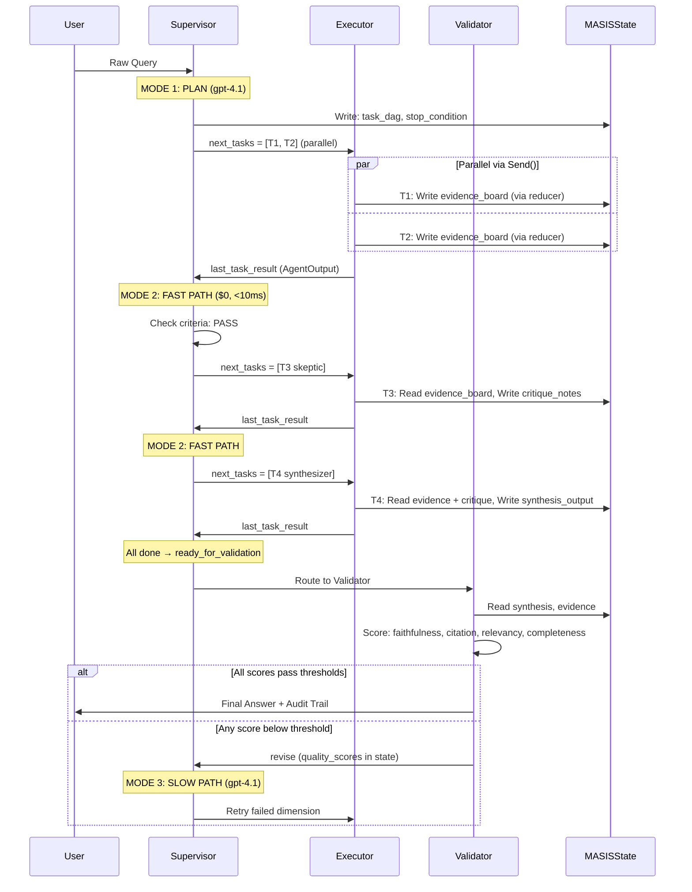

# Low-Level Design

This document covers the internal data structures, state schema, agent dispatch flow, and routing logic that make MASIS work.

---

## MASISState: The Shared Whiteboard

Everything flows through a single `MASISState` TypedDict. LangGraph nodes return partial dicts — only the keys they modify. Agents don't talk to each other directly; they read from and write to this shared state.

```python
# masis/schemas/models.py

class MASISState(TypedDict, total=False):
    # Immutable query identity
    original_query: str                              # NEVER modified after first turn
    query_id: str                                    # UUID for checkpoint + tracing

    # Supervisor-owned
    task_dag: List[TaskNode]                          # Dynamic DAG
    stop_condition: str                              # When is the query "done"?
    iteration_count: int                             # Global counter
    next_tasks: List[TaskNode]                       # Tasks to dispatch next
    supervisor_decision: str                         # Routing output for edges
    last_task_result: Optional[AgentOutput]           # Most recent agent output

    # Evidence whiteboard (parallel-safe via custom reducer)
    evidence_board: Annotated[List[EvidenceChunk], evidence_reducer]

    # Agent results
    critique_notes: Optional[SkepticOutput]           # Skeptic findings
    synthesis_output: Optional[SynthesizerOutput]     # Final answer

    # Quality & validation
    quality_scores: Dict[str, float]
    validation_round: int                            # Capped at 2

    # Budget & safety
    token_budget: BudgetTracker                      # 200K tokens / $0.50 / 300s
    api_call_counts: Dict[str, int]                  # Per-agent rate limiting

    # Audit
    decision_log: List[Dict[str, Any]]               # Every Supervisor decision
```

---

## Evidence Deduplication Reducer

When two parallel Researchers retrieve the same chunk, the reducer keeps only the copy with the highest retrieval score. This is registered via Python's `Annotated` type — LangGraph calls it automatically on every state update.

```python
# masis/schemas/models.py

def evidence_reducer(
    existing: List[EvidenceChunk],
    new: List[EvidenceChunk],
) -> List[EvidenceChunk]:
    """Dedup by (doc_id, chunk_id). Keep highest score."""
    index: Dict[tuple, EvidenceChunk] = {}
    for chunk in existing:
        key = (chunk.doc_id, chunk.chunk_id)
        index[key] = chunk
    for chunk in new:
        key = (chunk.doc_id, chunk.chunk_id)
        if key not in index or chunk.retrieval_score > index[key].retrieval_score:
            index[key] = chunk
    return list(index.values())

# Usage in state:
evidence_board: Annotated[List[EvidenceChunk], evidence_reducer]
# Agents just return: {"evidence_board": result.evidence}
# The reducer merges — it does NOT replace.
```

State grows linearly with unique evidence, not with task count. No locks needed.

---

## Execution Flow (Sequence Diagram)



---

## Filtered State Views Per Agent

Each agent sees only what it needs. The Supervisor never sees full evidence chunks.

| Agent | Sees | Does NOT See |
|---|---|---|
| **Supervisor** | `original_query`, `task_dag` (statuses), `last_task_result.summary` (500 chars max), `token_budget`, `iteration_count` | Full `evidence_board`, `critique_notes`, `synthesis_output` |
| **Researcher** | `task.query` (its own sub-question only) | Other researchers' evidence, `task_dag`, budget |
| **Skeptic** | All `evidence_board` chunks (needs cross-doc analysis), `task_dag` | Budget, `iteration_count`, other agent summaries |
| **Synthesizer** | `evidence_board` (U-shape ordered), `critique_notes`, `task_dag` | Budget, raw retrieval scores |
| **Validator** | `synthesis_output`, `evidence_board`, `original_query`, `task_dag` | Budget, `decision_log` |

The Supervisor makes routing decisions from 500-char summaries, not 100,000 chars of raw evidence. This keeps its context window small and its decisions fast.

---

## Pydantic Schema Hierarchy


---

## Routing Logic

Routing is pure Python — reads one string field, returns next node name. No LLM involved.

```python
# masis/graph/edges.py

def route_supervisor(state: MASISState) -> str:
    decision = state.get("supervisor_decision", "failed")

    if decision == "continue":             return "executor"
    if decision == "ready_for_validation": return "validator"
    if decision == "force_synthesize":     return "executor"  # executor checks flag
    if decision == "hitl_pause":           return END
    if decision == "failed":               return END
    return END

def route_validator(state: MASISState) -> str:
    if state.get("validation_pass", False): return END
    return "supervisor"
```

| Decision | Next Node | When |
|---|---|---|
| `"continue"` | Executor | Normal task dispatch |
| `"ready_for_validation"` | Validator | All DAG tasks complete |
| `"force_synthesize"` | Executor | Budget/time/repetition cap hit |
| `"hitl_pause"` | END | Human review needed |
| `"failed"` | END | Unrecoverable error |
| Validator `pass` | END | All quality gates met |
| Validator `revise` | Supervisor | At least one threshold missed |

---

## Tool Exposure Per Agent

| Capability | Supervisor | Researcher | Skeptic | Synthesizer | Validator |
|---|:---:|:---:|:---:|:---:|:---:|
| gpt-4.1 | Yes | — | — | Yes | — |
| gpt-4.1-mini | — | Yes | — | — | — |
| o3-mini | — | — | Yes | — | — |
| ChromaDB vector search | — | Yes | — | — | — |
| BM25 keyword search | — | Yes | — | — | — |
| Cross-encoder reranking | — | Yes | — | — | — |
| BART-MNLI (NLI) | — | — | Yes | Yes (post-hoc) | Yes |
| Tavily web search | — | Yes (via task type) | — | — | — |
| `interrupt()` (HITL) | Yes | — | — | — | — |
| Pydantic structured output | Yes | Yes | Yes | Yes | — |

---

## Relevant Code

| Component | File |
|---|---|
| State schema | `masis/schemas/models.py` |
| Graph wiring | `masis/graph/workflow.py` |
| Routing edges | `masis/graph/edges.py` |
| Supervisor modes | `masis/nodes/supervisor.py` |
| Evidence reducer | `masis/schemas/models.py` — `evidence_reducer()` |
