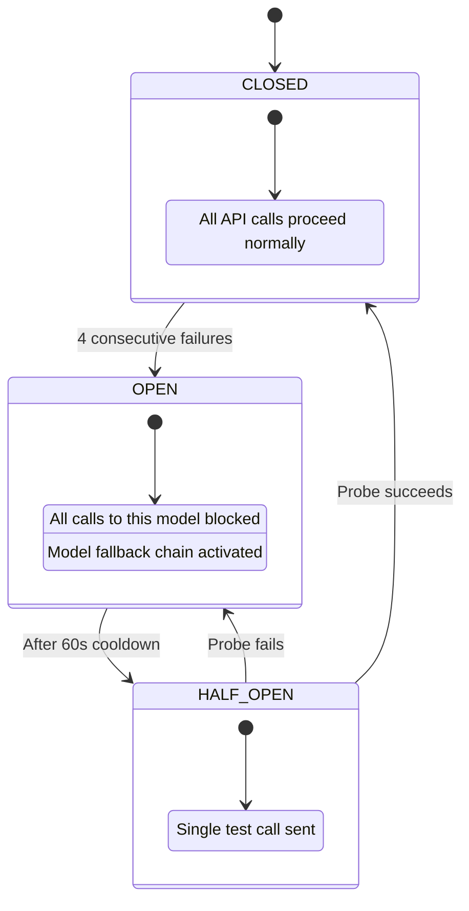

# Research & Technology Choices

This document covers why MASIS is built the way it is — framework choice, model selection, and the RAG techniques used inside each agent.

---

## Why LangGraph?

| Criterion | LangGraph | CrewAI | AutoGen | Bare LangChain |
|---|:---:|:---:|:---:|:---:|
| Native DAG with conditional edges | Yes | No (sequential/hierarchical) | Partial (conversation-based) | No (LCEL is linear) |
| Built-in state persistence (checkpointing) | Yes | No | No | No |
| `interrupt()` + `Command(resume=...)` for HITL | Yes | No | No | No |
| `Send()` for fan-out parallelism | Yes | Limited | Limited | No |
| Typed state schema (TypedDict + Annotated reducers) | Yes | No | No | No |
| Production-grade checkpoint after every super-step | Yes | No | No | No |
| Fine-grained control flow (you define every edge) | Yes | No | No (agent-to-agent chat) | Partial |

The core requirement was: checkpointed state + HITL interrupt/resume + conditional edges + `Send()` fan-out + typed reducers — all first-class. The alternatives would require building these from scratch.

Relevant files: `masis/graph/workflow.py` uses `StateGraph`, `Send`, `interrupt`, `Command`, `InMemorySaver`.

---

## Model Selection

### Why These Models?

Picking models for a multi-agent system isn't just "best model = use everywhere." Each agent has a different job.

| Role | Model | Why | Safe to Swap? |
|---|---|---|:---:|
| Supervisor (plan + slow path) | gpt-4.1 | DAG decomposition requires solid instruction-following and structured output reliability. Bad plans cascade everywhere. gpt-4.1 scores 90.7% on IFEval vs 83.6% for gpt-4o. | No |
| Researcher | gpt-4.1-mini | Runs in a tight loop — chunk grading, query rewriting, relevance classification. 5–8 calls per query, classification-level work. 60× cheaper than gpt-4.1 with no meaningful quality drop for these tasks. | Yes (to gpt-4.1-nano) |
| Skeptic LLM judge | o3-mini | Adversarial reasoning model — finds holes in arguments, not just summarizes. Scores 63% on AIME 2024 vs 26% for gpt-4.1. Also: different model family from Synthesizer = anti-sycophancy by design. | Careful |
| Synthesizer | gpt-4.1 | User-facing quality, citation enforcement, coherent 500-word answers from 15 chunks. Degraded quality with cheaper models. | No |
| Ambiguity detector | gpt-4.1-mini | Simple binary classification per query. One call. | Yes |
| Embedder | text-embedding-3-small | Cost-optimal ($0.02/1M tokens). MTEB retrieval score 59.8 — sufficient for domain-specific corpus. BM25 covers exact term matching. | Yes |
| NLI model (all agents) | facebook/bart-large-mnli | Free, runs locally, deterministic, <100ms per claim. Used in Skeptic (stage 1 pre-filter), Synthesizer (citation verification), and Validator (faithfulness scoring). | N/A |
| Reranker | cross-encoder/ms-marco-MiniLM-L-6-v2 | Free, local, deterministic. Used after hybrid retrieval to pick top-K chunks. | Yes |

### Model Routing Configuration

```python
# Referenced in architecture — configurable via environment variables

MODEL_ROUTING = {
    "supervisor_plan":    os.getenv("MODEL_SUPERVISOR", "gpt-4.1"),
    "supervisor_slow":    os.getenv("MODEL_SUPERVISOR", "gpt-4.1"),
    "researcher":         os.getenv("MODEL_RESEARCHER", "gpt-4.1-mini"),
    "skeptic_llm":        os.getenv("MODEL_SKEPTIC", "o3-mini"),
    "synthesizer":        os.getenv("MODEL_SYNTHESIZER", "gpt-4.1"),
    "ambiguity_detector": os.getenv("MODEL_AMBIGUITY", "gpt-4.1-mini"),
    "embedding":          "text-embedding-3-small",
    "nli":                "facebook/bart-large-mnli",
    "reranker":           "cross-encoder/ms-marco-MiniLM-L-6-v2",
}
```

### Anti-Sycophancy: Why Skeptic Uses o3-mini, Not gpt-4.1

Using a different model family from the Synthesizer ensures the critic doesn't "agree with" the answer generator. Same-family models tend to rate their own outputs more favorably. This is a known issue in LLM-as-judge pipelines. o3-mini is also a reasoning model — it's specifically better at finding logical gaps than at producing fluent prose, which is exactly what a Skeptic should do.

---

## RAG Pipeline: HyDE + CRAG + Self-RAG

Three complementary techniques in the Researcher pipeline. They're layered — each addresses a different failure mode.

### HyDE — Hypothetical Document Embeddings

**Problem:** Short factual queries ("Q3 revenue?") produce poor embedding similarity with long document passages.

**Solution:** Generate a hypothetical answer passage and embed that instead.

```
Query:     "What was Q3 revenue?"
HyDE:      "Infosys posted Q3 FY25 revenue of approximately $5B..."
Embedding: [HyDE passage] → much closer to actual doc passages in vector space
```

File: `masis/agents/researcher.py` — `hyde_rewrite()`

### CRAG — Corrective RAG

**Problem:** First retrieval may return irrelevant chunks for ambiguous queries.

**Solution:** Grade each chunk for relevance. If `pass_rate < 0.30`, rewrite the query and retry (max 1 retry).

```
Attempt 1: "Infosys market share" → 1/5 relevant (pass_rate=0.20) → RETRY
Attempt 2: "Infosys competitive position market" → 3/5 relevant (pass_rate=0.60) → PASS
```

CRAG retry cap: `crag_max_retries = 1` (set in `masis/schemas/thresholds.py`).

### Self-RAG — Self-Grounded Answer Generation

**Problem:** LLMs may add facts not present in the evidence.

**Solution:** After generation, verify grounding. If not grounded, regenerate (max 1 retry).

```
Generate: "Revenue grew 25%" — but evidence says 12%
Self-RAG check: "Is this grounded in evidence?" → NO
Regenerate: "Revenue grew 12% to $5,099M" → GROUNDED
```

Self-RAG retry cap: `self_rag_max_retries = 1`.

---

## U-Shape Context Ordering

**Problem:** LLMs attend most to the beginning and end of their context window. Information in the middle gets lost.

**Solution:** Reorder evidence chunks by score — best at start, second-best at end, weakest in middle.

```python
def u_shape_order(chunks):
    sorted_chunks = sorted(chunks, key=lambda c: c.rerank_score, reverse=True)
    result = []
    for i, chunk in enumerate(sorted_chunks):
        if i % 2 == 0:
            result.insert(0, chunk)   # Best → start (high attention)
        else:
            result.append(chunk)       # 2nd best → end (high attention)
    return result

# Input scores:  [0.92, 0.87, 0.74, 0.69]
# Output order:  [0.74, 0.92, 0.69, 0.87]
#                              ^^^^        ^^^^
#                              START      END  ← highest attention zones
```

---

## Skeptic Two-Stage Pipeline

Runs two stages sequentially to keep cost low while maintaining quality.

| Stage | Model | Cost | Latency | Purpose |
|---|---|---|---|---|
| Stage 1: NLI | BART-MNLI (local) | $0.00 | <100ms per claim | Fast, deterministic contradiction/entailment detection |
| Stage 2: LLM | o3-mini (cloud) | ~$0.008 | ~1.5s | Deep analysis of flagged issues, adversarial critique, reconciliation |

Stage 1 filters ~80% of claims as "supported" — only flagged claims go to the expensive Stage 2.

The confidence output from o3-mini is categorical ("high", "medium", "low"). MASIS maps these to floats before applying the 0.65 threshold:

```python
_CATEGORICAL_CONFIDENCE_MAP = {
    "very_high": 0.92, "high": 0.82,
    "medium_high": 0.72, "medium": 0.62,
    "medium_low": 0.48, "low": 0.35, "very_low": 0.20,
}
```

This mapping was added because o3-mini returns categorical strings, not floats, which caused the original code to silently fall back to heuristic confidence (~0.52–0.56), below the 0.65 threshold, causing unnecessary retry loops.

---

## Circuit Breaker Pattern

3-state circuit breaker for API resilience. Prevents cascading failures when a model API is down.



**Model Fallback Chains:**

| Agent | Primary | Fallback | Last Resort |
|---|---|---|---|
| Researcher | gpt-4.1-mini | gpt-4.1 | Return partial (0 chunks) |
| Skeptic LLM | o3-mini | gpt-4.1 | Skip critique (with warning) |
| Synthesizer | gpt-4.1 | gpt-4.1 (retry) | Return evidence summary only |
| Supervisor | gpt-4.1 | gpt-4.1 (retry) | force_synthesize |

---

## Two-Tier Supervisor Cost Savings

| Metric | Naive (LLM every turn) | MASIS Two-Tier |
|---|:---:|:---:|
| Supervisor LLM calls/query | ~10 | 2–4 |
| Supervisor cost/query | ~$0.15–0.20 | ~$0.04–0.06 |
| Supervisor latency | 10 × 3s = 30s | 4 Fast (0ms) + 2 Slow (6s) = 6s |
| Total query cost (typical) | ~$0.25+ | ~$0.04–0.10 |

60–70% of Supervisor turns use Fast Path — free, rule-based, <10ms. Slow Path fires only when a task fails criteria. This cuts per-query cost by 60–70% compared to naive multi-agent approaches.

---

## Skeptic Prompt Design

The Skeptic's job is adversarial. Its prompt enforces this. The 3-issue minimum means it cannot rubber-stamp evidence even when things look clean.

```python
SKEPTIC_PROMPT = """You are a research auditor. Your job is to CHALLENGE evidence.

RULES:
1. You MUST identify at least 3 potential issues (even minor ones)
2. Flag any claim that relies on a single source
3. Flag any forward-looking statement used as fact
4. Flag any claim where the source is older than 2 years
5. Flag any logical leap between evidence and conclusion

For each issue, classify:
  - CRITICAL: contradicts source evidence
  - WARNING: weak evidence, single-source, or outdated
  - INFO: minor concern, acceptable with disclaimer
"""
```

Example — single-source weakness detection:
```
Evidence: Only chunk_12 mentions "12% growth"
Skeptic: WARNING — "12% growth claim relies on single source (Annual Report p.42).
         No corroboration from quarterly reports or press releases."
```

---

## Model Swap Guide

All model assignments live in one place and are overridable via environment variables.

```python
MODEL_ROUTING = {
    "supervisor_plan":    os.getenv("MODEL_SUPERVISOR", "gpt-4.1"),
    "supervisor_slow":    os.getenv("MODEL_SUPERVISOR", "gpt-4.1"),
    "researcher":         os.getenv("MODEL_RESEARCHER", "gpt-4.1-mini"),
    "skeptic_llm":        os.getenv("MODEL_SKEPTIC", "o3-mini"),
    "synthesizer":        os.getenv("MODEL_SYNTHESIZER", "gpt-4.1"),
    "ambiguity_detector": os.getenv("MODEL_AMBIGUITY", "gpt-4.1-mini"),
}

# Swap via .env:
# MODEL_RESEARCHER=gpt-4.1-nano
# MODEL_AMBIGUITY=gpt-4.1-nano

# Or per-query at runtime:
result = graph.invoke(
    {"original_query": "...", "model_overrides": {"researcher": "gpt-4.1-nano"}},
    config
)
```

| Role | Safe to swap? | Risk if downgraded |
|---|:---:|---|
| Researcher | Yes → gpt-4.1-mini → gpt-4.1-nano | Lower grading quality, more CRAG retries |
| Ambiguity Detector | Yes | Slightly more false positives |
| Skeptic LLM | Careful | Cheaper models miss subtle contradictions |
| Supervisor | Not recommended | Bad DAG plans cascade everywhere |
| Synthesizer | Not recommended | User-facing answer quality drops |

---

## RAG Pipeline Constants

Key numeric config values for the Researcher pipeline:

```python
TOP_K_RETRIEVAL = 10      # chunks retrieved by vector + BM25 each
RERANK_TOP_N = 5          # chunks kept after cross-encoder rerank
MAX_DOC_GRADING_RETRIES = 1   # CRAG retries inside pipeline
MAX_HALLUCINATION_RETRIES = 1  # Self-RAG retries

CHUNK_SIZE_PARENT = 2000  # chars — full context window for LLM
CHUNK_SIZE_CHILD = 500    # chars — search window for retrieval
CHUNK_OVERLAP = 50        # chars

RRF_K = 60                # Reciprocal Rank Fusion constant
BM25_WEIGHT = 0.3
VECTOR_WEIGHT = 0.7

EMBEDDING_MODEL = "text-embedding-3-small"
RERANKER_MODEL  = "cross-encoder/ms-marco-MiniLM-L-6-v2"
```

Parent-child chunking means: child chunks (500 chars) are searched for precision, then their parent chunks (2000 chars) are retrieved to give the LLM full context. You get the best of both worlds — narrow search + wide reading window.

---

## Ambiguity Detector

Pre-Supervisor gate. Classifies the query before any DAG planning or agent work.

```python
class AmbiguityClassification(BaseModel):
    category: Literal["CLEAR", "AMBIGUOUS", "OUT_OF_SCOPE"]
    score: float
    clarification_options: Optional[list[str]] = None

async def ambiguity_detector(state: MASISState) -> dict:
    llm = ChatOpenAI(model="gpt-4.1-mini", temperature=0.1)
    result = await llm.with_structured_output(AmbiguityClassification).ainvoke([
        SystemMessage(content=AMBIGUITY_PROMPT),
        HumanMessage(content=state["original_query"]),
    ])

    if result.category == "CLEAR":
        return {}  # pass through to Supervisor

    elif result.category == "OUT_OF_SCOPE":
        return {"supervisor_decision": "failed", "reason": "out_of_scope"}

    else:  # AMBIGUOUS
        interrupt({
            "type": "ambiguous_query",
            "score": result.score,
            "options": result.clarification_options,
        })
```

Three query types handled:
```
"What was Q3 revenue?"           → CLEAR (0.12)    → proceed to Supervisor
"How is the tech division?"      → AMBIGUOUS (0.84) → interrupt for clarification
"What's the weather in Mumbai?"  → OUT_OF_SCOPE (0.95) → reject, $0 cost
```

---

## Circuit Breaker Implementation

```python
class BreakerState(Enum):
    CLOSED   = "closed"     # Normal operation
    OPEN     = "open"       # Failing — use fallback
    HALF_OPEN = "half_open" # Probing — try one call

class CircuitBreaker:
    def __init__(self, failure_threshold=4, recovery_timeout=60):
        self.state = BreakerState.CLOSED
        self.failure_count = 0
        self.last_failure_time = 0

    async def call(self, func, *args, fallback_func=None, **kwargs):
        if self.state == BreakerState.OPEN:
            if time.time() - self.last_failure_time > self.recovery_timeout:
                self.state = BreakerState.HALF_OPEN
            else:
                if fallback_func:
                    return await fallback_func(*args, **kwargs)
                raise CircuitBreakerOpenError()

        try:
            result = await func(*args, **kwargs)
            if self.state == BreakerState.HALF_OPEN:
                self.state = BreakerState.CLOSED
                self.failure_count = 0
            return result

        except Exception:
            self.failure_count += 1
            self.last_failure_time = time.time()
            if self.failure_count >= self.failure_threshold:
                self.state = BreakerState.OPEN
            if fallback_func:
                return await fallback_func(*args, **kwargs)
            raise
```

Trace (gpt-4.1-mini API failures):
```
Calls 1–4: gpt-4.1-mini → 429 errors → failure count 4/4 → breaker OPEN
Call 5+:   breaker OPEN → fallback: gpt-4.1 → SUCCESS (transparent to Supervisor)
After 60s: probe gpt-4.1-mini → SUCCESS → breaker CLOSED (back to normal)
```
