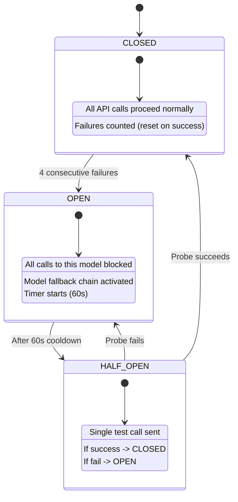

# Slide 3: Research & Technology Choices -- "Why These Choices?"

> **Pillar:** Research & Justification
> **Time Allocation:** 4-5 minutes
> **Curveball Addressed:** "Why LangGraph over CrewAI/AutoGen?" / "Where would you swap GPT-4-class for smaller SLMs?" / "Why not a single-agent RAG?"

---

## Framework Choice: LangGraph StateGraph

### Why LangGraph, Not Alternatives?

| Criterion | LangGraph | CrewAI | AutoGen | Bare LangChain |
|-----------|:---------:|:------:|:-------:|:--------------:|
| Native DAG with conditional edges | Yes | No (sequential or hierarchical) | Partial (conversation-based) | No (LCEL is linear) |
| Built-in state persistence (checkpointing) | Yes (PostgresSaver, InMemorySaver) | No | No | No |
| `interrupt()` + `Command(resume=...)` for HITL | Yes (first-class API) | No | No | No |
| `Send()` for fan-out parallelism | Yes | Limited | Limited | No |
| LangSmith / Langfuse tracing integration | Yes (native) | Partial | No | Yes |
| Typed state schema (TypedDict + Annotated reducers) | Yes | No | No | No |
| Production-grade state management | Yes (checkpoint after every super-step) | No | No | No |
| Fine-grained control flow | Yes (you define every edge) | No (framework decides) | No (agent-to-agent chat) | Partial |

> **Verdict:** LangGraph is the only framework that gives us checkpointed state + HITL interrupt/resume + conditional edges + fan-out Send() + typed reducers. The alternatives would require building these from scratch.

> **Codebase Reference:** `C:\Users\salil\final_maiss\masis\graph\workflow.py` -- uses `StateGraph`, `Send`, `interrupt`, `Command`, `InMemorySaver`

---

## Model Selection: Cost vs Capability vs Latency

### Model Routing Table (Centralized Configuration)

```python
# File: masis/config/model_routing.py (referenced in architecture)

MODEL_ROUTING = {
    "supervisor_plan":    os.getenv("MODEL_SUPERVISOR", "gpt-4.1"),        # Complex reasoning
    "supervisor_slow":    os.getenv("MODEL_SUPERVISOR", "gpt-4.1"),        # Decision making
    "researcher":         os.getenv("MODEL_RESEARCHER", "gpt-4.1-mini"),   # High-volume, cheap
    "skeptic_llm":        os.getenv("MODEL_SKEPTIC", "o3-mini"),          # Anti-sycophancy
    "synthesizer":        os.getenv("MODEL_SYNTHESIZER", "gpt-4.1"),       # User-facing quality
    "ambiguity_detector": os.getenv("MODEL_AMBIGUITY", "gpt-4.1-mini"),    # Simple classification
    "embedding":          "text-embedding-3-small",                        # Cost-optimal embedding
    "nli":                "facebook/bart-large-mnli",                      # Free, local, deterministic
    "reranker":           "cross-encoder/ms-marco-MiniLM-L-6-v2",         # Free, local
}
```

### Cost/Capability Tradeoff Chart

```python
# Interactive Plotly chart -- run to generate
import plotly.express as px
import pandas as pd

df = pd.DataFrame({
    'Model': ['gpt-4.1', 'gpt-4.1-mini', 'o3-mini', 'text-embed-3-small',
              'BART-MNLI', 'ms-marco-MiniLM', 'Llama-3-8B (fallback)'],
    'Cost_per_1M_tokens': [15.0, 0.30, 4.0, 0.02, 0.0, 0.0, 0.10],
    'Capability_Score': [95, 72, 80, 60, 65, 70, 65],
    'Latency_ms': [2000, 500, 1200, 100, 50, 30, 300],
    'Agent_Role': ['Supervisor + Synthesizer', 'Researcher + Ambiguity',
                   'Skeptic LLM Judge', 'Embedder (vector DB)',
                   'Skeptic NLI (free/local)', 'Reranker (free/local)',
                   'Fallback SLM']
})

fig = px.scatter(df, x='Cost_per_1M_tokens', y='Capability_Score',
                 size='Latency_ms', color='Agent_Role',
                 text='Model',
                 title='MASIS Model Selection: Cost vs Capability vs Latency',
                 labels={'Cost_per_1M_tokens': 'Cost per 1M Tokens ($)',
                         'Capability_Score': 'Capability Score (0-100)'},
                 size_max=50)
fig.update_traces(textposition='top center')
fig.update_layout(width=900, height=550)
fig.show()
```

### Why This Model Assignment?

| Role | Model | Justification | Safe to Swap? |
|------|-------|--------------|:-------------:|
| Supervisor (Plan + Slow) | gpt-4.1 | Complex reasoning, DAG decomposition, few calls (1-3/query) | No -- bad plans cascade |
| Researcher | gpt-4.1-mini | High-volume (5-8 calls/query), simple grading tasks, cost-sensitive | Yes -- to gpt-4.1-nano |
| Skeptic NLI (Stage 1) | BART-MNLI | Free, local, deterministic, <100ms per claim | N/A (already free) |
| Skeptic LLM (Stage 2) | o3-mini | **Different model family** from Synthesizer = anti-sycophancy | Careful -- may miss contradictions |
| Synthesizer | gpt-4.1 | User-facing quality, citation enforcement, few calls (1-2/query) | No -- quality drops |
| Ambiguity Detector | gpt-4.1-mini | Simple classification task, one call per query | Yes -- to gpt-4.1-nano |
| Embedder | text-embedding-3-small | Cost-optimal ($0.02/1M tokens), sufficient quality for RAG | Yes -- to local model |

---

## RAG Pipeline Justification: HyDE + CRAG + Self-RAG

### Why HyDE Query Rewriting? (MF-RES-01)

**Problem:** Short factual queries ("Q3 revenue?") produce poor embedding similarity with long document passages.

**Solution:** Generate a hypothetical answer passage and embed THAT instead.

```
Query:     "What was Q3 revenue?"
HyDE:      "TechCorp posted Q3 FY26 revenue of approximately..."
Embedding: [HyDE passage] -> much closer to actual doc passages in vector space
```

> **Codebase Reference:** `C:\Users\salil\final_maiss\masis\agents\researcher.py` -- `hyde_rewrite()` (lines 199-239)

### Why CRAG (Corrective RAG)? (MF-RES-05)

**Problem:** First retrieval may return irrelevant chunks for ambiguous queries.

**Solution:** Grade each chunk for relevance. If pass_rate < 0.30, rewrite query and retry (up to 3 times).

```
Attempt 1: "TechCorp market share" -> 1/5 relevant (pass_rate=0.20) -> RETRY
Attempt 2: "TechCorp competitive position market" -> 3/5 relevant (pass_rate=0.60) -> PASS
```

### Why Self-RAG? (MF-RES-06)

**Problem:** LLMs may add facts not present in the evidence (hallucination).

**Solution:** After generation, verify grounding. If not grounded, regenerate (up to 3 times).

```
Generate: "Revenue grew 25%" -- but evidence says 12%
Self-RAG check: "Is this grounded in evidence?" -> NO
Regenerate: "Revenue grew 12% to Rs.41,764 crore" -> GROUNDED
```

---

## U-Shape Context Ordering (MF-SYN-01)

### The Lost-in-the-Middle Problem

Research shows LLMs attend most to the **beginning and end** of their context window and lose information in the middle.

**Solution:** Reorder evidence chunks by score: best at start, 2nd best at end, weakest in middle.

```python
def u_shape_order(chunks):
    sorted_chunks = sorted(chunks, key=lambda c: c.rerank_score, reverse=True)
    result = []
    for i, chunk in enumerate(sorted_chunks):
        if i % 2 == 0:
            result.insert(0, chunk)   # Best -> start (high attention)
        else:
            result.append(chunk)       # 2nd best -> end (high attention)
    return result

# Input scores:  [0.92, 0.87, 0.74, 0.69]
# Output order:  [0.92, 0.69, 0.74, 0.87]
#                 ^^^^                ^^^^
#                 START              END  <- highest attention zones
```

---

## Skeptic Two-Stage Pipeline: NLI Pre-Filter + LLM Judge

### Why Two Stages Instead of One?

| Stage | Model | Cost | Latency | Purpose |
|-------|-------|------|---------|---------|
| Stage 1: NLI | BART-MNLI (local) | $0.00 | <100ms per claim | Fast, deterministic entailment/contradiction detection |
| Stage 2: LLM | o3-mini (cloud) | ~$0.008 | ~1.5s | Deep analysis of flagged issues, reconciliation, adversarial critique |

**Stage 1 filters ~80% of claims as "supported"** -- only flagged claims go to the expensive Stage 2.

### Why o3-mini for Skeptic, Not gpt-4.1?

**Anti-sycophancy:** Using a **different model family** from the Synthesizer (gpt-4.1) ensures the critic does not "agree with" the answer generator. This is a known issue in LLM-as-judge pipelines -- same-family models tend to rate their own outputs more favorably.

> **Codebase Reference:** `C:\Users\salil\final_maiss\masis\agents\researcher.py` -- full 8-stage pipeline (lines 246-330)

---

## Circuit Breaker Pattern (MF-SAFE-02)

### 3-State Circuit Breaker for API Resilience



**Model Fallback Chains:**

| Agent | Primary | Fallback | Last Resort |
|-------|---------|----------|-------------|
| Researcher | gpt-4.1-mini | gpt-4.1 | Return partial (0 chunks) |
| Skeptic LLM | o3-mini | gpt-4.1 | Skip critique (with warning) |
| Synthesizer | gpt-4.1 | gpt-4.1 (retry) | Return evidence summary only |
| Supervisor | gpt-4.1 | gpt-4.1 (retry) | force_synthesize |

---

## Cost Comparison: Two-Tier vs Naive Supervisor

| Metric | Naive (LLM every turn) | MASIS Two-Tier |
|--------|:----------------------:|:--------------:|
| Supervisor LLM calls/query | ~10 | 2-4 |
| Supervisor cost/query | ~$0.15-0.20 | ~$0.04-0.06 |
| Supervisor latency | 10 x 3s = 30s | 4 Fast (0ms) + 2 Slow (6s) = 6s |
| Total query cost (typical) | ~$0.25+ | ~$0.04-0.10 |
| Total query latency | ~35-45s | ~8-22s |

---

## Presenter Talking Points

1. "We chose LangGraph because it is the only framework offering checkpointed state, HITL interrupt/resume, Send() fan-out, and typed reducers -- all first-class. CrewAI and AutoGen would require building these from scratch."

2. "The model routing is centralized and env-var overridable. You can swap the Researcher model from gpt-4.1-mini to gpt-4.1-nano with a single environment variable change. But the Supervisor and Synthesizer should stay on gpt-4.1 -- bad planning cascades everywhere."

3. "The Skeptic uses a different model family (o3-mini) from the Synthesizer (gpt-4.1) deliberately. This is anti-sycophancy by design -- same-family models tend to rate their own outputs too favorably."

4. "HyDE, CRAG, and Self-RAG are complementary: HyDE improves retrieval quality, CRAG retries on bad retrieval, Self-RAG catches hallucination after generation. Together they form a three-layer grounding guarantee."

---

> **Wow Statement:** "Every dollar spent in this system is tracked, justified, and configurable. The Two-Tier Supervisor alone cuts per-query cost by 60-70% compared to naive multi-agent approaches."
