# Slide 4: Evaluation Strategy -- "How Do We Know It Works?"

> **Pillar:** Evaluation & Quality Gates
> **Time Allocation:** 4-5 minutes
> **Curveball Addressed:** "How do you ensure repeated queries produce stable conclusions?" / "What if the LLM judge is wrong?" / "How do you measure faithfulness without human labels?"

---

## Validator Quality Gate: 4 Hard Thresholds

The Validator node computes four metrics and enforces hard thresholds. If ANY metric fails, the answer loops back to the Supervisor for revision (up to 3 rounds).

| Metric | Threshold | How It Is Measured | What Failure Means |
|--------|:---------:|-------------------|-------------------|
| **Faithfulness** | >= 0.85 | NLI entailment: for each sentence in synthesis, compute entailment against source evidence chunks | Claims not traceable to cited sources (hallucination) |
| **Citation Accuracy** | >= 0.90 | For each `Citation.chunk_id`, verify it exists in `evidence_board` AND NLI entailment >= 0.80 | Fabricated or mismatched citations |
| **Answer Relevancy** | >= 0.80 | Semantic similarity between `synthesis_output.answer` and `original_query` | Answer drifted from the user's question |
| **DAG Completeness** | >= 0.90 | Percentage of planned DAG subtasks addressed in the answer | Key dimensions of the query left unanswered |

```python
# Validator enforcement (MF-VAL-05)
QUALITY_THRESHOLDS = {
    "faithfulness":      0.85,
    "citation_accuracy": 0.90,
    "relevancy":         0.80,
    "completeness":      0.90,
}

# If ANY threshold is missed:
#   route_validator -> "supervisor" (revise)
# Max 3 validation rounds (MF-VAL-07), then force END with best available
```

> **Codebase Reference:** `C:\Users\salil\final_maiss\masis\schemas\models.py` -- `SynthesizerOutput.citations` has `min_length=1` (line 616), making uncited answers a Pydantic ValidationError

---

## Evaluation Metrics Radar Chart

```python
# Interactive Plotly radar chart -- run to generate
import plotly.graph_objects as go

categories = ['Faithfulness', 'Citation<br>Accuracy', 'Answer<br>Relevancy',
              'DAG<br>Completeness', 'Consistency']

# MASIS scores from Scenario 1 (simple query)
scores_masis = [0.94, 0.95, 0.97, 1.00, 0.92]
# Single-agent RAG baseline (no skeptic, no validator)
scores_baseline = [0.65, 0.40, 0.72, 0.55, 0.60]
# Thresholds
thresholds = [0.85, 0.90, 0.80, 0.90, 0.80]

fig = go.Figure()

fig.add_trace(go.Scatterpolar(
    r=scores_masis + [scores_masis[0]],
    theta=categories + [categories[0]],
    fill='toself', name='MASIS v1',
    line_color='#3498DB', fillcolor='rgba(52,152,219,0.2)'
))

fig.add_trace(go.Scatterpolar(
    r=scores_baseline + [scores_baseline[0]],
    theta=categories + [categories[0]],
    fill='toself', name='Single-Agent Baseline',
    line_color='#E74C3C', fillcolor='rgba(231,76,60,0.2)'
))

fig.add_trace(go.Scatterpolar(
    r=thresholds + [thresholds[0]],
    theta=categories + [categories[0]],
    name='Pass Threshold',
    line=dict(color='#2ECC71', dash='dash', width=2),
))

fig.update_layout(
    polar=dict(radialaxis=dict(visible=True, range=[0, 1])),
    showlegend=True,
    title='MASIS Evaluation: Multi-Agent vs Single-Agent Baseline',
    width=700, height=500,
)
fig.show()
```

---

## HITL Interrupt Points (MF-HITL-01 through MF-HITL-07)

The system pauses at four defined points using LangGraph's `interrupt()` API. State is persisted to the checkpointer (PostgresSaver). The user resumes via `POST /masis/resume` with `Command(resume={...})`.

```mermaid
flowchart LR
    Q[User Query] --> AD{Ambiguity<br/>Detector}
    AD -->|"CLEAR<br/>(score < 0.70)"| SUP[Supervisor]
    AD -->|"AMBIGUOUS<br/>(score >= 0.70)"| HITL1["HITL 1: Ambiguity Gate<br/><i>Options: Cloud? AI? Enterprise? All?</i>"]
    AD -->|"OUT_OF_SCOPE"| REJECT[Reject Query<br/>$0 cost]
    HITL1 -->|"User clarifies"| SUP

    SUP -->|"DAG planned"| HITL2["HITL 2: DAG Approval<br/><i>Approve / Edit / Cancel</i>"]
    HITL2 -->|"Approved"| EXE[Execution]
    HITL2 -->|"Edited"| SUP

    EXE -->|"Coverage < threshold"| HITL3["HITL 3: Evidence Gap<br/><i>Accept partial? Expand to web? Cancel?</i>"]
    HITL3 -->|"accept_partial"| SYN[Synthesize]
    HITL3 -->|"expand_to_web"| EXE

    SYN -->|"risk_score > 0.70"| HITL4["HITL 4: Risk Gate<br/><i>Financial/legal content detected</i>"]
    HITL4 -->|"Approved"| OUT[Final Answer]

    style HITL1 fill:#F39C12,color:white
    style HITL2 fill:#F39C12,color:white
    style HITL3 fill:#F39C12,color:white
    style HITL4 fill:#F39C12,color:white
    style REJECT fill:#E74C3C,color:white
```



| HITL Point | Trigger | Resume Options | Codebase |
|-----------|---------|----------------|----------|
| 1. Ambiguity Gate | `ambiguity_score >= 0.70` | clarify, cancel | `masis/infra/hitl.py:ambiguity_detector()` |
| 2. DAG Approval | After Supervisor plans DAG | approve, edit, cancel | `masis/infra/hitl.py:dag_approval_interrupt()` |
| 3. Evidence Gap | Coverage < threshold mid-execution | accept_partial, expand_to_web, provide_data, cancel | `masis/infra/hitl.py:mid_execution_interrupt()` |
| 4. Risk Gate | `risk_score >= 0.70` in synthesis | approve, revise, add_disclaimer | `masis/infra/hitl.py:risk_gate()` |

> **Codebase Reference:** `C:\Users\salil\final_maiss\masis\infra\hitl.py` -- all 7 MF-HITL features (1064 lines)

---

## Budget Enforcement (MF-SAFE-06)

Three hard caps per query, checked every Supervisor turn in the Fast Path ($0, <10ms):

| Cap | Limit | When Hit | Action |
|-----|-------|----------|--------|
| **Token budget** | 100,000 tokens | `budget.remaining <= 0` | `force_synthesize` with best evidence |
| **Cost budget** | $0.50 USD | `total_cost_usd >= 0.50` | `force_synthesize` with disclaimer |
| **Wall clock** | 300 seconds | `time.time() - start_time > 300` | `force_synthesize` immediately |

```python
# File: masis/schemas/models.py -- BudgetTracker.is_exhausted() (lines 734-753)

def is_exhausted(self) -> bool:
    if self.remaining <= 0:         return True   # Token cap
    if self.total_cost_usd >= 0.50: return True   # Cost cap
    elapsed = time.time() - self.start_time
    if elapsed >= 300:              return True   # Wall clock
    return False
```

**Per-Agent Rate Limits (MF-SAFE-05):**

| Agent Type | Max Parallel | Max Total | Timeout |
|-----------|:----------:|:--------:|:-------:|
| Researcher | 3 | 8 | 30s |
| Web Search | 2 | 4 | 15s |
| Skeptic | 1 | 3 | 45s |
| Synthesizer | 1 | 3 | 60s |

---

## Circuit Breaker States (MF-SAFE-02)

```
CLOSED (normal)
  |
  | 4 consecutive API failures
  v
OPEN (all calls blocked, fallback chain active)
  |
  | After 60-second cooldown
  v
HALF-OPEN (single probe call)
  |
  |---> Success --> CLOSED (back to normal)
  |---> Failure --> OPEN (reset 60s timer)
```

**Scenario 7 Example:** Researcher calls gpt-4.1-mini, gets 4x HTTP 429 -> Circuit opens -> Fallback to gpt-4.1 -> Query succeeds (higher cost, same quality) -> 60s later, probe succeeds -> Circuit closes. User impact: NONE.

---

## 3-Layer Loop Prevention (MF-SAFE-01)

| Layer | Where | Mechanism | Threshold |
|-------|-------|-----------|-----------|
| 1 | Inside Researcher (CRAG) | Max 3 query-rewrite-retrieve-grade retries | `crag_max_retries = 3` |
| 2 | Supervisor Fast Path | Cosine similarity between last 2 same-type queries | `cosine > 0.90 -> force_synthesize` |
| 3 | Supervisor Fast Path | Hard iteration cap | `iteration_count >= 15 -> force_synthesize` |

**No path to infinite loops.** Even if layers 1 and 2 both fail, layer 3 is an absolute hard stop.

---

## Stability and Determinism

**Question:** "How do you ensure repeated queries produce stable conclusions?"

**Answer:** Multiple layers of determinism:

| Component | Deterministic? | Mechanism |
|-----------|:--------------:|-----------|
| BM25 search | Yes | Pure scoring function |
| Cross-encoder rerank | Yes | Deterministic model (ms-marco-MiniLM) |
| NLI entailment checks | Yes | BART-MNLI, deterministic |
| Fast Path decisions | Yes | Pure rule-based logic |
| Evidence reducer | Yes | Deterministic dedup by key |
| Researcher LLM | Near | `temperature=0.1` |
| Supervisor plan LLM | Near | `temperature=0.2` |
| Synthesizer LLM | Near | `temperature=0.1` |

**Result:** Same query -> same retrieval -> same reranking -> similar LLM output. Not 100% identical (LLMs are inherently stochastic) but stable within +/-5%.

---

## Test Pyramid

| Level | What | Count | Run Frequency |
|-------|------|:-----:|:-------------:|
| **Unit** | Individual functions: `evidence_reducer`, `is_ready()`, `check_agent_criteria()`, `_extract_metadata()` | 50+ | Every commit |
| **Integration** | Agent pipelines: researcher end-to-end, skeptic NLI+LLM, synthesizer with Pydantic enforcement | 20+ | Every PR |
| **E2E (Scenario)** | Full graph traces: Scenarios S1-S10 from `reasoning_simulation.md` | 10 | Weekly regression |
| **Golden Dataset** | 50+ curated queries spanning all query types (simple, comparative, contradictory, ambiguous, thematic) | 50+ | Weekly automated |

### Golden Dataset Categories

| Category | Example Query | Tests |
|----------|--------------|-------|
| Simple factual | "What was Q3 revenue?" | Happy path, Fast Path dominance |
| Comparative | "Compare cloud revenue to AWS" | Parallel Send(), web search fallback |
| Contradictory | "AI impact on margins?" | Skeptic reconciliation |
| Ambiguous | "How is the tech division?" | Ambiguity detector, HITL |
| Evidence-sparse | "R&D headcount trends" | Mid-execution HITL, partial results |
| Loop-prone | "Find evidence of market share decline" | 3-layer loop prevention |
| Budget-heavy | Complex 10-dimension analysis | Budget enforcement, graceful degradation |

---

## Presenter Talking Points

1. "The Validator enforces four hard thresholds: faithfulness at 0.85, citation accuracy at 0.90, relevancy at 0.80, and completeness at 0.90. If any threshold fails, the answer loops back to the Supervisor -- up to 3 times."

2. "We have four HITL interrupt points using LangGraph's interrupt() API: ambiguity gate, DAG approval, evidence gap, and risk gate. State is persisted to PostgreSQL, so the user can take hours to respond and the graph resumes exactly where it paused."

3. "Budget enforcement is checked every Supervisor turn in the Fast Path for zero cost. Three hard caps: 100K tokens, $0.50, and 300 seconds. When any cap is hit, the system force-synthesizes with the best available evidence rather than crashing."

4. "Stability comes from layered determinism: BM25, cross-encoder, NLI, and all Fast Path decisions are fully deterministic. LLM components use temperature 0.1-0.2 for near-deterministic behavior. Same query produces results within 5% variance."

---

> **Wow Statement:** "Pydantic makes uncited answers structurally impossible -- `citations: list[Citation] = Field(min_length=1)`. If the LLM tries to return zero citations, the response fails validation before it ever reaches the user."
