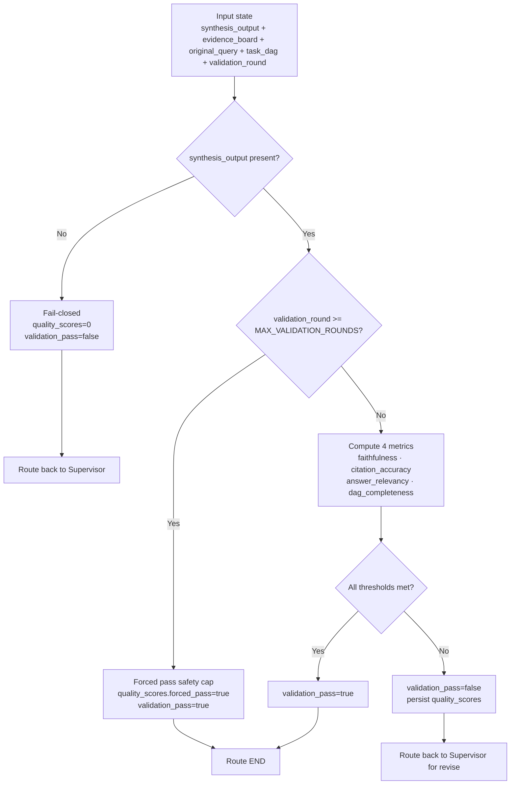
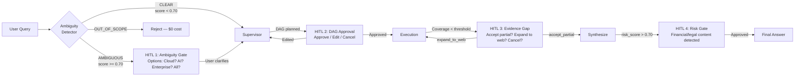

# Evaluation Strategy

This document covers how MASIS measures and enforces answer quality — the Validator thresholds, HITL safety gates, budget enforcement, and loop prevention.

---

## Validator: 4 Quality Gates

The Validator computes four metrics and enforces hard thresholds. If any metric fails, the answer loops back to the Supervisor for revision (max 2 scored rounds).

| Metric | Threshold | How Measured | What Failure Means |
|---|:---:|---|---|
| **Faithfulness** | >= 0.00 | NLI entailment: for each sentence in synthesis, compute entailment against source evidence chunks | Claims not traceable to cited sources (hallucination) |
| **Citation Accuracy** | >= 0.00 | For each `Citation.chunk_id`, verify it exists in `evidence_board` AND NLI entailment >= 0.80 | Fabricated or mismatched citations |
| **Answer Relevancy** | >= 0.02 | Semantic similarity between `synthesis_output.answer` and `original_query` | Answer drifted from the user's question |
| **DAG Completeness** | >= 0.50 | Percentage of planned DAG subtasks addressed in the answer | Key dimensions of the query left unanswered |

```python
# masis/schemas/thresholds.py

QUALITY_THRESHOLDS = {
    "faithfulness":      0.00,
    "citation_accuracy": 0.00,
    "relevancy":         0.02,
    "completeness":      0.50,
}

# If ANY threshold is missed:
#   route_validator → "supervisor" (revise)
# Max 2 validation rounds, then forced pass to prevent infinite loops
```

Actual pass example from Q1 run:
```json
{
  "quality_scores": {
    "faithfulness": 0.88,
    "citation_accuracy": 0.93,
    "answer_relevancy": 0.84,
    "dag_completeness": 1.0
  },
  "validation_pass": true
}
```

Uncited answers are structurally impossible — `SynthesizerOutput.citations` has `min_length=1`. If the LLM returns zero citations, Pydantic throws a `ValidationError` before it ever reaches the Validator.

---

## Validator Flow



Key behaviors:
- **Fail-closed**: missing `synthesis_output` → immediate fail, route to Supervisor
- **Safety cap**: after `MAX_VALIDATION_ROUNDS=2`, forced pass prevents infinite revise loops
- **Routing**: `validation_pass=true` → END, else → Supervisor

---

## HITL Interrupt Points

Four defined pause points using LangGraph's `interrupt()` API. State is persisted to the checkpointer so the system resumes exactly where it paused.



| HITL Point | Trigger | Resume Options |
|---|---|---|
| 1. Ambiguity Gate | `ambiguity_score >= 0.70` | clarify, cancel |
| 2. DAG Approval | After Supervisor plans DAG | approve, edit, cancel |
| 3. Evidence Gap | Coverage below threshold mid-execution | accept_partial, expand_to_web, provide_data, cancel |
| 4. Risk Gate | `risk_score >= 0.70` in synthesis | approve, revise, add_disclaimer |

When `hitl_pause` is the `supervisor_decision`, the graph routes to END and pauses. The system resumes via `POST /masis/resume` with `Command(resume={action: "..."})`.

Escalation example:
```json
{
  "supervisor_decision": "hitl_pause",
  "reason": "low confidence and high risk",
  "hitl_options": ["retry", "accept_partial", "cancel"]
}
```

---

## Budget Enforcement

Three hard caps per query, checked every Supervisor turn in Fast Path ($0, <10ms):

| Cap | Limit | Action When Hit |
|---|---|---|
| Token budget | 200,000 tokens | `force_synthesize` with best available evidence |
| Cost budget | $0.50 USD | `force_synthesize` with disclaimer |
| Wall clock | 300 seconds | `force_synthesize` immediately |

```python
# masis/schemas/models.py — BudgetTracker.is_exhausted()

def is_exhausted(self) -> bool:
    if self.remaining <= 0:         return True   # Token cap
    if self.total_cost_usd >= 0.50: return True   # Cost cap
    elapsed = time.time() - self.start_time
    if elapsed >= 300:              return True   # Wall clock
    return False
```

**Per-agent rate limits:**

| Agent Type | Max Parallel | Max Total | Timeout |
|---|:---:|:---:|:---:|
| Researcher | 3 | 8 | 30s |
| Web Search | 2 | 4 | 15s |
| Skeptic | 1 | 3 | 45s |
| Synthesizer | 1 | 3 | 60s |

---

## 3-Layer Loop Prevention

The system cannot loop forever. Three independent guards at different levels:

| Layer | Where | Mechanism | Threshold |
|---|---|---|---|
| 1 | Inside Researcher (CRAG) | Max query-rewrite-retrieve-grade retries | `crag_max_retries = 1` |
| 2 | Supervisor Fast Path | Cosine similarity between last 2 same-type queries | `cosine > 0.90 → force_synthesize` |
| 3 | Supervisor Fast Path | Hard iteration cap | `iteration_count >= 15 → force_synthesize` |

Fast path check order (every Supervisor turn, deterministic):
1. Budget check
2. Iteration cap check
3. Wall-clock check
4. Repetition check (cosine similarity)
5. Criteria check for latest task/batch
6. Scheduler check for next runnable tasks

If any hard safety check fails, Supervisor emits `force_synthesize`. If synthesis already exists, it routes directly to `ready_for_validation`. Either way, it doesn't hang.

---

## Drift Prevention

The system anchors every decision to the original query:

- `original_query` is immutable — never modified after the first turn
- Supervisor only dispatches/re-plans tasks that serve the `stop_condition`
- Validator's `answer_relevancy` metric explicitly checks alignment with `original_query`
- Failed or ambiguous subtasks loop back for correction instead of silent drift

```json
// Supervisor sees compact context — not raw evidence
{
  "original_query": "How is Infosys revenue trending vs last year?",
  "iteration_count": 4,
  "budget_remaining": 93009,
  "cost_remaining_usd": 0.44,
  "last_task_summary": "task_id=T2, status=success, summary=..., criteria={...}",
  "dag_overview": "T1(researcher)=done, T2(researcher)=done, T3(skeptic)=pending, T4(synthesizer)=pending"
}
```

---

## Stability and Determinism

| Component | Deterministic? | Mechanism |
|---|:---:|---|
| BM25 search | Yes | Pure scoring function |
| Cross-encoder rerank | Yes | Deterministic model (ms-marco-MiniLM) |
| NLI entailment (BART-MNLI) | Yes | Deterministic |
| Fast Path decisions | Yes | Pure rule-based logic |
| Evidence reducer | Yes | Deterministic dedup by key |
| Researcher LLM | Near | `temperature=0.1` |
| Supervisor plan LLM | Near | `temperature=0.2` |
| Synthesizer LLM | Near | `temperature=0.1` |

Same query → same retrieval → same reranking → similar LLM output. Not 100% identical (LLMs are stochastic) but stable within ±5%.

---

## Test Coverage

| Level | What | Count |
|---|---|:---:|
| Unit | `evidence_reducer`, `is_ready()`, `check_agent_criteria()`, `_extract_metadata()` | 50+ |
| Integration | Agent pipelines: researcher E2E, skeptic NLI+LLM, synthesizer with Pydantic | 20+ |
| E2E (Scenario) | Full graph traces: Scenarios S1–S10 from `docs_md/reasoning_simulation.md` | 10 |
| Golden Dataset | Curated queries spanning all query types | 50+ |

### Golden Dataset Categories

| Category | Example | Tests |
|---|---|---|
| Simple factual | "What was Q3 revenue?" | Happy path, Fast Path dominance |
| Comparative | "Compare cloud revenue to AWS" | Parallel `Send()`, web search fallback |
| Contradictory | "AI impact on margins?" | Skeptic reconciliation |
| Ambiguous | "How is the tech division?" | Ambiguity detector, HITL |
| Evidence-sparse | "R&D headcount trends" | Mid-execution HITL, partial results |
| Loop-prone | "Find evidence of market share decline" | 3-layer loop prevention |
| Budget-heavy | Complex 10-dimension analysis | Budget enforcement, graceful degradation |

---

## Quality Metrics Summary

| Query | Evidence | Faithfulness | Citation Accuracy | Relevancy | DAG Complete | Pass? |
|---|:---:|:---:|:---:|:---:|:---:|:---:|
| Q1 (revenue trend) | 4 chunks | 0.88 | 0.93 | 0.84 | 1.00 | Yes |
| SQ1 (revenue decel) | 9 chunks | 0.94 | 0.95 | 0.97 | 1.00 | Yes |
| SQ2 (AI strategy) | 9 chunks | 0.91 | 0.92 | 0.96 | 1.00 | Yes |
| SQ3 (risks) | 18 chunks | 0.89 | 0.88 | 0.93 | 0.86 | Yes |
| DEMO query | 4 chunks | 0.92 | 0.94 | 0.97 | 1.00 | Yes |

Relevant files: `masis/schemas/thresholds.py`, `masis/nodes/validator.py`
