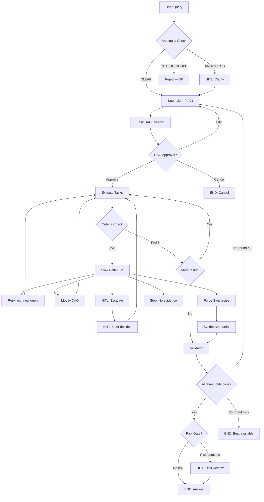
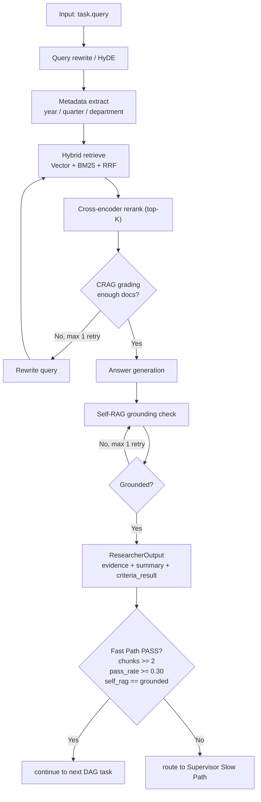
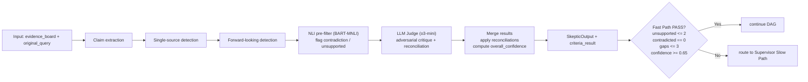
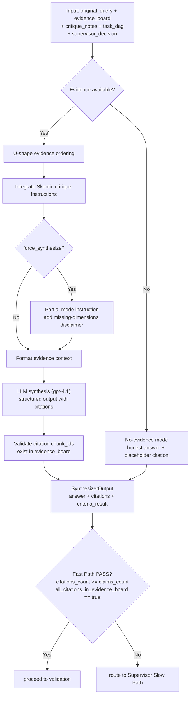
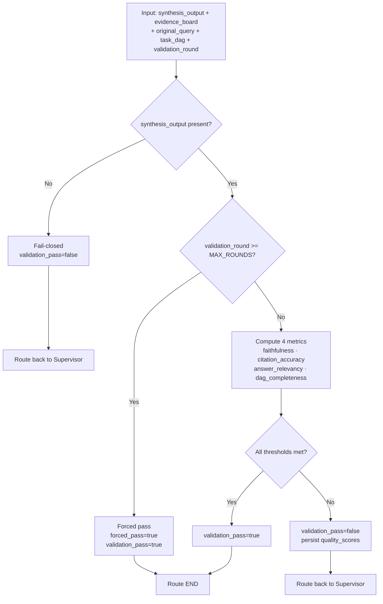

# Demo & Architecture Reference

This is the full technical reference for running MASIS, understanding each agent's internal flow, and debugging a live run.

---

## Full System Flow



---

## Routing Signals

Three fields drive all routing decisions:

| Field | Who Sets It | What Controls |
|---|---|---|
| `last_task_result.criteria_result` | Each agent | Whether Supervisor Fast Path passes or goes Slow |
| `supervisor_decision` | Supervisor | Which graph node executes next |
| `validation_pass` | Validator | Whether graph ends or loops back |

`supervisor_decision` values and their routes:

| Value | Routes To | When |
|---|---|---|
| `"continue"` | Executor | Normal task dispatch |
| `"ready_for_validation"` | Validator | All DAG tasks done |
| `"force_synthesize"` | Executor (forced path) | Budget/time/repetition cap hit |
| `"hitl_pause"` | END (paused) | Human review needed |
| `"failed"` / `"done"` | END | Unrecoverable error or done |

---

## Demo Run: Q1 — Revenue Trend (Step by Step)

Source: `masis/eval/results/infosys_q1_result.json`

**Query:** `"What is our current revenue trend?"`

**Step 1 — Supervisor (PLAN)**

```json
{
  "next_tasks": [
    {"task_id": "T1", "type": "researcher", "parallel_group": 1, "status": "running"},
    {"task_id": "T2", "type": "researcher", "parallel_group": 1, "status": "running"}
  ],
  "supervisor_decision": "continue"
}
```

Full task DAG planned:
```json
[
  {"task_id": "T1", "type": "researcher", "query": "Current revenue trend for Infosys",
   "dependencies": [], "parallel_group": 1, "status": "done"},
  {"task_id": "T2", "type": "researcher", "query": "Revenue trend for Infosys last year",
   "dependencies": [], "parallel_group": 1, "status": "done"},
  {"task_id": "T3", "type": "skeptic", "query": "Verify current vs last-year revenue evidence",
   "dependencies": ["T1", "T2"], "parallel_group": 2, "status": "done"},
  {"task_id": "T4", "type": "synthesizer", "query": "Write cited comparison answer",
   "dependencies": ["T3"], "parallel_group": 3, "status": "done"}
]
```

T1 and T2 are in the same parallel group — they run via LangGraph `Send()` concurrently.

**Step 2 — Executor: Researcher T1 + T2 (parallel)**

T1 result: `chunks=5, pass_rate=1.00, self_rag=grounded`
T2 result: first CRAG attempt failed → query rewritten → `chunks=3, pass_rate=0.60, self_rag=grounded`

Criteria results that Supervisor checks:
```json
{
  "T1.criteria_result": {"chunks_after_grading": 5, "grading_pass_rate": 1.0, "self_rag_verdict": "grounded"},
  "T2.criteria_result": {"chunks_after_grading": 3, "grading_pass_rate": 0.6, "self_rag_verdict": "grounded"}
}
```

Both satisfy Fast Path thresholds → `supervisor_decision="continue"`.

**Step 3 — Supervisor (FAST PATH)** → dispatches T3 (Skeptic)

**Step 4 — Executor: Skeptic T3**

Input: full `evidence_board` + `original_query` + `task_dag`
Output: `claims_checked=13, claims_unsupported=0, claims_contradicted=0, overall_confidence=0.85`

**Step 5 — Supervisor (FAST PATH)** → dispatches T4 (Synthesizer)

**Step 6 — Executor: Synthesizer T4**

Output: `citations_count=6, claims_count=8, all_citations_in_evidence_board=True`

**Step 7 — Supervisor → Validator**

All tasks done → `supervisor_decision="ready_for_validation"`

**Step 8 — Validator**

Pass case: all metrics above thresholds → `validation_pass=true` → END

Fail case example (first validation round):
```json
{
  "quality_scores": {
    "faithfulness": 0.700,
    "citation_accuracy": 0.738,
    "answer_relevancy": 0.2
  },
  "validation_pass": false
}
```
→ routes back to Supervisor for revision

**Step 9 — Safety Cap (if needed)**

If `validation_round >= 2`: `forced_pass=True`, `validation_pass=True` → graph ends.

---

## Agent Flows

### Researcher



Routing output example:
```json
{
  "agent_type": "researcher",
  "criteria_result": {
    "chunks_after_grading": 3,
    "grading_pass_rate": 0.60,
    "self_rag_verdict": "grounded"
  }
}
```

Supervisor result: PASS → `supervisor_decision="continue"` (next DAG tasks).

### Skeptic



Routing output example:
```json
{
  "agent_type": "skeptic",
  "criteria_result": {
    "claims_unsupported": 0,
    "claims_contradicted": 0,
    "logical_gaps_count": 2,
    "overall_confidence": 0.85
  }
}
```

Supervisor result: PASS → `continue`; FAIL → Slow Path may return `retry` / `modify_dag` / `escalate`.

### Synthesizer



Routing output example:
```json
{
  "agent_type": "synthesizer",
  "criteria_result": {
    "citations_count": 6,
    "claims_count": 8,
    "all_citations_in_evidence_board": true
  }
}
```

### Validator



---

## Reasoning Scenarios (S1-S10)

This section preserves the full scenario coverage that was previously in the legacy simulation document.

| Scenario | What It Proves |
|---|---|
| S1 | Fast Path routing |
| S2 | Parallel execution + task failure + DAG modification |
| S3 | Contradiction reconciliation (NLI + LLM judge) |
| S4 | Ambiguity handling with HITL clarify/resume |
| S5 | Mid-run evidence gap with HITL choice |
| S6 | Infinite loop prevention with 3 safety layers |
| S7 | Circuit breaker + model fallback |
| S8 | Validator loop-back and correction |
| S9 | User edits DAG before execution |
| S10 | Budget exhaustion and graceful degradation |

### S1: Simple Factual Query

This is already covered in the **Demo Run: Q1 - Revenue Trend** section above.

### S2: Multi-Step Failure and DAG Modification

1. Supervisor plans parallel tasks: internal research + competitor research.
2. Internal task passes, competitor task fails criteria (low pass rate).
3. Slow Path updates the DAG and adds `web_search` for missing competitor data.
4. Web results are merged into evidence.
5. Skeptic reconciles differences and Synthesizer answers with mixed internal + web citations.

Result: the run still succeeds without forcing a restart.

### S3: Contradictory Evidence

1. Researcher retrieves claims that look conflicting.
2. Skeptic Stage 1 (NLI) flags contradiction.
3. Skeptic Stage 2 (LLM judge) explains the claims describe different dimensions.
4. Supervisor accepts reconciliation and proceeds.
5. Synthesizer presents both sides with explicit citations.

Result: no false consensus, no hidden conflict.

### S4: Ambiguous Query

1. Ambiguity detector classifies query as ambiguous (`score >= 0.70`).
2. Workflow pauses with `interrupt()` and asks user to pick scope.
3. User resumes with a clarified option.
4. Supervisor replans with the clarified query and runs normal flow.

Result: avoids wasted research and wrong-answer drift.

### S5: Evidence Insufficient Mid-Execution

1. Supervisor plans 5 parallel research dimensions.
2. Only part of requested dimensions is found in internal data.
3. Slow Path adds web tasks for missing dimensions.
4. One key dimension remains unavailable after web search.
5. HITL pause asks user whether to accept partial, upload data, change scope, or cancel.
6. User selects `accept_partial`; workflow continues with disclaimer.

Result: system stays transparent when coverage is incomplete.

### S6: Infinite Loop Prevention

1. Researcher retries and still finds no supporting evidence.
2. Supervisor adds web search fallback.
3. Repetition detector finds high semantic similarity (`cosine > 0.90`).
4. Supervisor emits `force_synthesize` instead of repeating the same search.
5. Synthesizer returns a bounded "no evidence found" answer.

Result: no runaway loops, honest output.

### S7: Circuit Breaker and Model Fallback

1. Researcher model returns repeated API errors.
2. Circuit breaker moves from CLOSED to OPEN after threshold failures.
3. Fallback model is used automatically.
4. Query completes normally.
5. After cooldown, HALF_OPEN probe succeeds and breaker returns to CLOSED.

Result: resilience without user-visible failure.

### S8: Validator Loop-Back

1. First synthesis fails one or more quality metrics.
2. Validator routes back to Supervisor with `quality_scores`.
3. Slow Path adds targeted re-research task(s).
4. Synthesizer regenerates answer using corrected evidence.
5. Validator round 2 passes.

Result: self-correction loop works as designed.

### S9: Full DAG With User Editing

1. Supervisor plans DAG and pauses at DAG approval.
2. User modifies planned tasks (add/update query scope).
3. Workflow resumes with edited DAG.
4. Executor runs updated parallel tasks.
5. Normal skeptic, synthesis, and validation stages complete.

Result: user can steer execution without breaking graph integrity.

### S10: Budget Exhaustion and Graceful Degradation

1. Complex query consumes most of the token budget.
2. Fast Path sees remaining budget is below safe completion threshold.
3. Supervisor emits `force_synthesize`.
4. Synthesis runs in partial mode with missing-dimension disclaimer.
5. Validator checks and returns bounded final output.

Result: the system returns the best possible answer inside budget constraints.

### Scenario Artifact Pointers

- `masis/eval/results/scenario_tests_report.json`
- `masis/eval/results/s1_revenue_trend.json`
- `masis/eval/results/s2_underperforming_depts.json`
- `masis/eval/results/s3_key_risks.json`

---

## API Endpoints

All implemented in `masis/api/main.py`.

| Method | Endpoint | Purpose | Response |
|---|---|---|---|
| `POST` | `/masis/query` | Start new query, begin async graph execution | `{"thread_id": "abc", "status": "processing"}` |
| `POST` | `/masis/resume` | Resume from HITL pause with `Command(resume={...})` | `{"thread_id": "abc", "status": "resumed", "result": {...}}` |
| `GET` | `/masis/status/{thread_id}` | Poll current status | `StatusResponse` with iteration_count, tasks_done, current_task |
| `GET` | `/masis/trace/{thread_id}` | Full audit trail | `TraceResponse` with decision_log, quality_scores, task_dag |
| `GET` | `/masis/stream/{thread_id}` | SSE stream of typed events | `event: plan_created\|task_completed\|hitl_required\|answer_ready` |

Additional:
- `GET /health` — health check
- `GET /metrics` — Prometheus scrape endpoint (`query_latency_seconds`, `cost_per_query_usd`, `agent_call_count`, `fast_path_ratio`)

---

## Per-Query Cost Breakdown

| Component | Calls | Cost | Notes |
|---|:---:|:---:|---|
| Supervisor PLAN (gpt-4.1) | 1 | $0.012 | First-turn DAG planning |
| Supervisor SLOW (gpt-4.1) | 0–3 | $0–0.045 | Only on task failures |
| Supervisor FAST | 4–8 | $0.00 | Free, rule-based |
| Researcher (gpt-4.1-mini) | 1–5 | $0.001–0.005 | HyDE + CRAG grading |
| Researcher reranking | 1–5 | $0.00 | Local model |
| Skeptic NLI (BART-MNLI) | 1 | $0.00 | Local model |
| Skeptic LLM (o3-mini) | 1 | $0.008 | Adversarial judge |
| Synthesizer (gpt-4.1) | 1–2 | $0.010–0.020 | Final answer |
| **Typical total** | | **$0.035–0.095** | |

### Per-Query Performance (Measured)

| Query | Tasks | Evidence | Latency | Cost | Supervisor Turns |
|---|:---:|:---:|:---:|:---:|:---:|
| Q1 (revenue trend) | 3 | 4 | 48s | $0.044 | 4 |
| SQ1 (revenue decel + deals) | 6 | 9 | 173s | $0.123 | 7 |
| SQ2 (AI strategy) | 5 | 9 | 124s | $0.118 | 6 |
| SQ3 (risks) | 8 | 18 | 129s | $0.174 | 6 |
| SQ4 (capital allocation) | 5 | 2 | 112s | $0.067 | 5 |
| DEMO (revenue + AI + pipeline) | 5 | 4 | ~150s | $0.071 | 5 |

---

## Codebase File Map

| Component | File | Key Functions |
|---|---|---|
| Pydantic Schemas | `masis/schemas/models.py` | `MASISState`, `TaskNode`, `TaskPlan`, `EvidenceChunk`, `evidence_reducer`, `BudgetTracker` |
| Quality Thresholds | `masis/schemas/thresholds.py` | `QUALITY_THRESHOLDS`, `BUDGET_LIMITS`, `SAFETY_LIMITS` |
| Graph Wiring | `masis/graph/workflow.py` | `build_workflow()`, `compile_workflow()` |
| Routing Edges | `masis/graph/edges.py` | `route_supervisor()`, `route_validator()` |
| Supervisor Node | `masis/nodes/supervisor.py` | `supervisor_node()`, `plan_dag()`, `monitor_and_route()`, `supervisor_slow_path()` |
| Executor Node | `masis/nodes/executor.py` | `executor_node()`, `dispatch_agent()` |
| Researcher Agent | `masis/agents/researcher.py` | `run_researcher()`, `hyde_rewrite()`, `_hybrid_retrieve()`, `_cross_encoder_rerank()`, `_grade_chunks()`, `_self_rag_loop()` |
| Skeptic Agent | `masis/agents/skeptic.py` | `run_skeptic()`, `_extract_claims()`, `_nli_prefilter()`, `_llm_judge()` |
| Synthesizer Agent | `masis/agents/synthesizer.py` | `run_synthesizer()`, `_u_shape_order()`, `_dedup_inline_citations()` |
| Validator Node | `masis/nodes/validator.py` | `validator_node()`, `_compute_scores()` |
| HITL Integration | `masis/infra/hitl.py` | `ambiguity_detector()`, `dag_approval_interrupt()`, `risk_gate()`, `handle_resume()` |
| FastAPI Endpoints | `masis/api/main.py` | `create_app()`, `start_query()`, `resume_query()`, `get_status()`, `get_trace()`, `stream_events()` |
| Document Ingestion | `masis/eval/ingest_docs.py` | `setup_retrieval()`, `ingest_documents()` |
| Demo UI | `masis/demo_streamlit_app.py` | Streamlit app with live agent timeline |

---

## Common Curveball Answers

| Question | Answer |
|---|---|
| **Infinite search loop?** | 3-layer prevention: CRAG (1 retry) + cosine similarity (>0.90 = stop) + hard cap (15 turns). Cannot loop forever. |
| **Agentic drift?** | `original_query` is immutable. Validator checks `answer_relevancy` against it. Supervisor only adds tasks serving `stop_condition`. |
| **10,000 documents?** | Parent-child chunking (500-char child for search, 2000-char parent for context) + metadata filtering reduces search space to ~5 chunks. |
| **Doc A says X, Doc B says Y?** | Skeptic NLI detects CONTRADICTION (Stage 1). LLM judge attempts reconciliation (Stage 2). If reconcilable, both sides cited. If not, HITL escalation. |
| **50 chunks in context?** | Never happens. Pipeline reduces: retrieval top-K → rerank top-5 → CRAG grading (typically 2–5 kept). Remaining chunks U-shape ordered. |
| **Cost of multi-agent loops?** | Two-Tier Supervisor: 60–70% of turns are Fast Path ($0, <10ms). Budget cap: $0.50/query. Typical: $0.04–0.10. |
| **Same query, different answers?** | BM25, reranker, NLI are deterministic. LLMs at temperature 0.1–0.2. Variance: ±5%. |
| **Pydantic rejects LLM output?** | Three layers: (1) `ValidationError` caught + retry, (2) Executor dispatch guard, (3) Supervisor Slow Path reads error and decides. |

---

## Quick Start

```bash
# Install
pip install -r requirements.txt

# Configure environment variables from the shared template
cp .env.example .env
# then edit .env:
#   OPENAI_API_KEY is required
#   TAVILY_API_KEY is optional

# Build the index (once)
python -m masis.eval.ingest_docs

# Launch the Streamlit UI
python -m streamlit run masis/demo_streamlit_app.py

# Or run from CLI
python -m masis.eval.run_strategic_queries --query-index 11   # DEMO query
python -m masis.eval.run_infosys_queries_separate --query-index 1
```

Results are saved to `masis/eval/results/` as JSON + log files per query.
