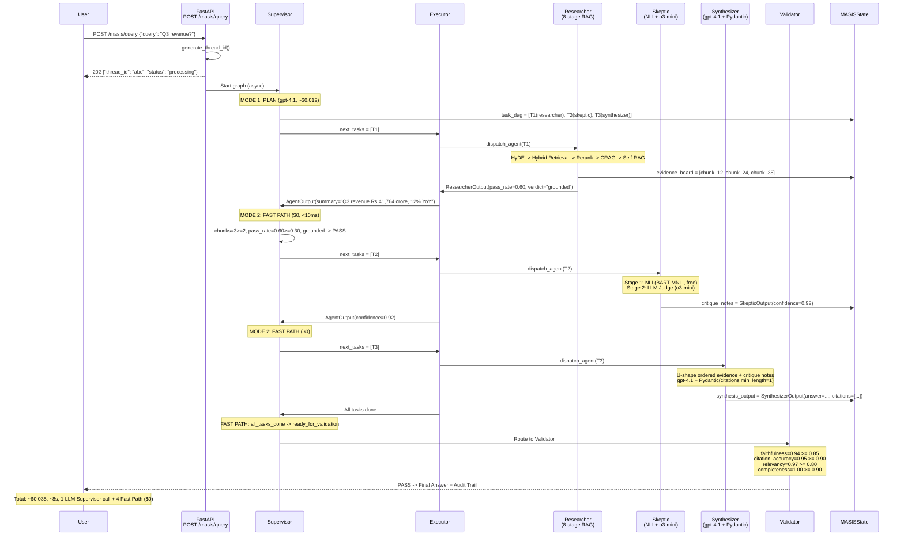
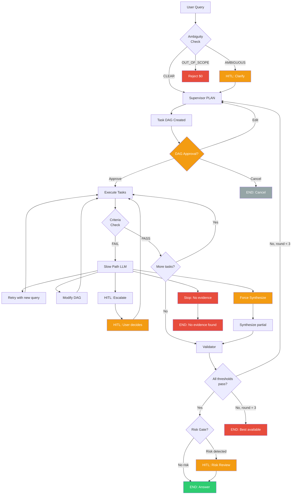

# Slide 5: Live Demo Flow & Full Architecture -- "Battle-Tested"

> **Pillar:** Demo, Integration, and Curveball Defense
> **Time Allocation:** 5-6 minutes
> **Curveball Addressed:** All remaining curveballs -- infinite loops, agentic drift, 10K documents, Doc A vs Doc B contradictions

---

## End-to-End Query Lifecycle: Scenario 1 (Simple Factual)

### Query: "What was TechCorp's Q3 FY26 revenue?"

---

## API Endpoint Table

All endpoints implemented in `C:\Users\salil\final_maiss\masis\api\main.py`.

| Method | Endpoint | Purpose | Response | MF-ID |
|--------|----------|---------|----------|-------|
| `POST` | `/masis/query` | Start new query, create thread_id, begin async graph execution | `{"thread_id": "abc", "status": "processing"}` | MF-API-01 |
| `POST` | `/masis/resume` | Resume from HITL pause with `Command(resume={action: "..."})` | `{"thread_id": "abc", "status": "resumed", "result": {...}}` | MF-API-02 |
| `GET` | `/masis/status/{thread_id}` | Poll current status: processing / paused / completed / failed | `StatusResponse` with iteration_count, tasks_done, current_task | MF-API-03 |
| `GET` | `/masis/trace/{thread_id}` | Full audit trail: DAG, all decisions, quality scores, checkpoints | `TraceResponse` with decision_log, quality_scores, task_dag | MF-API-04 |
| `GET` | `/masis/stream/{thread_id}` | SSE stream of typed events during execution | `event: plan_created\|task_completed\|hitl_required\|answer_ready` | MF-API-05 |

**Additional:**
- `GET /health` -- Health check
- `GET /metrics` -- Prometheus scrape endpoint (`query_latency_seconds`, `cost_per_query_usd`, `agent_call_count`, `fast_path_ratio`)

---

## Phase Delivery Timeline

| Phase | Focus | Key Deliverables | Status |
|:-----:|-------|-----------------|:------:|
| **P0** | Foundation | Pydantic schemas (models.py, thresholds.py), MASISState TypedDict, evidence_reducer, BudgetTracker | Complete |
| **P1** | Core Agents | Researcher (8-stage RAG), Skeptic (NLI + LLM judge), Synthesizer (Pydantic citations) | Complete |
| **P2** | Graph Wiring | 3-node StateGraph, conditional edges, route_supervisor, route_validator | Complete |
| **P3** | Supervisor Intelligence | plan_dag (MODE 1), monitor_and_route (MODE 2), supervisor_slow_path (MODE 3) | Complete |
| **P4** | HITL & Safety | Ambiguity detector, DAG approval, risk gate, circuit breaker, model fallback | Complete |
| **P5** | API & Observability | FastAPI 5 endpoints, SSE streaming, Prometheus metrics, Langfuse tracing | Complete |

---

## Key Metrics and Numbers From Implementation

### Per-Query Cost Breakdown (Typical)

| Component | Calls | Cost | Notes |
|-----------|:-----:|:----:|-------|
| Supervisor PLAN (gpt-4.1) | 1 | $0.012 | First-turn DAG planning |
| Supervisor SLOW (gpt-4.1) | 0-3 | $0-0.045 | Only on task failures |
| Supervisor FAST | 4-8 | $0.00 | Free, rule-based |
| Researcher (gpt-4.1-mini) | 1-5 | $0.001-0.005 | HyDE + CRAG grading |
| Researcher reranking | 1-5 | $0.00 | Local model (ms-marco) |
| Skeptic NLI (BART-MNLI) | 1 | $0.00 | Local model |
| Skeptic LLM (o3-mini) | 1 | $0.008 | Adversarial judge |
| Synthesizer (gpt-4.1) | 1-2 | $0.010-0.020 | Final answer |
| **TYPICAL TOTAL** | | **$0.035-0.095** | |

### Per-Scenario Performance

| Scenario | Cost | Latency | Supervisor LLM Calls | Fast Path Calls |
|----------|:----:|:-------:|:--------------------:|:--------------:|
| S1: Simple factual | $0.035 | ~8s | 1 | 4 |
| S2: Multi-step + failure | $0.095 | ~22s | 3 | 5 |
| S3: Contradictory evidence | $0.065 | ~15s | 2 | 3 |
| S4: Ambiguous query | $0.045 | ~12s + user time | 1 | 3 |
| S5: Evidence insufficient | $0.120 | ~35s + user time | 5 | 3 |
| S6: Infinite loop prevention | $0.042 | ~10s | 1 | 3 |
| S7: Circuit breaker | $0.065 | ~16s | 1 | 3 |
| S8: Validator loop-back | $0.085 | ~20s | 2 | 5 |
| S9: User DAG editing | $0.110 | ~25s + user time | 2 | 4 |
| S10: Budget exhaustion | $0.094 | ~45s | 3 | 8 |

---

## Curveball Defense Quick-Fire Table

| Curveball Question | Answer | Implementation |
|-------------------|--------|----------------|
| **Infinite search loop?** | 3-layer prevention: CRAG (3 retries) + cosine similarity (>0.90 = stop) + hard cap (15 turns) | `supervisor.py:monitor_and_route()`, `researcher.py:_run_pipeline()` |
| **Agentic drift from original intent?** | `original_query` is immutable (MF-MEM-02). Validator checks `answer_relevancy(answer, original_query) >= 0.80`. Supervisor only adds tasks that serve the `stop_condition`. | `models.py:MASISState.original_query`, `edges.py:route_validator()` |
| **10,000 documents?** | Parent-child chunking (500-char child for search, 2000-char parent for context) + metadata filtering (year/quarter/department) reduces search space from 10K docs to ~5 chunks | `researcher.py:_expand_to_parents()`, `_extract_metadata()` |
| **Doc A says X, Doc B says Y?** | Skeptic NLI detects CONTRADICTION (Stage 1). LLM judge attempts reconciliation (Stage 2). If reconcilable, presents both sides with citations. If not, HITL escalation. | `reasoning_simulation.md` Scenario 3, `hitl.py:mid_execution_interrupt()` |
| **50 chunks in context?** | Never happens. Pipeline reduces: 10 (hybrid) -> 5 (rerank) -> 2-4 (CRAG grading). Remaining chunks U-shape ordered: best at start+end where LLM attention is highest. | `researcher.py:_cross_encoder_rerank()`, architecture Q18 |
| **Expense of multi-agent loops?** | Two-Tier Supervisor: 60-70% of turns are Fast Path ($0, <10ms). Budget cap: $0.50/query. Typical query: $0.04-0.10. | `supervisor.py:_fast_decision()`, `models.py:BudgetTracker` |
| **Repeated queries, different answers?** | BM25, reranker, NLI are deterministic. LLMs at temperature 0.1-0.2. Prompt caching for consistency. Variance: +/-5%. | Architecture Q19 |
| **What if Pydantic rejects LLM output?** | Three layers: (1) Pydantic ValidationError caught + retry, (2) Executor dispatch guard, (3) Supervisor Slow Path reads error and decides | Architecture Q9 |

---

## Full Architecture: Failure Handling DAG

---

## Codebase File Map

| Component | File | Key Functions | Lines |
|-----------|------|--------------|:-----:|
| Pydantic Schemas | `masis/schemas/models.py` | `MASISState`, `TaskNode`, `TaskPlan`, `EvidenceChunk`, `evidence_reducer`, `BudgetTracker`, `SupervisorDecision` | 949 |
| Graph Wiring | `masis/graph/workflow.py` | `build_workflow()`, `compile_workflow()` | 204 |
| Routing Edges | `masis/graph/edges.py` | `route_supervisor()`, `route_validator()` | 180 |
| Supervisor Node | `masis/nodes/supervisor.py` | `supervisor_node()`, `plan_dag()`, `monitor_and_route()`, `supervisor_slow_path()` | 847 |
| Researcher Agent | `masis/agents/researcher.py` | `run_researcher()`, `hyde_rewrite()`, `_hybrid_retrieve()`, `_cross_encoder_rerank()`, `_grade_chunks()`, `_self_rag_loop()` | 906 |
| HITL Integration | `masis/infra/hitl.py` | `ambiguity_detector()`, `dag_approval_interrupt()`, `risk_gate()`, `handle_resume()`, `build_partial_result()`, `build_cancel_result()` | 1064 |
| FastAPI Endpoints | `masis/api/main.py` | `create_app()`, `start_query()`, `resume_query()`, `get_status()`, `get_trace()`, `stream_events()` | 817 |

---

## Presenter Talking Points

1. "A simple factual query costs $0.035 and takes 8 seconds. The Supervisor makes only 1 LLM call for planning, then uses the Free Fast Path for all 4 subsequent routing decisions."

2. "The system never crashes. In Scenario 10, budget exhaustion triggers graceful degradation: the system synthesizes with 8 of 10 planned dimensions and includes a disclaimer listing what is missing."

3. "Every decision is logged to the audit trail. GET /masis/trace returns the full checkpoint history, all Supervisor decisions with costs and latencies, quality scores, and the final answer. This is production compliance-ready."

4. "The system handles contradictory evidence by presenting both sides. In Scenario 3, the Skeptic reconciles 'AI improved efficiency by 2.3%' with 'AI compressed margins by 1.8pp' as different metrics -- revenue-side vs cost-side -- and the Synthesizer presents both perspectives with citations."

---

## Demo Idea: Live Streamlit Trace Visualization

For maximum impact, demonstrate the system with a Streamlit app that:

1. **Input:** Text box for user query
2. **Live DAG visualization:** Shows task nodes coloring from gray (pending) -> blue (running) -> green (done) / red (failed) in real time via SSE stream
3. **Decision log panel:** Shows each Supervisor decision with mode (FAST/SLOW), cost, and latency
4. **Evidence board:** Expanding cards showing retrieved chunks with rerank scores
5. **Final answer panel:** Synthesized answer with inline citations linking to evidence chunks
6. **Metrics sidebar:** Running totals for tokens used, cost, wall clock, and a radar chart updating in real time

Connect via `GET /masis/stream/{thread_id}` for real-time SSE events.

---

> **Wow Statement:** "This system has ten traced scenarios, four human-in-the-loop safety gates, three layers of loop prevention, a circuit breaker with model fallback, and budget enforcement -- and the happy path still completes in 8 seconds for 3.5 cents."

---

## Presenter Tips

### Timing Guide (Total: ~22-25 minutes)

| Slide | Time | Focus |
|:-----:|:----:|-------|
| 1: HLD | 4-5 min | Lead with the 3-node architecture. Explain graph vs DAG distinction. |
| 2: LLD | 5-6 min | Show MASISState schema. Walk through the sequence diagram. Emphasize filtered views. |
| 3: Research | 4-5 min | Model routing table is the anchor. Explain Two-Tier cost savings. |
| 4: Evaluation | 4-5 min | Start with the 4 thresholds. Show the radar chart. Walk through HITL points. |
| 5: Demo | 5-6 min | End with the Scenario 1 trace. Keep the curveball table ready for Q&A. |

### When the Interviewer Asks a Curveball

1. **Pause.** Do not rush to answer.
2. **Connect it to a slide.** "Great question -- that is exactly what Slide 4 addresses with the 3-layer loop prevention."
3. **Give the concrete number.** "CRAG retries 3 times, then the cosine check at 0.90, then the hard cap at 15 iterations."
4. **Show the code reference.** "You can see this in `supervisor.py`, line 474, the `is_repetitive()` check."

### One "Wow Factor" Demo Idea

Run a live query through the system with the Streamlit trace visualization. Deliberately use a query that triggers a CRAG retry (e.g., "Find evidence of market share decline" against docs that show growth). The audience watches the DAG nodes turn red, sees the Supervisor add a web search task, and then sees the system produce an honest "no evidence supports this claim" answer. This demonstrates the system's intellectual honesty -- it refuses to hallucinate even when asked to find something that does not exist.
