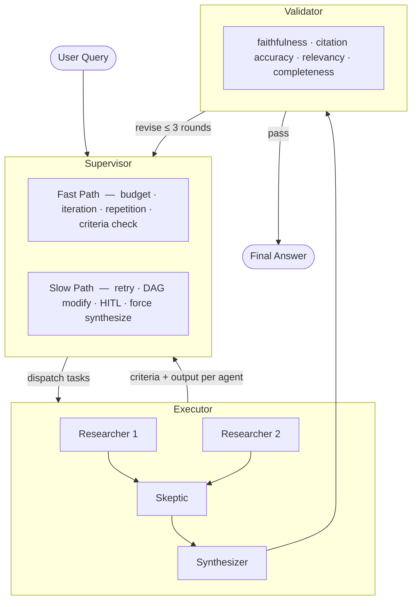

```mermaid
flowchart TD
    U([User Query]) --> SUP

    subgraph SUP[Supervisor]
        FAST["Fast Path  —  budget · iteration · repetition · criteria check"]
        SLOW["Slow Path  —  retry · DAG modify · HITL · force synthesize"]
    end

    SUP -->|"dispatch tasks"| EXE

    subgraph EXE[Executor]
        R1[Researcher 1]
        R2[Researcher 2]
        SK[Skeptic]
        SY[Synthesizer]

        R1 --> SK
        R2 --> SK
        SK --> SY
    end

    EXE -->|"criteria + output per agent"| SUP

    SY --> VAL

    subgraph VAL[Validator]
        V1["faithfulness · citation accuracy · relevancy · completeness"]
    end

    VAL -->|"revise  ≤ 3 rounds"| SUP
    VAL -->|pass| ANS([Final Answer])
```
