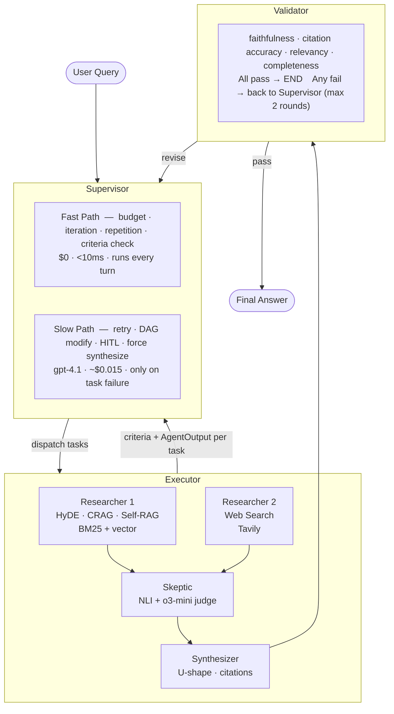

# MASIS Architecture Diagram

3-node LangGraph StateGraph: **Supervisor → Executor → Validator**. Agents (Researcher, Skeptic, Synthesizer) are Python functions dispatched by the Executor, not separate graph nodes.

For full architecture details, see [docs_md/01_HLD.md](../../docs_md/01_HLD.md).
