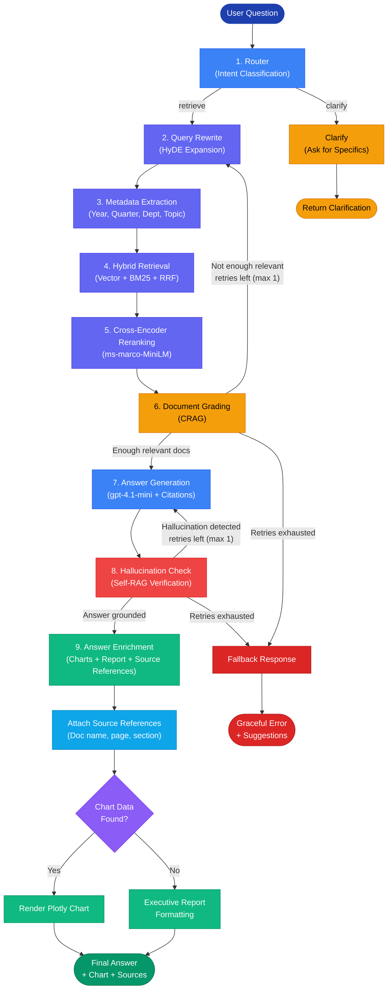
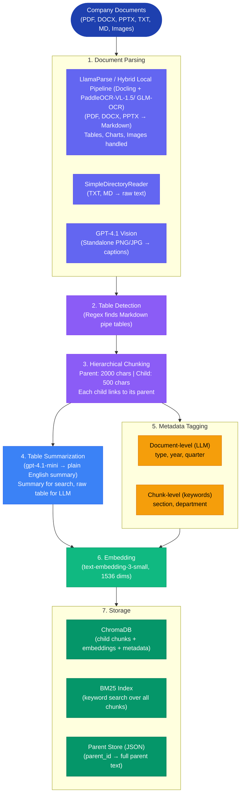
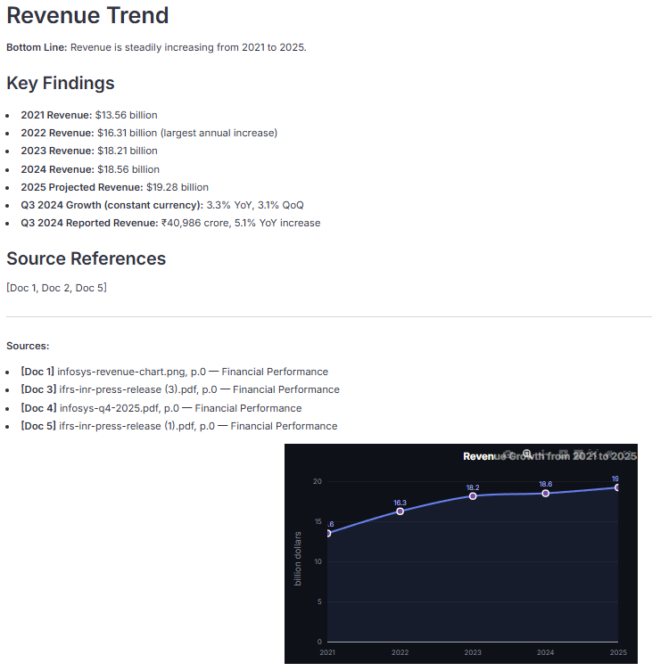
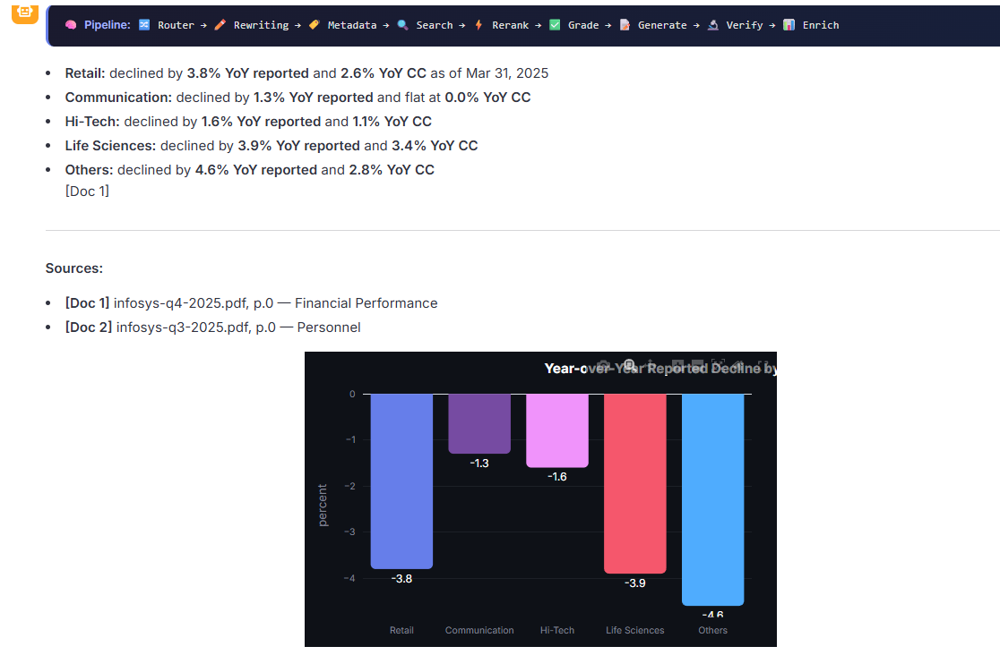
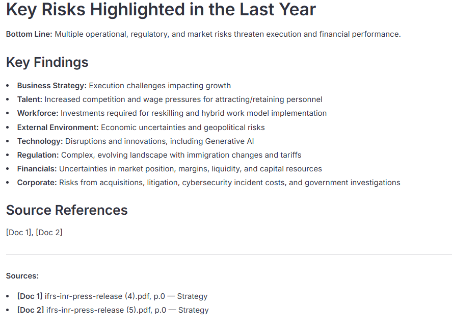
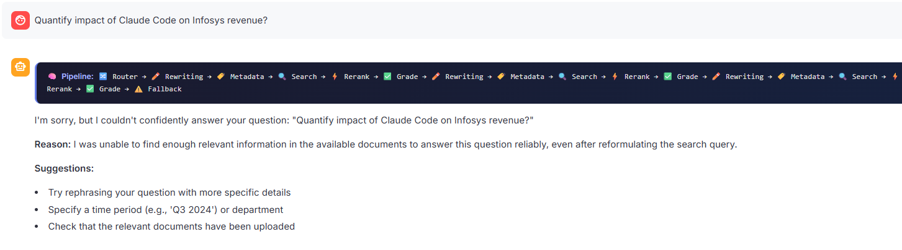
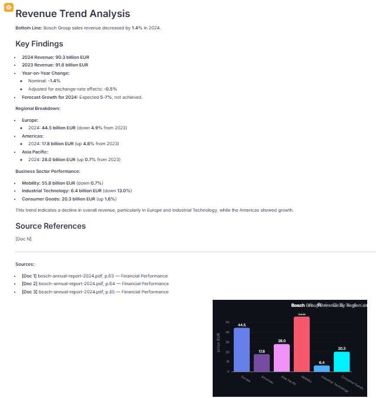
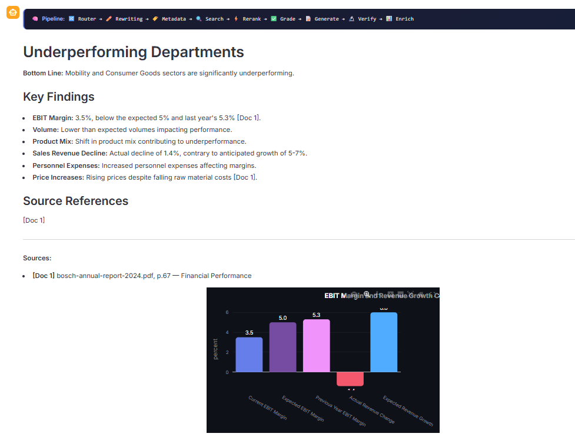
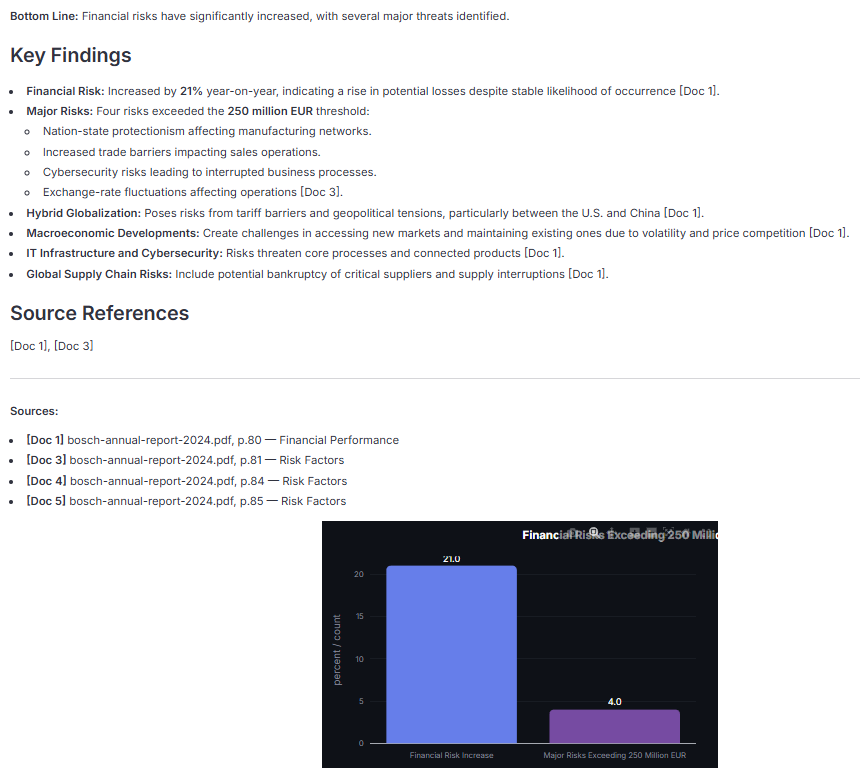
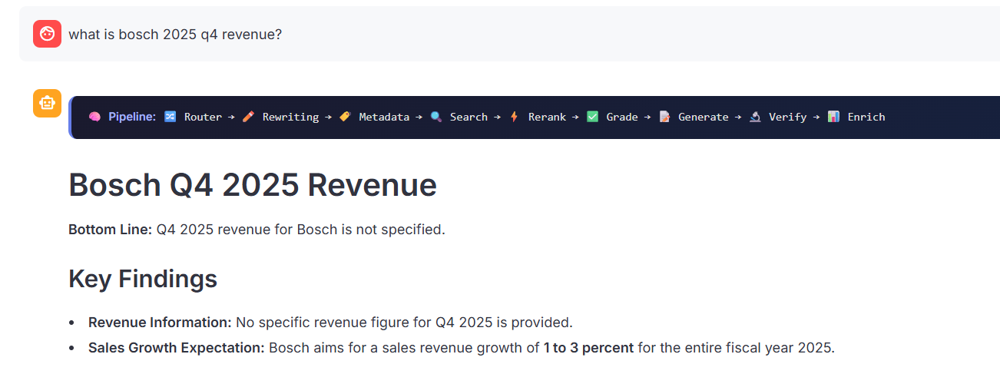

# AI Leadership Insight Agent

This Insights agent reads company documents (annual reports, quarterly filings, strategy notes) and answers leadership questions with verified, source-referenced answers. Built on a multi-stage RAG pipeline with self-correction.

Upload documents, the system indexes them once, and then we can ask questions in plain English. The agent finds the most relevant passages, checks its own answer for hallucinations, and returns a response with exact document references and optional charts.

---

## How It Works

There are two phases: indexing (one-time) and querying (every time we ask a question).

### Phase 1: Document Indexing (One-Time)

This runs once when we first load your documents. It prepares them for fast search later.

1. **Parsing** -- LlamaParse (by LlamaIndex) in VLM Agentic Mode reads each PDF, DOCX, and PPTX file and converts it into clean Markdown text. It uses multimodal AI to understand the full page layout, including tables, charts, and images embedded inside the document. Tables come out as proper Markdown tables with columns intact, not garbled text. Plain text files (TXT, MD) are loaded directly without LlamaParse. 

Alternative (if llamaparse not desired due to cost or security): **Hybrid Local Pipeline (Docling + PaddleOCR-VL-1.5/ GLM-OCR)** Also, https://huggingface.co/zai-org/GLM-OCR -> which reports best results on OmniDocBench v1.5, is fast/lightweight, open-source, and can run locally or via API.

2. **Image Captioning** -- Any standalone image files (PNG, JPG) sitting in the documents folder are described by **GPT-4.1 Vision**. This turns the image content into searchable text.

3. **Chunking** -- Each document is split into small pieces (500 characters) for precise search and large pieces (2000 characters) for giving the LLM enough surrounding context. Every small chunk stores a link to its parent large chunk.

5. **Table Summarization and Retrieval** -- Raw financial tables are often too dense for semantic search. 

So each table is summarized into a plain English sentence by **gpt-4.1-mini**. The summary is what gets searched; the original table is what the LLM sees when generating the answer.

5. **Metadata Tagging** -- **gpt-4.1-mini** tags docs with structured information: document type (annual report, quarterly filing, strategy note), year, and quarter. Each chunk also gets a section label (Financial, Strategy, Risk, Operations) based on keyword matching.

6. **Embedding and Storage** -- All chunks are converted into numerical vectors using OpenAI text-embedding-3-small and stored in ChromaDB. A keyword index (BM25) is also built over all chunk text for backup search.

7. **Smart Caching** -- When you run ingestion again, the system computes hashes of every document file and compares them against a saved manifest. If nothing has changed, ingestion is skipped entirely — saving API calls, embedding costs, and time. If any file is added, removed, or modified, a full re-ingest runs automatically. Use `--force` to bypass the cache.

### Phase 2: Querying (Per Question)

When we ask a question, it flows through a LangGraph pipeline with 11 nodes and 3 conditional edges:

1. **Router** -- The LLM reads your question and decides: is this something that can be answered from the documents (retrieve), or is the question too vague and needs clarification (clarify)?

2. **Query Rewrite (HyDE)** -- The LLM writes a hypothetical answer paragraph to your question. This fake paragraph is used as the search query instead of the raw question. It matches document language better.

3. **Metadata Extraction** -- The LLM extracts structured filters from your question: year, quarter, department, and topic. These filters narrow down the search space before retrieval.

4. **Hybrid Retrieval** -- Two search methods run in parallel. Vector search (ChromaDB) finds semantically similar chunks. Keyword search (BM25) finds exact word matches. Results from both are merged using Reciprocal Rank Fusion (RRF) which gives the highest scores to chunks that rank well in both methods.

5. **Cross-Encoder Reranking** -- A separate model (ms-marco-MiniLM-L-6-v2) re-scores each retrieved chunk for relevance. The top 5 chunks are kept.

6. **Document Grading (Corrective RAG)** -- The LLM checks each chunk: is it actually relevant to the question? If too few chunks are relevant, the query is rewritten and retrieval is retried. This loops up to 1 time.

7. **Answer Generation** -- **gpt-4.1-mini** generates the answer using only the retrieved chunks. Every claim cites its source as [Doc N]. The LLM is told to answer only from the provided context and never invent facts.

8. **Hallucination Check (Self-RAG)** -- The LLM reads the answer and verifies every claim against the source chunks. If any claim is not supported by the documents, the answer is regenerated. This loops up to 1 time. Only grounded answers reach the user.

9. **Answer Enrichment** -- The final answer gets source references (file name, page number, section) attached. If the answer contains comparable numbers, an interactive Plotly chart is automatically generated (bar, pie, or line chart).

### Alternative Parser: Hybrid Local Pipeline (Docling + PaddleOCR-VL-1.5/ GLM-OCR)

I have built around LlamaParse because it consistently scores high on document parsing benchmarks and handles tables, charts, and images in a single API call. However, the architecture is modular.

If LlamaParse is not available (for example, if you cannot use a cloud API or your free tier runs out), we can replace it with **Hybrid Local Pipeline (Docling + PaddleOCR-VL-1.5/ GLM-OCR)** (https://huggingface.co/zai-org/GLM-OCR).

GLM-OCR has reported best results on OmniDocBench v1.5, is fast/lightweight, open-source, and can be used either locally or through API. To switch, you only need to change the `file_extractor` dictionary in `ingest.py` -- the rest of the pipeline stays the same as long as the replacement parser outputs Markdown with pipe tables.

### Why LlamaParse (with Hybrid Local Pipeline (Docling + PaddleOCR-VL-1.5/ GLM-OCR) alternative)?

1.  **Accuracy First**: Leadership insights demand 100% factual accuracy. LlamaParse performs strongly on complex financial tables and charts found in annual reports.
2.  **Offline vs. Online**: Ingestion is a one-time, offline process. While LlamaParse (or Hybrid Local Pipeline (Docling + PaddleOCR-VL-1.5/ GLM-OCR)) takes time to run, it only happens once. It does not affect the speed of answering questions (online latency), which remains sub-second for retrieval.
3.  **Alternative Path**: Hybrid Local Pipeline (Docling + PaddleOCR-VL-1.5/ GLM-OCR) (https://huggingface.co/zai-org/GLM-OCR) is a fast, lightweight alternative with best reported document parsing results on OmniDocBench v1.5, and it can run locally or via API.

---

## Architecture

### Query Pipeline (Online, Per Question)



### Ingestion Pipeline (Offline, One-Time)



### Technologies Used

| Component | Technology |
|---|---|
| Orchestration | LangGraph (StateGraph) |
| LLM | gpt-4.1-mini (query pipeline and ingestion) |
| Embeddings | OpenAI text-embedding-3-small (1536 dimensions) |
| Vector Store | ChromaDB |
| Keyword Search | BM25 (rank-bm25) |
| Cross-Encoder Reranking | ms-marco-MiniLM-L-6-v2 (Sentence Transformers) |
| Document Parsing | LlamaParse (primary) + Hybrid Local Pipeline (Docling + PaddleOCR-VL-1.5/ GLM-OCR) (alternative; best reported results on OmniDocBench v1.5, fast/lightweight, local or API) |
| Image Captioning | GPT-4.1 Vision (standalone images only) |
| UI | Streamlit + Plotly |

### Research Papers Referenced

1. Corrective Retrieval Augmented Generation (CRAG) -- Yan et al., 2024
2. Self-RAG: Learning to Retrieve, Generate, and Critique through Self-Reflection -- Asai et al., 2023
3. Precise Zero-Shot Dense Retrieval without Relevance Labels (HyDE) -- Gao et al., 2022
4. RAG-Fusion: a New Take on Retrieval-Augmented Generation (RRF) -- Rackauckas, 2024
5. Enhancing Transformer-Based Rerankers with Synthetic Data -- Madjarov, 2025

---

## Setup and Run

### Prerequisites

- Python 3.10 or higher
- An OpenAI API key
- A LlamaParse API key (free tier: 1000 pages per day at [cloud.llamaindex.ai](https://cloud.llamaindex.ai)) **or** Hybrid Local Pipeline (Docling + PaddleOCR-VL-1.5/ GLM-OCR) setup (local/runtime or API) via [Hybrid Local Pipeline (Docling + PaddleOCR-VL-1.5/ GLM-OCR)](https://huggingface.co/zai-org/GLM-OCR)

### Installation

1. Clone the repository:

```bash
git clone https://github.com/SalilBhatnagarDE/AI-Leadership-Insights-Agent-Flow-Research
cd AI-Leadership-Insights-Agent-Flow-Research
```

2. Install dependencies:

```bash
pip install -r requirements.txt
```

3. Create a `.env` file with your API keys:

```
OPENAI_API_KEY=your_openai_key_here
LLAMA_CLOUD_API_KEY=your_llama_cloud_key_here

# You can generate a key in LlamaCloud. It is free some 10000 per day.

```

If LlamaParse is not desired for project needs, use Hybrid Local Pipeline (Docling + PaddleOCR-VL-1.5/ GLM-OCR) (best reported results on OmniDocBench v1.5; fast/lightweight; local or API). Refer to the technical reference doc for integration details.

4. Place your company documents in a folder named `<company>_company_docs/`. Two sample folders are included:

```
bosch_company_docs/        # Bosch annual report
infosys_company_docs/      # Infosys quarterly filings
```

To add a new company, create a folder named `<company>_company_docs/` (for example, `tesla_company_docs/`) and place documents inside. The system auto-discovers any folder matching this naming pattern.

Supported formats: PDF, DOCX, PPTX, TXT, MD, and images (JPG, PNG).

### Running the Agent

**Step 1: Index your documents** (one-time, run again only when documents change)

```bash
# Index the default company (infosys)
python main.py --ingest

# Index a specific company
python main.py --company infosys --ingest
python main.py --company bosch --ingest
```

**Step 2: Ask questions**

```bash
# Single question
python main.py --question "What is our current revenue trend?"

# Question for a specific company
python main.py --company infosys --question "Which departments are underperforming?"

# Interactive chat mode
python main.py --company bosch --interactive

# Stream pipeline steps in real time
python main.py --company infosys --question "What were the key risks?" --stream
```

**Recommended After ingestion - to see charts/ plots in the output: Streamlit UI**

```bash
streamlit run app.py
```

**Extra tuning: Prompts updates**
To update prompts, edit `prompts.py`. Each node has its own prompt template. For example, to change the query rewrite prompt, modify the `hyde_prompt` variable. Changes take effect immediately without needing to restart anything.

Current consideration in prompts:
----extra information about financial quarters for context----
(Q4 FY26): The Indian financial year runs April 1 to March 31. Therefore, Q4 (Fourth Quarter) 2026 is January 1 – March 31, 2026
(Q3 FY26): The Indian financial year runs April 1 to March 31. Therefore, Q3 (Third Quarter) 2026 is October 1 – December 31, 2025
(Q2 FY26): July 1 – September 30, 2025
(Q1 FY26): April 1 – June 30, 2025
(Q4 FY25): January 1 – March 31, 2025
(Q3 FY25): October 1 – December 31, 2024


---

## Sample Outputs

### A. Infosys

Running against `infosys_company_docs`.

#### 1. "What is our current revenue trend?"



#### 2. "Which departments are underperforming?"



#### 3. "What were the key risks highlighted in the last year?"



#### 4. Out-of-scope question: "Quantify impact of Claude Code on Infosys revenue?"

The system correctly identifies that this information is not in the documents and refuses to make up an answer.



---

### B. Bosch

Running against `bosch_company_docs` (Bosch Annual Report 2024).

#### 1. "What is our current revenue trend?"



#### 2. "Which departments are underperforming?"



#### 3. "What were the key risks highlighted in the last year?"



#### 4. Out-of-scope question: "What is Bosch Q4 2025 revenue?"

The documents only contain data up to 2024. The agent identifies that Q4 2025 data is not available and says so instead of making up numbers.



---

## Evaluation Framework (Ragas)

The system includes a built-in evaluation pipeline powered by [Ragas](https://docs.ragas.io/) to quantitatively measure the quality of the RAG pipeline.

### Golden Dataset

`evaluation/golden_dataset.json` contains 3 curated question-answer pairs for Infosys with ground-truth answers verified against the actual source documents:

### Running the Evaluation

```bash
# Run evaluation against Infosys golden dataset
python evaluation/evaluate.py --company infosys

# Custom output path
python evaluation/evaluate.py --company infosys --output evaluation/results.json
```

Results are saved to `evaluation/results.json` with per-question scores and overall averages.

### Results

| Metric | Score | Note |
|---|---|---|
| **Context Recall** | **0.7548** | The system aligns well with the ground truth. |
| **Context Precision** | **0.7778** | Relevant documents are consistently ranked at the top. |
| **Faithfulness** | **0.8111** | Answers are factually grounded and free of hallucinations. |
| **Answer Relevancy** | **0.7724** | Answers address the user query. Verbosity may impact the specific relevancy metric |

---

## Project Structure

```
AI_Leadership_Insight_Agent/
  app.py                  # Streamlit UI with Plotly charts
  main.py                 # CLI entry point (ingest, query, interactive)
  config.py               # All settings (models, chunking, retrieval thresholds)
  prompts.py              # All LLM prompt templates
  requirements.txt        # Python dependencies
  .env                    # API keys (not committed to git)
  <company>_company_docs/ # Your documents go here
  chroma_db/              # Vector store (auto-created on ingestion)
  outputs/                # Sample output screenshots
  evaluation/
    golden_dataset.json   # Curated QA pairs for Ragas evaluation
    evaluate.py           # Ragas evaluation script (Faithfulness, Relevancy, Precision, Recall)
    results.json          # Evaluation results (auto-generated)
  ingestion/
    ingest.py             # Document loading, chunking, embedding pipeline
    hybrid_retriever.py   # Vector + BM25 + RRF hybrid search
    metadata_tagger.py    # Document and chunk metadata extraction
    table_summarizer.py   # Table summarization for better search
  graph/
    state.py              # Shared state definition (TypedDict)
    workflow.py           # LangGraph assembly (nodes + edges)
    nodes/                # One file per pipeline stage
      router.py           # Intent classification (retrieve or clarify)
      rewrite_query.py    # HyDE query expansion
      extract_metadata.py # Year, quarter, department, topic extraction
      retrieve.py         # Hybrid retrieval call
      rerank.py           # Cross-encoder reranking
      grade_documents.py  # CRAG relevance grading
      generate.py         # Grounded answer generation with citations
      check_hallucination.py  # Self-RAG claim verification
      enrich_answer.py    # Charts + report formatting + source references
      clarify.py          # Clarification for vague queries
      fallback.py         # Graceful fallback responses
    edges/                # Conditional routing logic
      route_question.py
      decide_to_generate.py
      check_hallucination_edge.py
  docs/
    TECHNICAL_REFERENCE.md    # Detailed technical documentation
```

---

## Technical Documentation

For a detailed breakdown of every component, node, edge, prompt, and configuration setting, see [TECHNICAL_REFERENCE.md](docs/TECHNICAL_REFERENCE.md).
