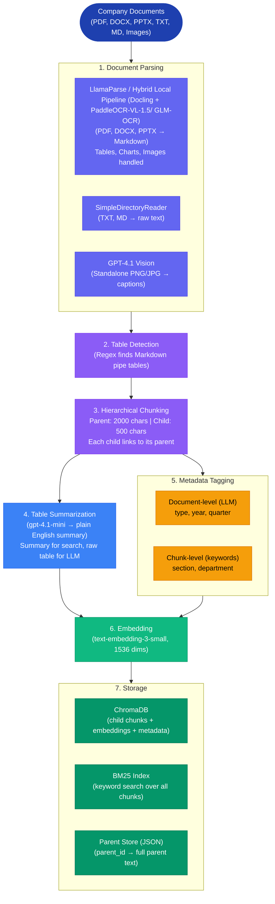
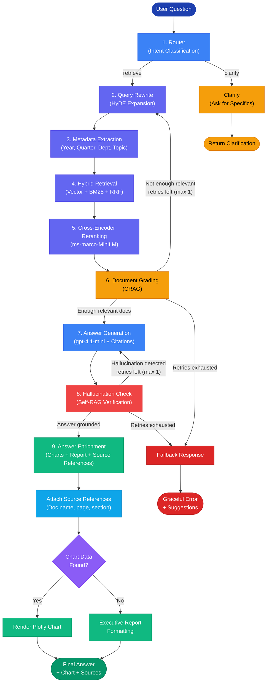

# Technical Reference -- AI Leadership Insight Agent

This reference outlines the system's core components: the ingestion pipeline, query logic, node orchestration, and configuration.

---

## Table of Contents

1. [System Architecture](#system-architecture)
2. [Ingestion Pipeline](#ingestion-pipeline)
3. [Query Pipeline](#query-pipeline)
4. [Node Details](#node-details)
5. [Edge Logic](#edge-logic)
6. [Answer Enrichment](#answer-enrichment)
7. [Retrieval Deep Dive](#retrieval-deep-dive)
8. [Prompt Design](#prompt-design)
9. [Configuration Reference](#configuration-reference)
10. [Smart Caching](#smart-caching)
11. [Evaluation Framework](#evaluation-framework)
12. [Technology Stack](#technology-stack)

---

## System Architecture

The system has two pipelines: ingestion (offline, runs once per document set) and query (online, runs per question).

### Ingestion Flow (Offline, One-Time)



### Query Flow (Online, Per Question)



---

### Parsing & Ingestion

**Why LlamaParse (with Hybrid Local Pipeline (Docling + PaddleOCR-VL-1.5/ GLM-OCR) alternative)?**
I prioritized retrieval accuracy over ingestion speed. Misreading a single digit in a financial table can lead to incorrect strategic insights. LlamaParse provides strong reconstruction of complex tables and charts, ensuring the LLM sees the data exactly as presented in the PDF.

**Offline vs. Online Latency**
- **Ingestion (Slow, Offline)**: Parsing and indexing is computationally expensive and slow. However, this is a one-time cost per document.
- **Querying (Fast, Online)**: Once indexed, the vector search and RRF retrieval happen in milliseconds. The choice of parser has zero impact on query latency.

**Alternative: Hybrid Local Pipeline (Docling + PaddleOCR-VL-1.5/ GLM-OCR)**
Hybrid Local Pipeline (Docling + PaddleOCR-VL-1.5/ GLM-OCR) (https://huggingface.co/zai-org/GLM-OCR) reports best document parsing results on OmniDocBench v1.5, is fast/lightweight, and can be run locally or consumed via API.

---

## Ingestion Pipeline

Located in the `ingestion/` directory.

### ingest.py

The main ingestion entry point. It orchestrates loading, chunking, tagging, embedding, and storing.

Key functions:
- `ingest_pipeline()` -- Runs the full pipeline from raw documents to ChromaDB. Returns stats (number of documents, chunks, parents).
- `load_documents(doc_dir)` -- Uses LlamaParse VLM Agentic Mode for PDF, DOCX, and PPTX (outputs Markdown with pipe tables, charts, and images handled by multimodal AI). Hybrid Local Pipeline (Docling + PaddleOCR-VL-1.5/ GLM-OCR) is the recommended alternative (best reported results on OmniDocBench v1.5; fast/lightweight; local or API). Uses SimpleDirectoryReader for TXT and MD files. Standalone images (PNG, JPG) are captioned by **GPT-4.1 Vision**.
- `extract_tables_from_text()` -- Finds Markdown tables using regex (pipe characters and separator lines).
- `create_hierarchical_chunks()` -- Splits text into parent (2000 char) and child (500 char) chunks. Each child stores a `parent_id` linking to its parent.

Storage details:
- Child chunks go into ChromaDB with embeddings and full metadata.
- Parent chunks are saved to `parent_store.json` for context expansion during retrieval.
- A BM25 index is built over all child chunk text and stored locally.

### hybrid_retriever.py

The retrieval engine. Combines dense vector search and sparse keyword search for higher recall.

Key functions:
- `HybridRetriever.__init__()` -- Loads ChromaDB collection, builds BM25 index, loads parent store, and sets up embedding function.
- `search(query, query_metadata, metadata_filters, top_k)` -- Runs vector search and BM25 in parallel, then fuses results with RRF.
- `_rrf_fusion(vector_results, bm25_results, k=60)` -- Reciprocal Rank Fusion: each result gets a score of `1 / (k + rank)` from each method. Scores are summed across methods. Results are sorted by combined score. Documents that rank highly in both methods get the best combined scores.
- `resolve_parent_context(results)` -- For each child chunk in the results, looks up the parent chunk and replaces the text. This gives the LLM more context while keeping retrieval precise at the child level. For table chunks, the raw table is returned instead of the summary.

Metadata filtering:
- Pre-filters ChromaDB using extracted metadata (year, quarter, department, topic).
- If filtered search returns zero results, filters are dropped one at a time (progressive fallback).
- Filter drop order: most specific first (quarter), then year, then department, then topic.

### metadata_tagger.py

Two levels of metadata extraction:
1. Document-level: **gpt-4.1-mini** reads the first 3 pages and classifies the document type (annual report, quarterly report, strategy note, etc.), year, quarter, and departments mentioned. This is one LLM call per file.
2. Chunk-level: No LLM needed. Rule-based keyword matching assigns section labels (Financial, Strategy, Risk, Operations, Personnel, Technology, Compliance, Market) and department labels (Sales, Engineering, Marketing, Finance, HR, etc.).

### table_summarizer.py

Financial tables are full of numbers that do not match well against natural language questions. This module sends each Markdown table to **gpt-4.1-mini**, which returns a plain English summary (for example, "Revenue grew 5.1 percent year over year to 19.2 billion dollars"). The summary is what gets embedded for semantic search. The raw table is stored separately and returned to the LLM when answering, so it gets exact numbers.

The LLM chain is cached as a module-level singleton to avoid re-creating the OpenAI client on every call.

### Document Parsing

The system uses LlamaParse (a cloud API by LlamaIndex) to parse complex documents. Hybrid Local Pipeline (Docling + PaddleOCR-VL-1.5/ GLM-OCR) (https://huggingface.co/zai-org/GLM-OCR) is the primary alternative and can run locally or via API. When you run ingestion:

1. Each PDF, DOCX, or PPTX file is uploaded to LlamaParse (using VLM Agentic Mode).
2. LlamaParse uses multimodal AI to understand the full page, including text, tables, charts, and images.
3. The output is clean Markdown with tables preserved as pipe tables.
4. This Markdown feeds into the same chunking and embedding pipeline as plain text files.

This requires a `LLAMA_CLOUD_API_KEY` (free tier: 1000 pages per day at cloud.llamaindex.ai).

Alternative: If LlamaParse is not available or not desired due to cost or security (cloud restriction or free tier exhausted), the `file_extractor` dictionary in `ingest.py` can be swapped to use Hybrid Local Pipeline (Docling + PaddleOCR-VL-1.5/ GLM-OCR). Hybrid Local Pipeline (Docling + PaddleOCR-VL-1.5/ GLM-OCR) has best reported parsing results on OmniDocBench v1.5, is fast/lightweight, and supports both local execution and API-based usage.

---

## Query Pipeline

### LangGraph Orchestration

The query pipeline runs as a compiled LangGraph StateGraph. All nodes share a single `GraphState` typed dictionary. Conditional edges examine state fields to decide which node runs next. This lets the CRAG and Self-RAG loops work as cycles in the graph rather than nested if-else code.

### State Definition (graph/state.py)

| Field | Type | What it holds |
|---|---|---|
| question | str | Current query (may be rewritten by HyDE) |
| original_question | str | Original user query, preserved for display |
| rewritten_question | str | After HyDE expansion |
| route | str | Router classification: "retrieve" or "clarify" |
| query_metadata | dict | Extracted filters: year, quarter, department, topic |
| metadata_filters | list | Currently active filter keys |
| metadata_retries | int | Progressive fallback counter |
| documents | list | Raw retrieved document chunks |
| reranked_documents | list | After cross-encoder scoring |
| generation | str | Generated answer text |
| chart_data | dict | Extracted chart visualization data |
| doc_grading_retries | int | CRAG loop counter (max 1) |
| hallucination_retries | int | Self-RAG loop counter (max 1) |
| answer_contains_hallucinations | bool | Flag from verification step |

---

## Node Details

### router.py
Classifies the user question into one of two intents using a single LLM call:
- `retrieve` -- The question is clear and answerable from documents. Proceed to the RAG pipeline.
- `clarify` -- The question is too vague. Ask the user for more detail.

### rewrite_query.py
Implements HyDE (Hypothetical Document Embeddings). Two LLM calls happen here:
1. The query is rewritten to expand abbreviations and add related terms (for example, "revenue" becomes "revenue, income, sales, top-line").
2. A hypothetical answer paragraph is generated. This paragraph is concatenated with the rewritten query for embedding-based retrieval.

The idea behind HyDE: a plausible answer passage is closer in embedding space to the actual answer than a short question. This bridges the gap between how users write questions and how documents are written.

### extract_metadata.py
Uses the LLM with structured output to extract metadata from the question:
- year (for example, "2024")
- quarter (for example, "Q3")
- department (for example, "Finance")
- topic (for example, "revenue", "risks")

These become pre-filters on the ChromaDB collection. The search space is narrowed before vector similarity and BM25 run.

### retrieve.py
Calls the HybridRetriever to perform combined dense and sparse retrieval. Passes metadata filters from the previous node. If retrieval returns zero results and progressive fallback is enabled, the node drops filters one by one and retries.

### rerank.py
Uses a cross-encoder model (ms-marco-MiniLM-L-6-v2) to re-score retrieved documents.

Why this matters: The initial retrieval uses bi-encoders, which encode query and document separately and compare via cosine similarity. This is fast but can miss subtle relevance. Cross-encoders process the query and document together through a single transformer pass, producing a more accurate relevance score. Cross-encoders are too slow for searching thousands of chunks, but work well for re-scoring the top 10 results.

After scoring, the top 5 documents are kept. Parent context resolution also happens here: each child chunk's text is replaced with its parent chunk text for richer LLM context.

### grade_documents.py
The CRAG (Corrective RAG) grading node. Each of the top documents is scored as relevant or irrelevant by the LLM.

Decision logic:
- If at least 1 relevant document is found, proceed to generation.
- If not enough are relevant and retries remain, rewrite the query and loop back through retrieval (CRAG loop).
- If retries are exhausted, return a graceful fallback.

This implements the self-correcting loop from the CRAG paper. Instead of generating from bad context, the system rewrites the query with different terms and tries again.

### generate.py
Produces the final answer using the generation prompt. The prompt enforces:
- Answer only from the provided context documents.
- Cite sources inline as [Doc N].
- Keep answers under 200 words.
- Bold key metrics.
- Say explicitly if information is missing.

The context is built by concatenating the reranked documents, each labeled with file name and page number.

### check_hallucination.py
The Self-RAG verification node. After generation, a separate LLM call compares every claim in the answer against the source documents. The prompt specifically checks numbers, dates, percentages, and categorical claims.

Decision logic:
- No hallucination found: proceed to enrichment.
- Hallucination detected and retries remain: regenerate the answer.
- Retries exhausted: return a fallback.

This catches fabricated facts before they reach the user. The LLM essentially reviews its own work against the original sources.

### enrich_answer.py
The final step. Three operations:
1. Chart extraction using Pydantic structured output.
2. Report formatting via LLM.
3. Document reference building.

See the Answer Enrichment section below.

### clarify.py
For questions that are too vague. Generates a polite clarification request with 2 to 3 suggested interpretations.

### fallback.py
Generates a graceful response when the pipeline cannot produce a reliable answer. Includes the reason (for example, "no relevant documents found") and suggestions for the user (rephrase, specify a time period, check uploaded documents).

---

## Edge Logic

### route_question.py
Maps the router classification to the next node:
- "retrieve" goes to rewrite_query (start the RAG pipeline)
- "clarify" goes to clarify (ask for more detail)

### decide_to_generate.py
After document grading, determines the next step:
- "generate" -- At least 1 relevant document found. Proceed to answer generation.
- "rewrite" -- Not enough relevant docs and retries remaining. Rewrite the query and loop back (CRAG loop).
- "fallback" -- Retries exhausted. Give up gracefully.

### check_hallucination_edge.py
After hallucination verification:
- "end" -- No hallucination. Answer is grounded. Proceed to enrichment.
- "retry" -- Hallucination detected, retries remaining. Regenerate the answer (Self-RAG loop).
- "fallback" -- Retries exhausted. Return fallback response.

---

## Answer Enrichment

### Chart Extraction
Uses gpt-4.1-mini with structured output (Pydantic `ChartAnalysis` model) to detect whether the answer contains comparable numbers suitable for a chart.

The Pydantic schema enforces:
- `has_chart_data` (bool) -- Whether the answer contains 2 or more comparable numbers
- `chart_type` (str) -- bar (comparisons), pie (proportions), line (time trends)
- `title` (str) -- Short chart title
- `labels` (list of str) -- Category names
- `values` (list of float) -- Corresponding numerical values
- `unit` (str) -- Unit of measurement (for example, "billion euros")

Charts are rendered using Plotly in the Streamlit UI. The rendering supports dark theme, hover tooltips, zoom and pan, and download as PNG. Chart types include rounded bar charts, donut charts, and spline line charts with filled area.

### Report Formatting
Open-ended and analytical answers are reformatted into a structured briefing:
- Bottom Line -- One sentence core takeaway
- Key Findings -- Up to 8 bullet points with bold topic labels
- Source References -- Preserved [Doc N] inline citations

Factual answers (single number, specific fact) get lighter formatting, just bolded key numbers.

### Document References
After formatting, a deduplicated list of source documents is appended at the bottom of every answer. Each reference includes:
- Source file name
- Page number
- Section header (if available)

This provides full traceability from every answer back to the original document.

---

## Prompt Design

All prompts are in `prompts.py`. Key design decisions:

- Grounding constraints: The generation prompt tells the LLM to answer only from provided context and cite sources as [Doc N]. This reduces hallucination at the generation level.
- Structured output: The metadata extractor and chart extractor use Pydantic schemas. The LLM returns structured JSON that is validated by Pydantic.
- Claim-level verification: The hallucination grader prompt asks the LLM to check specific claims, numbers, and dates rather than giving a general assessment.
- Word limits: The generation prompt caps answers at 200 words. The report formatter caps output at 250 words. This keeps outputs concise and factual.
- Progressive prompting: Each prompt is designed for a specific task (routing, rewriting, grading, generating, verifying, formatting) rather than a single mega-prompt. This keeps each LLM call focused and reduces error rates.

---

## Configuration Reference

All settings are in `config.py`, loaded from `.env`:

| Setting | Default | What it does |
|---|---|---|
| LLM_MODEL | gpt-4.1-mini | Model for the real-time query pipeline |
| INGESTION_LLM_MODEL | gpt-4.1 | Model for offline indexing (metadata, table summaries) |
| EMBEDDING_MODEL | text-embedding-3-small | 1536-dimension embedding model |
| CHUNK_SIZE_PARENT | 2000 | Parent chunk size in characters |
| CHUNK_SIZE_CHILD | 500 | Child chunk size in characters |
| CHUNK_OVERLAP | 50 | Overlap between chunks |
| TOP_K_RETRIEVAL | 10 | Chunks fetched from hybrid search |
| RERANK_TOP_N | 5 | Chunks kept after cross-encoder reranking |
| BM25_WEIGHT | 0.3 | BM25 weight in RRF fusion |
| VECTOR_WEIGHT | 0.7 | Dense vector weight in RRF fusion |
| RRF_K | 60 | RRF constant (standard default from the paper) |
| MAX_DOC_GRADING_RETRIES | 3 | Max CRAG rewrite loops |
| MAX_HALLUCINATION_RETRIES | 3 | Max Self-RAG regeneration loops |
| DOCS_RELEVANCE_THRESHOLD | 1 | Minimum relevant docs to proceed to generation |
| RERANKER_MODEL | ms-marco-MiniLM-L-6-v2 | Cross-encoder model for reranking |
| DEFAULT_COMPANY | infosys | Default company for CLI and Streamlit |

### Multi-Company Support

The system supports multiple company datasets. Each company has its own document folder, ChromaDB collection, and parent store. Indexing one company does not affect another.

Folder convention: Any directory named `<company>_company_docs/` is auto-discovered at startup.

```
bosch_company_docs/        # company name: "bosch"
infosys_company_docs/      # company name: "infosys"
tesla_company_docs/        # company name: "tesla" (add your own)
```

How it works:
- Each company gets its own ChromaDB collection (`leadership_docs_bosch`, `leadership_docs_infosys`, etc.)
- Each company gets its own parent store (`parent_store_bosch.json`, `parent_store_infosys.json`, etc.)
- Switching companies does not affect other companies' indexed data

CLI usage:
```bash
# Index a company
python main.py --company bosch --ingest

# Query a company
python main.py --company infosys --question "What is the revenue trend?"
```

Streamlit UI: Use the sidebar dropdown to select a company.

When to re-index: Run `--ingest` again whenever you add, remove, or update documents in a company folder. The system's hash-based caching will automatically detect changes and only re-process when needed.

---

## Smart Caching

The ingestion pipeline uses **SHA-256 file hashing** to avoid redundant processing. This saves parsing/embedding costs (LlamaParse or Hybrid Local Pipeline (Docling + PaddleOCR-VL-1.5/ GLM-OCR), plus OpenAI embeddings) and time.

### How It Works

1. Before ingestion, the system computes a SHA-256 hash for every supported file in the document folder.
2. These hashes are compared against a saved manifest (`chroma_db/file_hashes_<company>.json`).
3. If all hashes match the manifest: ingestion is **skipped entirely**.
4. If any file is new, removed, or modified: a **full re-ingest** runs.
5. After successful storage, the new manifest is saved.

### Why Full Re-ingest (Not Incremental)

ChromaDB does not natively support deleting all chunks from a specific source file while keeping others. Implementing incremental per-file delta would require tracking chunk-to-file mappings and managing partial collection updates. A full re-ingest on any change is pragmatic and guarantees consistency.

### CLI Usage

```bash
# Normal ingest (uses cache)
python main.py --company infosys --ingest

# Force re-ingest (bypasses cache)
python main.py --company infosys --ingest --force
```

### Streamlit UI

The sidebar includes a **"Force re-ingest"** checkbox. When unchecked (default), the system uses caching. When checked, all documents are reprocessed.

### Configuration

| Setting | Location | Value |
|---|---|---|
| `HASH_MANIFEST_PATH` | `config.py` | `chroma_db/file_hashes_<company>.json` |

---

## Evaluation Framework

The system includes a quantitative evaluation pipeline using [Ragas](https://docs.ragas.io/) to measure RAG quality.

### Architecture

```
evaluation/
  golden_dataset.json   # Curated question-answer pairs with verified ground truths
  evaluate.py           # Evaluation script using Ragas metrics
  results.json          # Per-question and overall scores (auto-generated)
```

### Golden Dataset

The golden dataset (`evaluation/golden_dataset.json`) contains question-answer pairs with ground-truth answers manually verified against the source documents. Each entry includes:

- `question`: The natural language query
- `ground_truth`: The verified expected answer
- `reference_files`: Source documents the answer is derived from

### Metrics

Four Ragas metrics are computed:

| Metric | What It Measures | How |
|---|---|---|
| **Faithfulness** | Answer grounded in context | LLM checks each claim against retrieved docs |
| **Answer Relevancy** | Response pertinence | LLM + embeddings measure relevance to question |
| **Context Precision** | Retrieval ranking quality | Are ground-truth-relevant docs ranked highest? |
| **Context Recall** | Retrieval completeness | Were all necessary docs retrieved? |

### How It Works

1. Each golden question is run through the full agent pipeline (`run_agent()`).
2. The generated answer and retrieved contexts are captured.
3. Ragas evaluates each (question, answer, contexts, ground_truth) tuple.
4. Results include per-question scores and overall averages.

### Running

```bash
python evaluation/evaluate.py --company infosys
python evaluation/evaluate.py --company infosys --output evaluation/results.json
```

### Results (Infosys Dataset)

| Metric | Score | Analysis |
|---|---|---|
| **Context Recall** | **0.7548** | High. The hybrid retrieval found most relevant chunks, with minor variance in specific detail retrieval. |
| **Context Precision** | **0.7778** | Excellent. The cross-encoder reranking consistently pushed the most relevant chunks to the top 5. |
| **Faithfulness** | **0.8111** | Very High. The Self-RAG loop effectively prevents hallucinations. |
| **Answer Relevancy** | **0.7724** | Good. The generated risk analysis is detailed and accurate, though this verbosity impacts the specific relevancy metric. |

### Extending the Dataset

To add new evaluation questions:
1. Add entries to `golden_dataset.json` following the existing format.
2. Ensure `ground_truth` is verified against actual document contents.
3. List the source files in `reference_files` for traceability.

---

## Technology Stack

| Layer | Technology | Purpose |
|---|---|---|
| Orchestration | LangGraph | StateGraph with conditional edges, loops, streaming |
| LLM Framework | LangChain | Prompt templates, LLM wrappers, structured output |
| LLM (Query and Indexing) | OpenAI gpt-4.1-mini | Routing, grading, generation, verification, metadata, table summaries |
| Embeddings | OpenAI text-embedding-3-small | 1536-dimension dense vectors for semantic search |
| Vector Store | ChromaDB | Persistent vector storage with metadata filtering |
| Keyword Search | rank-bm25 | BM25 keyword-based retrieval |
| Reranking | Sentence Transformers CrossEncoder | ms-marco-MiniLM for passage relevance scoring |
| Document Parsing | LlamaParse (primary) / Hybrid Local Pipeline (Docling + PaddleOCR-VL-1.5/ GLM-OCR) (alternative) | Multimodal parser: PDF, DOCX, PPTX to Markdown (tables, charts, images). Hybrid Local Pipeline (Docling + PaddleOCR-VL-1.5/ GLM-OCR) reports best results on OmniDocBench v1.5 and can run locally or via API. |
| Image Captioning | OpenAI GPT-4.1 Vision | Semantic captioning of standalone images |
| Document Loading | LlamaIndex SimpleDirectoryReader | TXT, MD file loading |
| UI | Streamlit | Chat interface, file upload, real-time streaming |
| Charts | Plotly | Interactive bar, pie, line charts with dark theme |
| Data Validation | Pydantic | Structured LLM output schemas for charts and metadata |
| Config | python-dotenv | Environment variable management |
| Evaluation | Ragas | RAG quality metrics: Faithfulness, Relevancy, Precision, Recall |
| Caching | hashlib (SHA-256) | File-level change detection to skip redundant ingestion |
